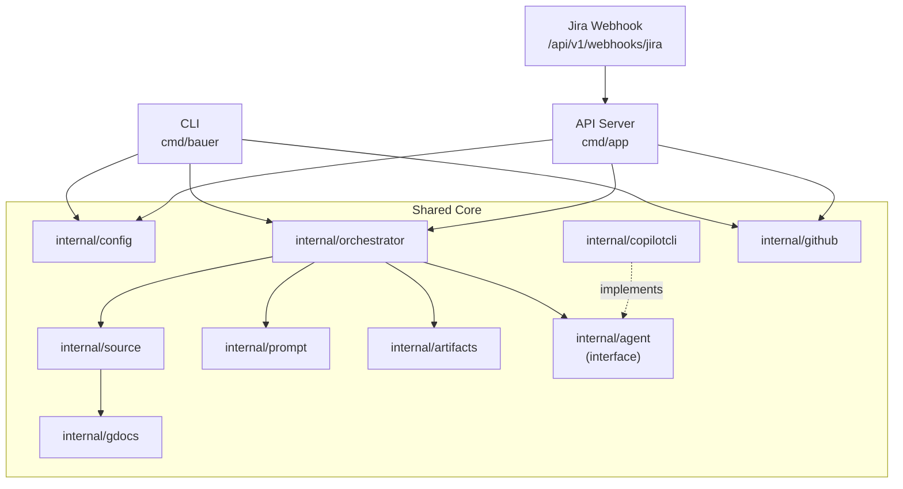
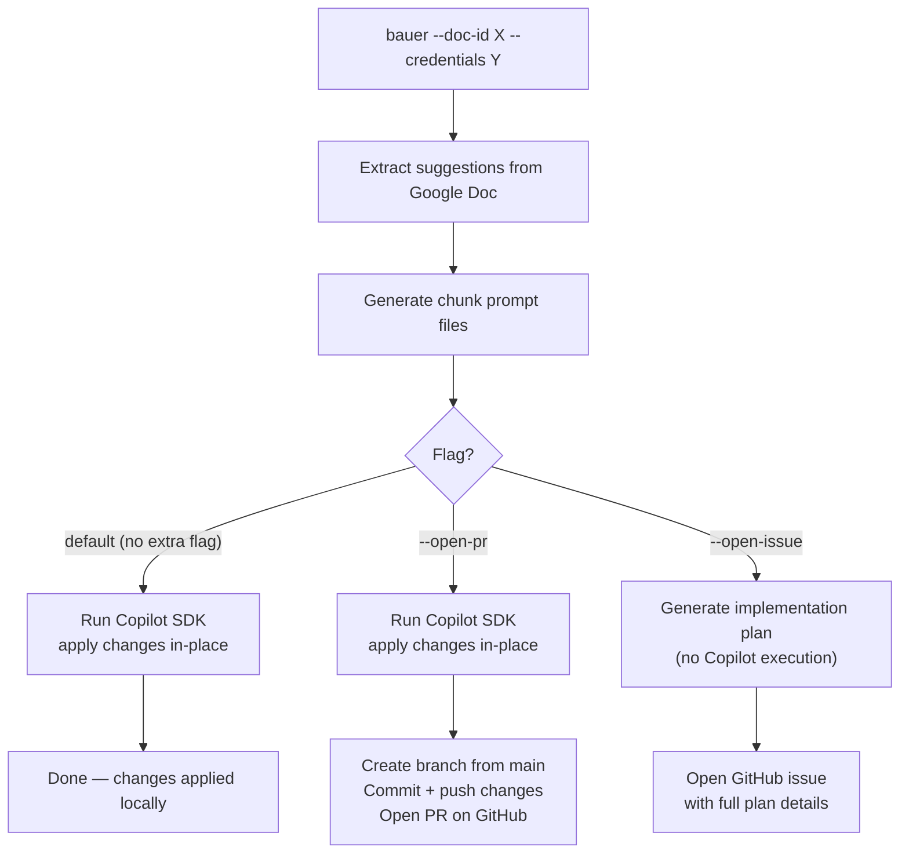
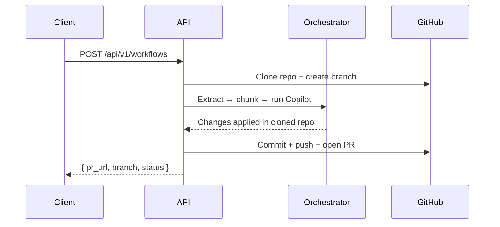
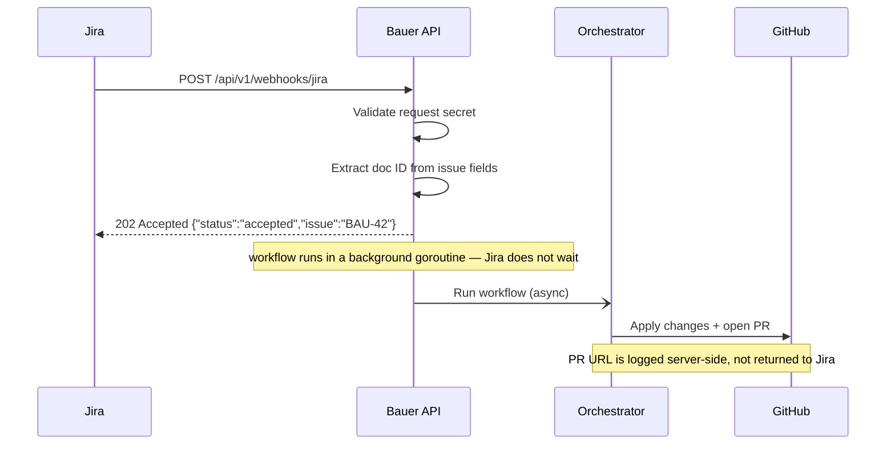
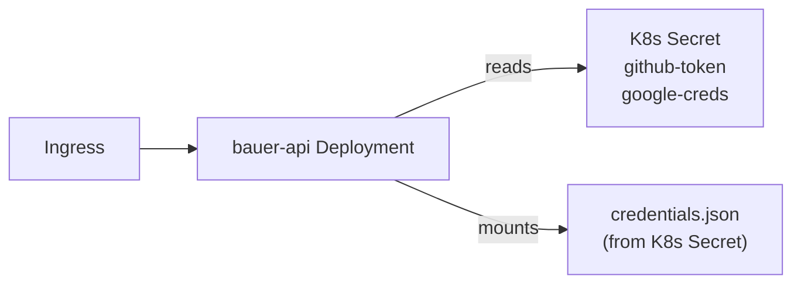

# Bauer v2 Architecture

> The target architecture for Bauer — a shared-core system with a CLI, an HTTP API, and a Jira webhook integration.

---

## What is Bauer v2?

Bauer reads implementation suggestions from a Google Doc, generates structured prompts, and uses GitHub Copilot to apply those changes to a codebase. v2 extends this into a full CLI + API system where:

- The **CLI** runs directly inside any target repo and applies changes locally
- The **HTTP API** handles the same workflow programmatically (open issues or full PRs)
- A **Jira webhook** lets tickets automatically trigger the workflow
- All entry points share the same core logic — no duplication

---

## System Overview



Both `cmd/bauer` and `cmd/app` are thin wiring layers — all business logic lives in `internal/`. Adding a new entry point (GitHub Action, scheduled job, etc.) is just a new `cmd/` package.

---

## Entry Points

| Binary      | Package      | Purpose                           |
| ----------- | ------------ | --------------------------------- |
| `bauer`     | `cmd/bauer/` | CLI — runs inside the target repo |
| `bauer-api` | `cmd/app/`   | HTTP API server                   |

---

## Shared Core Packages

Sharing core logic between the CLI and API is the right call here. The internal packages are already designed to be entry-point-agnostic — the `cmd/` layer just wires them together differently.

| Package                 | Responsibility                                                                                                           |
| ----------------------- | ------------------------------------------------------------------------------------------------------------------------ |
| `internal/gdocs`        | Google Docs auth, doc fetch, suggestion extraction and grouping                                                          |
| `internal/source`       | Source adapters and normalized `SourceBundle` — the orchestrator depends on this, not directly on `internal/gdocs`       |
| `internal/prompt`       | Chunk prompt generation from suggestions, template rendering; directly aware of gdocs and figma source types             |
| `internal/agent`        | Defines the `Agent` interface that all AI execution backends implement                                                   |
| `internal/copilotcli`   | Implements `agent.Agent`; manages Copilot SDK process lifecycle, sessions, streaming                                     |
| `internal/orchestrator` | Wires source → prompt → agent into a single `Execute()` call; depends on `agent.Agent`, not concrete client              |
| `internal/artifacts`    | Append-only run artifact storage; writes extraction, prompts, outputs, and screenshots under timestamped run directories |
| `internal/github`       | GitHub auth, branch ops, commits, issue creation, PR creation                                                            |
| `internal/config`       | Configuration loading and resolution (shared by CLI and API)                                                             |

---

## Configuration

### API: `.env` + `.env.local`

The API loads config from a pair of files, with OS environment variables always winning (important for containers and K8s):

```
1. OS environment variables   ← highest priority (used in containers/K8s)
2. .env.local                 ← local overrides, secrets — always gitignored
3. .env                       ← defaults, safe to commit (no secrets)
4. Hardcoded defaults         ← lowest priority
```

Go doesn't load `.env` files automatically, so the API uses a loader (e.g. `godotenv`) at startup. The `.env.local` file overrides `.env` for local development, and OS env vars override both for production deployments.

```bash
# .env — safe to commit
BAUER_API_PORT=8090
BAUER_MODEL=gpt-5-mini-high
BAUER_SUMMARY_MODEL=gpt-5-mini-high
BAUER_CHUNK_SIZE=1
BAUER_PAGE_REFRESH=false
BAUER_OUTPUT_DIR=bauer-output
BAUER_BRANCH_PREFIX=bauer

# .env.local — gitignored, secrets live here
BAUER_GITHUB_TOKEN=ghp_...
BAUER_CREDENTIALS_PATH=/path/to/service-account.json
```

Secrets (`BAUER_GITHUB_TOKEN`, `BAUER_CREDENTIALS_PATH`) are **never** in request bodies — they're always configured server-side.

### CLI: Flags + Env Vars

The CLI uses a layered approach:

```
1. CLI flags                  ← highest priority
2. BAUER_* environment vars   ← useful for scripting and CI
3. Hardcoded defaults         ← lowest priority
```

Supporting env vars as a fallback means users don't have to repeat the same flags in scripts. Secrets (`--credentials`) can come from either a flag or the `BAUER_CREDENTIALS_PATH` env var — never hardcoded. There is no JSON config file support for the CLI — that's been removed in favour of env vars.

---

## CLI

The CLI **does not clone repos** and does not expect a GitHub repo URL — it assumes it's already running inside the target repository. It reads the GitHub remote from the local git config if it needs one (e.g. for opening a PR or issue).

### Modes



### Flags

| Flag              | Default                                                                       | Description                                                       |
| ----------------- | ----------------------------------------------------------------------------- | ----------------------------------------------------------------- |
| `--doc-id`        | required                                                                      | Google Doc ID                                                     |
| `--credentials`   | required (or BAUER_CREDENTIALS_PATH / GOOGLE_APPLICATION_CREDENTIALS env var) | Path to Google service account JSON                               |
| `--chunk-size`    | `1`                                                                           | Suggestion groups per chunk                                       |
| `--page-refresh`  | `false`                                                                       | Use page-refresh instruction mode                                 |
| `--model`         | `gpt-5-mini-high`                                                             | Copilot model                                                     |
| `--summary-model` | `gpt-5-mini-high`                                                             | Model for summary session (when >1 chunk)                         |
| `--artifacts-dir` | `./bauer-artifacts`                                                           | Directory for run artifacts (replaces old `--output-dir`)         |
| `--figma-url`     | `""`                                                                          | Optional Figma link; enables the full Figma ingestion pipeline    |
| `--dry-run`       | `false`                                                                       | Skip Copilot execution, just write chunk files                    |
| `--open-pr`       | `false`                                                                       | After applying changes, create a branch and open a PR             |
| `--open-issue`    | `false`                                                                       | Skip Copilot execution, open a GitHub issue with the plan instead |
| `--branch-prefix` | `bauer`                                                                       | Branch name prefix (used with `--open-pr`)                        |

Notes:

- `--open-pr` and `--open-issue` require GitHub auth. The CLI resolves the token in this order: `BAUER_GITHUB_TOKEN` → `GITHUB_TOKEN` → `GH_TOKEN` → `gh auth token`. Never a CLI flag.
- `--open-issue` and `--open-pr` are mutually exclusive.
- The CLI reads the GitHub remote from the current repo's git config — no `--github-repo` flag needed.

---

## API

The API exposes the same flows over HTTP. Two endpoints cover the two main use cases:

### `POST /api/v1/issues`

Generates a detailed implementation plan from the Google Doc and opens a GitHub issue. No code changes are applied.

**Request:**

```json
{
  "doc_id": "1abc...",
  "github_repo": "owner/repo",
  "chunk_size": 1,
  "page_refresh": false,
  "model": "gpt-5-mini-high"
}
```

**Response:**

```json
{
  "status": "success",
  "issue_url": "https://github.com/owner/repo/issues/42",
  "issue_number": 42
}
```

---

### `POST /api/v1/workflows`

Full flow: clone repo → apply changes via Copilot → open PR.

> **Implementation status (current):** The shipped endpoint uses an *issue-delegation* flow rather than running Copilot in-process. It extracts suggestions, pushes the parse result to a branch on the target repo, and opens a Copilot-assigned GitHub issue that drives PR creation. The request body carries only non-secret fields (`doc_id`, `github_repo`, `branch_prefix`, `chunk_size`, `page_refresh`) — credentials come from server config and the GitHub token from the server environment. The call is synchronous and returns `{ "code": 201, "status", "issue_url", "branch" }`.

**Request:**

```json
{
  "doc_id": "1abc...",
  "github_repo": "owner/repo",
  "branch_prefix": "bauer",
  "chunk_size": 1,
  "page_refresh": false,
  "model": "gpt-5-mini-high",
  "summary_model": "gpt-5-mini-high",
  "dry_run": false
}
```

**Response:**

```json
{
  "status": "success",
  "pr_url": "https://github.com/owner/repo/pulls/123",
  "branch": "bauer/doc-suggestions-1743500000",
  "chunk_count": 3
}
```

**Flow:**



---

### `GET /api/v1/health`

Liveness check. Returns `200` if the server is up.

### `GET /api/v1/health/ready`

Readiness check. Verifies that credentials and GitHub token are configured.

### `POST /api/v1/webhooks/jira`

See the Jira Webhook section below.

---

## Jira Webhook

The Jira webhook lets Bauer trigger automatically when a new ticket is created in Jira (e.g. a "BAU" task).

### How It Works



The webhook handler calls the **same internal workflow logic** directly — it does not make an HTTP call to `/api/v1/workflows`. This is cleaner: no loopback, no extra auth, same process.

Jira receives a `202 Accepted` response immediately — it never receives the PR URL. The workflow result is logged on the server.

### Setting Up the Webhook in Jira

1. Go to **Jira → Settings → System → Webhooks** (requires Jira admin access)
2. Create a new webhook pointing to `https://your-api.example.com/api/v1/webhooks/jira`
3. Select **Issue Created** as the trigger event
4. Optionally add a **JQL filter** to limit which issues trigger it: `project = BAU AND issuetype = Task`
5. Set a **shared secret** (passed as a query param or header) so Bauer can verify the request came from Jira

Jira Cloud webhook docs: https://developer.atlassian.com/cloud/jira/platform/rest/v3/api-group-webhooks/
Jira Server webhook docs: https://developer.atlassian.com/server/jira/platform/webhooks/

### Expected Payload

```json
{
  "timestamp": 1700000000000,
  "webhookEvent": "jira:issue_created",
  "issue_event_type_name": "issue_created",
  "user": {
    "accountId": "abc123",
    "displayName": "Alice"
  },
  "issue": {
    "id": "10001",
    "key": "BAU-42",
    "self": "https://your-domain.atlassian.net/rest/api/3/issue/10001",
    "fields": {
      "summary": "Update web copy — sprint 24",
      "description": { "type": "doc", "content": [...] },
      "issuetype": { "name": "Task" },
      "status": { "name": "To Do" },
      "project": { "key": "BAU", "name": "BAU Tasks" },
      "customfield_10100": "1abc..."
    }
  }
}
```

The Google Doc ID needs to be embedded somewhere in the issue. The cleanest option is a **custom field** (e.g. `Google Doc ID`) on the Jira issue type. The exact field key (`customfield_XXXXX`) depends on your Jira config. Alternatively, the doc ID can be parsed from the issue description using a known format.

### Webhook Verification

Add a shared secret to the webhook URL and verify it in the handler:

```
POST /api/v1/webhooks/jira?secret=your-shared-secret
```

The handler should reject requests with a missing or invalid secret with `401 Unauthorized`.

Jira webhook security docs: https://developer.atlassian.com/cloud/jira/platform/webhooks/#securing-your-webhook

---

## GitHub Integration (Service Account)

The API needs to act on GitHub to open issues, push branches, and create PRs. Two options:

### Option A: Personal Access Token (PAT)

Create a dedicated bot GitHub account, generate a fine-grained PAT with:

- `Contents: Read & Write`
- `Pull requests: Read & Write`
- `Issues: Read & Write`

Store it as `BAUER_GITHUB_TOKEN`. Simple to set up, good enough for getting started.

### Option B: GitHub App (recommended for production)

1. Go to GitHub → Settings → Developer Settings → GitHub Apps → New GitHub App
2. Set permissions: `Contents: Read & Write`, `Pull requests: Read & Write`, `Issues: Read & Write`
3. Install the app on target repos
4. Store `GITHUB_APP_ID` and `GITHUB_APP_PRIVATE_KEY` as secrets
5. Generate short-lived installation access tokens at runtime (expire in 1 hour)

GitHub Apps are preferred for production: better audit trails, no bot account needed, tokens auto-rotate.

GitHub App creation docs: https://docs.github.com/en/apps/creating-github-apps/about-creating-github-apps/about-creating-github-apps

For the initial implementation, a PAT is fine. The token goes in `BAUER_GITHUB_TOKEN` (or the standard `GH_TOKEN` / `GITHUB_TOKEN`).

---

## Deployment

### Docker

The API runs as a container. The `gh` CLI (used for GitHub operations) needs to be in the image, authenticated via `GH_TOKEN`.

```dockerfile
FROM golang:1.22 AS builder
# ... build bauer-api

FROM debian:bookworm-slim
RUN apt-get update && apt-get install -y git gh
COPY --from=builder /app/bauer-api /usr/local/bin/
ENV BAUER_API_PORT=8090
EXPOSE 8090
CMD ["bauer-api"]
```

Required at runtime:

- `BAUER_GITHUB_TOKEN` / `GH_TOKEN`
- `BAUER_CREDENTIALS_PATH` + mounted Google credentials volume

### Kubernetes



Secrets are injected as environment variables or mounted volumes. The `BAUER_CREDENTIALS_PATH` env var points to the mounted credentials file. `BAUER_GITHUB_TOKEN` comes from a K8s Secret via `secretKeyRef`.

---

## Key Design Decisions

| Decision                                | Choice | Reason                                                                                                                                                                                                                                                                                   |
| --------------------------------------- | ------ | ---------------------------------------------------------------------------------------------------------------------------------------------------------------------------------------------------------------------------------------------------------------------------------------- |
| CLI runs in current directory           | Yes    | It's a CLI — no cloning needed, feels native                                                                                                                                                                                                                                             |
| CLI doesn't take `--github-repo`        | Yes    | It reads the remote from local git config instead                                                                                                                                                                                                                                        |
| Shared `internal/` packages             | Yes    | Single source of truth, no drift between CLI and API                                                                                                                                                                                                                                     |
| Secrets in env vars only (API)          | Yes    | Security + K8s/container compatibility                                                                                                                                                                                                                                                   |
| `.env` + `.env.local` for API           | Yes    | Standard pattern, clear separation of defaults vs secrets                                                                                                                                                                                                                                |
| Jira calls internal logic (not HTTP)    | Yes    | Cleaner, no loopback, same process                                                                                                                                                                                                                                                       |
| Two API endpoints (issues vs workflows) | Yes    | Clean separation — different flows, different use cases                                                                                                                                                                                                                                  |
| `agent.Agent` interface                 | Yes    | Orchestrator is backend-agnostic; swap AI provider without touching core logic                                                                                                                                                                                                           |
| No JSON config files                    | Yes    | Env vars for API, flags + env vars for CLI — cleaner, no third config mechanism                                                                                                                                                                                                          |
| `internal/source` abstraction           | Yes    | Orchestrator must not be coupled to Google Docs directly; source layer normalizes all upstream inputs so future sources (Figma, Jira, etc.) fit the same pipeline without touching the orchestrator                                                                                      |
| Append-only run artifacts               | Yes    | Overwriting extraction outputs and prompt files blocks traceability, debugging, and later design-aware features; every run gets a timestamped directory under `bauer-artifacts/`                                                                                                         |
| Prompt pkg knows its sources directly   | Yes    | The prompt package is intentionally coupled to gdocs and figma types — it is not source-agnostic. It always handles gdocs data and adds figma-specific sections when figma data is present. Abstracting sources at the prompt level would hide important per-source prompting decisions. |

---

## Known Limitations

- **Synchronous API**: `/api/v1/workflows` blocks for the full workflow duration (up to 30+ minutes). Fine for a POC; async job tracking is a future addition.
- **`gh` CLI dependency**: GitHub operations use the `gh` binary. The Dockerfile installs it. A future improvement migrates to the GitHub REST API directly to eliminate this external dependency.
- **Temp dir cleanup**: Cloned repos accumulate in temp directories between API requests. A cleanup step should be added post-workflow.
