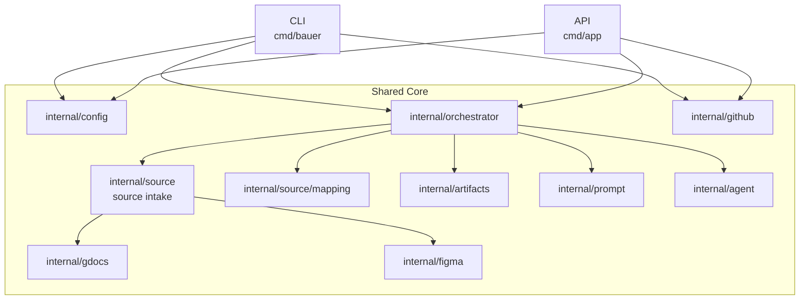
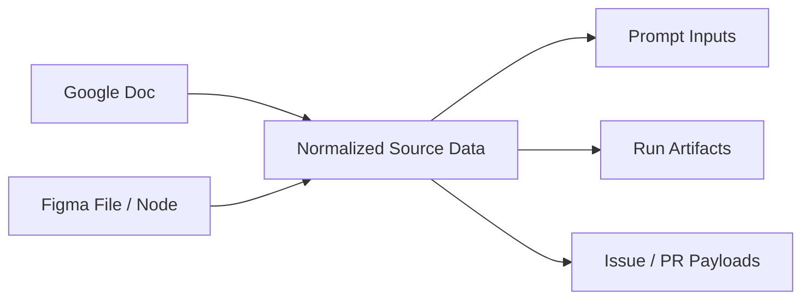
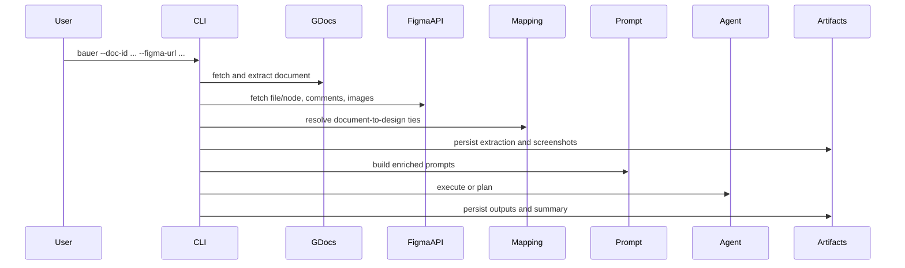
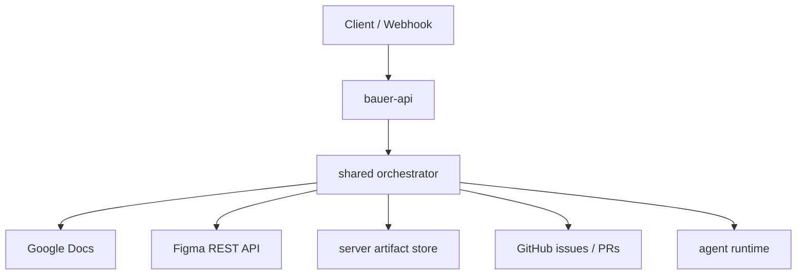

# Bauer v2.1 Architecture

> The Bauer architecture delta after v2: add design-aware inputs, starting with Figma, without breaking the CLI-first and shared-core direction established in v2.

---

## Table of Contents

1. [Executive Overview](#executive-overview)
2. [REST API vs MCP at a Glance](#rest-api-vs-mcp-at-a-glance)
3. [What Changes in v2.1](#what-changes-in-v21)
4. [Goals](#goals)
5. [Non-Goals](#non-goals)
6. [Figma Cheat Sheet for Developers](#figma-cheat-sheet-for-developers)
7. [Architecture Principles](#architecture-principles)
8. [System Overview](#system-overview)
9. [New Shared-Core Capabilities](#new-shared-core-capabilities)
10. [Source Data Model](#source-data-model)
11. [Document-to-Design Mapping Model](#document-to-design-mapping-model)
12. [Comments and Review Signals](#comments-and-review-signals)
13. [Screenshots and Visual Assets](#screenshots-and-visual-assets)
14. [Artifact History and Run Storage](#artifact-history-and-run-storage)
15. [Local CLI Topology](#local-cli-topology)
16. [Later API and Production Topology](#later-api-and-production-topology)
17. [Configuration and Secrets](#configuration-and-secrets)
18. [Rate Limits, Caching, and Drift](#rate-limits-caching-and-drift)
19. [Security and Data Handling](#security-and-data-handling)
20. [Why REST API is Canonical and MCP is Optional](#why-rest-api-is-canonical-and-mcp-is-optional)
21. [Future Extensions Beyond Figma](#future-extensions-beyond-figma)
22. [References](#references)

---

## Executive Overview

- v2.1 builds on v2. It does not replace it.
- Bauer keeps the same shared-core shape: thin CLI and API entry points, business logic in `internal/`.
- The main addition is a new design-aware source path, starting with Figma.
- Bauer should fetch and normalize Figma data through the Figma REST API.
- Bauer may optionally let supported agent clients use the Figma MCP server during execution, but MCP is not the required Bauer backend.
- Google Docs text remains the canonical anchor for planning and intent because headings and core text are assumed to stay stable.
- Figma adds design structure, screenshots, and comments that Bauer ties back to the document through explicit mapping records.
- Bauer must stop overwriting generated outputs. v2.1 requires append-only run artifacts with timestamped run directories.

In short: v2.1 turns Bauer from a single-source suggestion pipeline into a multi-source implementation pipeline with explicit traceability between text intent, design intent, prompts, and outputs.

---

## REST API vs MCP at a Glance

This section is intentionally high level. The detailed comparison lives in spec 002.

### Functional overview

| Capability                               | Figma REST API                          | Figma MCP server                                            |
| ---------------------------------------- | --------------------------------------- | ----------------------------------------------------------- |
| Structured file and node reads           | Yes                                     | Indirectly through client tools                             |
| Comments read/write                      | Yes                                     | Not Bauer's durable source of truth                         |
| Image rendering for durable artifacts    | Yes                                     | Can help agent runtime, but not Bauer's stable storage path |
| Works directly from Go CLI and later API | Yes                                     | No, depends on supported MCP client                         |
| Works without editor-specific runtime    | Yes                                     | No                                                          |
| Rich live design context for agents      | Limited, Bauer must shape it            | Yes                                                         |
| Agent-guided canvas interaction          | No                                      | Yes, in supported clients                                   |
| Best role in Bauer                       | Canonical ingestion and artifact source | Optional runtime enrichment                                 |

### Choice

- Bauer core should use the Figma REST API as the canonical ingestion path.
- Bauer may optionally benefit from MCP when the agent runtime already supports it.
- The strongest long-term model is hybrid:
  - REST API for deterministic fetch, normalization, screenshots, comments, and artifact history
  - MCP for supported local developer tools that want richer live context or future write-back workflows

---

## What Changes in v2.1

v2 established:

- shared core in `internal/`
- CLI and API as entry points
- Google Docs extraction as the main source
- prompt generation and Copilot-driven execution

v2.1 adds:

- a source-intake abstraction instead of hard-coding Google Docs as the only upstream source
- a Figma ingestion path for design structure, screenshots, and comments
- a mapping layer that ties document sections to Figma nodes
- append-only run artifacts for reproducibility and review
- an explicit local-first path for CLI rollout before later API centralization

v2.1 does not change the core Bauer promise:

- read implementation intent
- turn it into structured prompts
- let agents implement or plan the work
- preserve traceability

---

## Goals

- Add Figma as a first-class design source.
- Keep Bauer source-agnostic at the orchestration layer.
- Preserve the current v2 CLI-first rollout strategy.
- Give agents enough visual and structural context to check whether code aligns with design.
- Keep a clear chain from source input to final output.
- Make failures visible: missing nodes, stale mappings, unresolved comments, expired screenshots, low-confidence ties.
- Create a design that later supports other upstream sources, not just Figma.

---

## Non-Goals

- Replacing Google Docs as the primary text/planning source.
- Making Figma the source of truth for product intent.
- Requiring Figma MCP for all Bauer runs.
- Requiring Code Connect before the first Figma slice can ship.
- Solving every future design-system workflow in v2.1.
- Full write-back to Figma as part of the first implementation slice.

---

## Figma Cheat Sheet for Developers

This section is intentionally simple. Bauer users should not need prior Figma experience.

### Core concepts

| Term      | Meaning                                         | Why Bauer cares                                                   |
| --------- | ----------------------------------------------- | ----------------------------------------------------------------- |
| File      | The top-level Figma document                    | Shared link usually points to a file                              |
| Page      | A top-level section inside a file               | Useful for broad organization                                     |
| Frame     | A screen, region, or canvas container           | Usually the best level for implementation checks                  |
| Layer     | Any object inside a frame                       | Text, image, rectangle, icon, group, etc.                         |
| Component | A reusable design primitive                     | Important when checking if code should reuse existing UI patterns |
| Instance  | A placed use of a component                     | Shows where a component is used in a screen                       |
| Node      | Figma's API term for an object in the file tree | Node IDs are the main machine anchor                              |
| Dev Mode  | Figma's developer-oriented inspection view      | Helpful context, but Bauer should not depend on UI-only behavior  |
| Comment   | Feedback attached to a file region or object    | Needs extraction and association                                  |

### What link should a developer provide?

- Best input: a node-specific link to a frame or region.
- Acceptable input: a whole-file link.
- Tradeoff:
  - whole-file link is easier to provide, but Bauer must resolve the relevant node later
  - node-specific link is more precise and reduces matching mistakes

### What does a typical Figma link look like?

Whole file:

```text
https://www.figma.com/file/FILE_KEY/File-Name
```

Specific node:

```text
https://www.figma.com/file/FILE_KEY/File-Name?node-id=1:42
```

What Bauer extracts from the link:

- file key
- optional node id
- enough metadata to refetch the file or node later

### Do we need the full design or only the ready-for-dev area?

- Bauer should accept both.
- Preferred input is the smallest relevant area that still contains enough context.
- If the user only provides a full-file link, Bauer should require either:
  - a mapping manifest already in place, or
  - a later resolution step that identifies the relevant nodes/frames

### How should developers think about Figma in Bauer?

- Google Docs explains what should change.
- Figma shows how the relevant area should look and behave.
- Bauer ties those two together and passes both to agents.

---

## Architecture Principles

1. Text intent stays canonical.
   The extracted Google Docs structure remains Bauer's main planning anchor.

2. Design context is additive.
   Figma improves precision, validation, and implementation quality. It does not replace the text flow.

3. Orchestrator stays source-type-agnostic.
   It should not know about Google Docs vs Figma specifics. Source intake is encapsulated in `internal/source`. The mapping layer lives in `internal/source/mapping` — it is a sub-package of source because it owns the join between source outputs (gdocs result + figma result). The orchestrator may import `source/mapping`, but it does not import `internal/gdocs` or `internal/figma` directly.

4. Mapping must be explicit.
   Pure fuzzy matching is not enough for a durable workflow. The `internal/source/mapping` resolver records confidence scores and status for every association.

5. Artifacts must be durable.
   Temporary render URLs and overwrite-only output directories are not sufficient.

6. CLI-first still matters.
   v2.1 must be implementable after phase 2 of spec 001, before the new API work is complete.

7. The prompt package is intentionally coupled to gdocs and figma types, not source-agnostic.
   The prompt package must know what sources it is rendering. It always renders gdocs suggestion data (always present) and conditionally adds a figma-specific prompting section when figma context is present. Abstracting the sources inside a generic blob at the prompt level would hide per-source prompt logic and make templates unreadable. The `PromptData` type reflects this: `SuggestionsJSON` (always set) and `FigmaContextJSON` (empty string when no Figma URL was supplied, non-empty when Figma data is present).

8. Chunking is preserved and is more important with Figma, not less.
   Each suggestion group processed by the prompt engine may now carry screenshots, design anchor references, and Figma comment excerpts in addition to the gdocs suggestion text. Per-chunk token load is therefore higher than before. Chunking prevents the agent from being overwhelmed by the cumulative context of all suggestions plus all design data at once. The `ChunkNumber` and `TotalChunks` fields remain in `PromptData` and the multi-chunk summary path remains active.

---

## System Overview



The key change from v2 is the new source-intake and mapping layers. Everything else stays consistent with the shared-core direction already established.

---

## New Shared-Core Capabilities

### 1. Source intake

The intake layer should normalize all upstream sources into a shared internal model.

Minimum source types for v2.1:

- document source: Google Docs
- design source: Figma

Possible later source types:

- Jira tickets
- markdown specs in repo
- screenshots or design bundles from other tools

### 2. Mapping layer

The mapping layer owns the relationship between:

- document sections/headings
- Figma frames/nodes
- comments
- screenshots

### 3. Artifact layer

The artifact layer writes append-only run outputs and makes later inspection possible.

### 4. Prompt enrichment

Prompt generation must be able to include:

- text suggestions from docs
- mapped design context from Figma
- visual artifact references
- mapping confidence and unresolved items

---

## Source Data Model

v2.1 needs a shared internal representation for source material.



### Normalized document source

Carries:

- doc id
- document title
- heading tree
- section anchors
- extracted actionable suggestions
- source metadata

### Normalized Figma source

Carries:

- file key
- optional selected node id
- page/frame hierarchy
- relevant node metadata
- nearby text layers
- component and instance hints
- exported images and screenshot metadata
- comment records
- source metadata such as last modified time and version

### Why normalize?

- downstream logic stays simpler
- prompts do not need raw third-party payloads
- artifacts stay consistent across source types
- later sources can fit the same pipeline

---

## Document-to-Design Mapping Model

This is the most important new architecture topic.

### Recommendation

Use deterministic assisted mapping.

Do not use text matching alone.

### Why not pure text matching?

- text layers in Figma may be incomplete, abbreviated, or stylized
- visual structure often does not map one-to-one to body text
- comments may refer to regions, not exact text
- small naming drifts would break a text-only system

### Why not only manual mapping?

- too much friction for the first run
- poor local developer experience
- expensive to maintain without tool help

### Recommended model

Each mapping record should tie a document anchor to one or more design anchors.

Document anchor fields:

- doc id
- section id or stable heading path
- primary heading text
- optional surrounding text signature

Design anchor fields:

- figma file key
- node id
- node path
- node name
- nearest text layers
- screenshot artifact id

Mapping metadata:

- mapping method: manual, assisted, recovered
- confidence score
- last verified time
- last seen file version
- drift status
- unresolved reason if mapping is weak or broken

### Matching strategy

1. Prefer explicit mapping records if they already exist.
2. If absent, use assisted matching based on:
   - heading text
   - node names
   - nearest text layers
   - stable section order
3. Save the resolved mapping record for later runs.
4. On later runs, validate the stored node still exists and still looks plausible.
5. If validation fails, mark drift visibly and fall back to assisted recovery.

### Why this works for Bauer

- it uses the current doc extraction flow as the canonical backbone
- it keeps design context precise enough for implementation
- it gives a durable audit trail when mappings change over time

---

## Comments and Review Signals

Figma comments are a first-class source in v2.1.

### What Bauer needs from comments

- comment id
- file key
- author metadata
- created and updated timestamps
- markdown text when available
- reply/root relationship
- position metadata
- nearest node or resolved region

### How comments should be associated

1. If the comment is directly attached to a mapped node or region, tie it there.
2. If not, resolve it to the nearest mapped design region in the same frame/page.
3. If still unresolved, preserve it as unresolved instead of dropping it.

### Why unresolved matters

Unresolved comments should remain visible because they may still affect implementation quality. Silent drops would make Bauer unreliable.

### How comments should influence prompts

- comments become review hints, not canonical product requirements
- prompt text should distinguish between:
  - doc-backed requirements
  - design-backed observations
  - comment-backed review notes

---

## Screenshots and Visual Assets

### Recommendation

Treat screenshots as durable Bauer artifacts, not external temporary URLs.

### Why

- Figma image URLs expire
- prompts, issues, and PRs need stable references
- later debugging requires the exact image used during a run

### Visual asset flow

1. Bauer resolves the relevant node ids.
2. Bauer requests rendered images for those nodes through the Figma REST API.
3. Bauer stores those images inside the run artifact directory.
4. Bauer records metadata for each image:
   - file key
   - node id
   - source version
   - export format and scale
   - artifact path
5. Prompts and issue/PR content reference Bauer-managed artifacts.

### Role of MCP screenshots

MCP may still help supported agents capture or reason about visual context during execution, but that is an optional enhancement. It is not the durable storage path.

---

## Artifact History and Run Storage

v2's overwrite-only behavior is not sufficient for v2.1.

### Required change

Every run gets its own immutable artifact directory.

Suggested layout:

```text
bauer-artifacts/
  runs/
    2026-04-29T14:30:45Z_<run-id>.json
  <run-id>/
    metadata.json
    extraction/
      gdocs.json
      figma.json
      mappings.json
      comments.json
    screenshots/
      node-1_42.png
      node-1_84.png
    prompts/
      chunk-1-of-3.md
      chunk-2-of-3.md
    outputs/
      chunk-1-output.md
      summary.md
    logs/
      execution.jsonl
```

### Why this is required

- screenshots are time-sensitive assets
- mapping bugs need replayable evidence
- prompt changes need comparison across runs
- issue mode should capture the exact source bundle used to produce the issue text

### CLI now, API later

- CLI should write local run artifacts immediately once the feature lands
- API should later centralize the same model in server-side storage

---

## Local CLI Topology

v2.1 should start after phase 2 of spec 001, which means the CLI is the first supported entry point.



CLI-first implications:

- local developer provides the Figma link and auth
- local artifact storage is enough for the first slice
- issue mode can reference local artifact files and metadata even before central hosting exists

---

## Later API and Production Topology

The later API rollout should reuse the same shared-core logic.



Later production requirements:

- central artifact storage
- retention rules
- optional published asset URLs for issue/PR visuals
- stronger caching and rate-limit handling
- observability around mapping and screenshot failures

---

## Configuration and Secrets

### Figma credentials

Figma token and artifact storage are both configured through environment variables and CLI flags using the same layered model as all other Bauer config.

**Token resolution order (CLI and API):**

```
BAUER_FIGMA_TOKEN → FIGMA_TOKEN
```

- `BAUER_FIGMA_TOKEN` is the primary, Bauer-specific env var. Use this in `.env.local` and CI.
- `FIGMA_TOKEN` is a fallback for developers who already have a token set from another tool.
- The token is **never** a CLI flag — it is a secret and must not appear in shell history or process listings.
- If `--figma-url` is supplied but neither env var is set, Bauer exits before making any API calls with a clear error.

**Artifacts directory resolution order (CLI and API):**

```
--artifacts-dir flag → BAUER_ARTIFACTS_DIR env var → "./bauer-artifacts"
```

- For the CLI: `./bauer-artifacts/` is relative to the directory where `bauer` is invoked (typically the target repo root).
- For the API: should be set explicitly via `BAUER_ARTIFACTS_DIR` to a stable server-managed path.

### CLI

| Flag              | Default             | Description                                                                                           |
| ----------------- | ------------------- | ----------------------------------------------------------------------------------------------------- |
| `--figma-url`     | `""`                | Optional Figma link (file or node-specific). Enables the full Figma ingestion pipeline when provided. |
| `--artifacts-dir` | `./bauer-artifacts` | Directory for run artifacts (extraction, prompts, outputs, screenshots, `runs.jsonl`).                |

Rules:
- `--figma-url` accepts both whole-file and node-specific Figma links (e.g. `https://www.figma.com/file/KEY/Name?node-id=1%3A42`)
- when `--figma-url` is omitted, Bauer runs in gdocs-only mode; all Figma ingestion steps are skipped
- `BAUER_FIGMA_TOKEN` → `FIGMA_TOKEN` — token resolution order; never a CLI flag
- if `--figma-url` is set but no Figma token is resolvable, Bauer exits with a clear error before any network calls

### API

- `BAUER_FIGMA_TOKEN` must be set server-side; never in a request body
- request bodies carry only non-secret parameters (`figma_url`, `doc_id`, etc.)
- `BAUER_ARTIFACTS_DIR` should point to a server-managed directory with enough storage for screenshots

### Important rule

Just like GitHub and Google credentials in v2, Figma secrets should never be part of persisted request bodies or logs.

---

## Rate Limits, Caching, and Drift

### Rate limits

Figma API usage is rate-limited. Bauer should assume:

- node and image fetches are not free
- comments fetches should be batched and cached where practical
- retries must respect `Retry-After` behavior

### Caching

What to cache:

- file metadata
- node lookups
- rendered screenshots when source version is unchanged
- mapping resolution results

### Drift detection

Drift should be explicit.

Example drift states:

- node missing
- node renamed
- frame moved to another page
- nearest text changed enough to reduce confidence
- screenshot version stale compared to latest file metadata

Bauer should surface drift in:

- run artifacts
- logs
- issue/PR summaries when it affects confidence

---

## Security and Data Handling

v2.1 adds new sensitive data classes.

### Sensitive inputs and artifacts

- Google Doc content
- Figma screenshots
- Figma comments
- token-bearing configuration
- mappings that may reveal internal product structure

### Required handling

- never log raw tokens
- avoid embedding temporary Figma image URLs in durable outputs
- allow future retention and purge controls
- treat screenshots and comments as potentially sensitive review artifacts

---

## Why REST API is Canonical and MCP is Optional

This decision needs to be explicit.

### Bauer should depend on the Figma REST API because

- it works naturally from Go in both CLI and API flows
- it supports the exact ingestion needs Bauer owns:
  - file and node fetch
  - comments
  - image rendering
  - metadata
- it gives deterministic, auditable payloads for artifacts
- it does not depend on a specific editor or agent runtime

### Bauer should not depend on MCP because

- MCP availability depends on supported clients
- MCP is best suited for live agent context, not Bauer's durable ingestion layer
- Bauer must still function in non-MCP environments and later server-side flows

### MCP is still valuable because

- supported developer tools can enrich agent execution with live design context
- it can improve self-check loops during implementation
- future write-back workflows may use it when the team is ready

### Code Connect

Code Connect should be documented as recommended but optional:

- if a design system already maps Figma components to code, Bauer and supported MCP clients benefit
- if not, Bauer should still work with REST-based ingestion and screenshots

---

## Future Extensions Beyond Figma

v2.1 should not frame source intake as a one-off Figma exception.

The architecture should support future additions such as:

- Jira ticket fields and comments
- repo-local markdown specs
- screenshot bundles from other design tools
- test evidence and production snapshots used as validation context

The principle is the same:

- normalize upstream source data
- create explicit mappings to canonical text anchors
- preserve durable artifacts
- enrich prompts and outputs without making orchestration source-specific

---

## References

These links back the main architecture choices in this document.

### Figma REST API as the canonical ingestion path

- REST API overview: https://developers.figma.com/docs/rest-api/
- File, nodes, images, and metadata endpoints: https://developers.figma.com/docs/rest-api/file-endpoints/#get-images-endpoint
- Comments endpoints: https://developers.figma.com/docs/rest-api/comments-endpoints/

### MCP as an optional runtime enhancement

- Figma MCP overview: https://developers.figma.com/docs/figma-mcp-server/
- Remote server setup, recommended by Figma: https://developers.figma.com/docs/figma-mcp-server/remote-server-installation/
- Creating Figma MCP skills: https://developers.figma.com/docs/figma-mcp-server/create-skills/

### Code Connect as an optional fidelity improvement

- Code Connect overview: https://developers.figma.com/docs/code-connect/

### Recent Figma positioning on agent workflows

- The TL;DR on MCP: https://www.figma.com/blog/the-tldr-on-mcp/
- Agents, meet the Figma canvas: https://www.figma.com/blog/the-figma-canvas-is-now-open-to-agents/

### Related Bauer planning doc

- Spec 002 is the implementation plan for this architecture delta.
