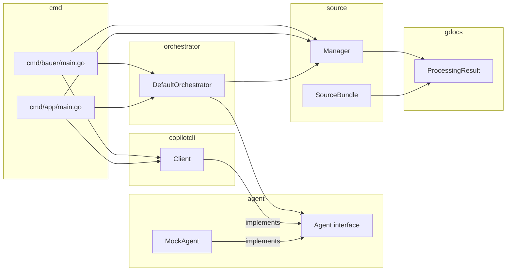
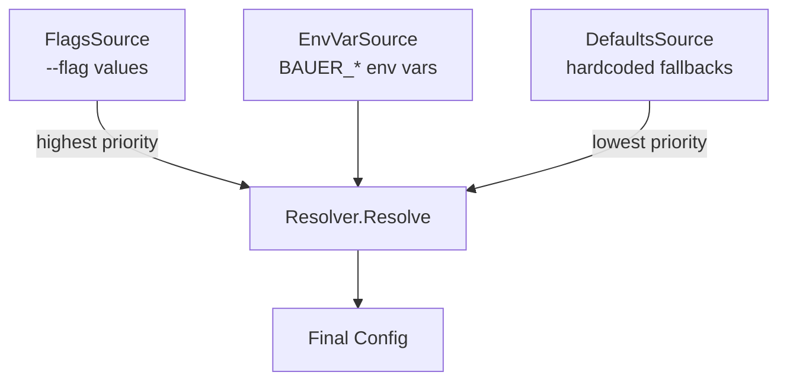

# Bauer v2 Implementation Log

_Coordination file for the multi-agent implementation of specs 001 and 002._

---

## How to use this file

Each sub-agent appends its entry to the **Branch Log** section below. You (the reviewer) read through these entries in order to understand what was implemented in each branch, then check out each branch and review it as a PR against the previous.

**Review guide:**
1. Start with the **Branch Chain** section — it gives you the full sequence.
2. For each branch: read the log entry, check out the branch, review the diff.
3. Each branch is independently reviewable as a PR against its parent.

---

## Branch Chain

| Order | Branch | Parent | Phase / Tasks | Status |
|-------|--------|--------|---------------|--------|
| 0 | `feature/bauer-v2` | `main` | Base branch — no code changes | ✅ created |
| 1 | `feat/phase-0a-agent-source` | `feature/bauer-v2` | 001 Phase 0: T0.1, T0.2, T0.2a, T0.2b | ✅ done |
| 2 | `feat/phase-0b-artifacts-config` | `feat/phase-0a-agent-source` | 001 Phase 0: T0.2c, T0.3, T0.4, T0.5 | ✅ done |
| 3 | `feat/phase-1-cli-restore` | `feat/phase-0b-artifacts-config` | 001 Phase 1: T1.1, T1.2, T1.3 | ✅ done |
| 4 | `feat/phase-2-cli-features` | `feat/phase-1-cli-restore` | 001 Phase 2: T2.1, T2.2, T2.3 | ✅ done |
| 5 | `feat/figma-phase-b-client` | `feat/phase-2-cli-features` | 002 Phase B: T2F.0, T2F.1, T2F.2, T2F.3, T2F.4 | ✅ done |
| 6 | `feat/figma-phase-c-mapping` | `feat/figma-phase-b-client` | 002 Phase C: T2F.5, T2F.6, T2F.7 | ✅ done |
| 7 | `feat/figma-phase-d-cli` | `feat/figma-phase-c-mapping` | 002 Phase D: T2F.8, T2F.9 | ⏳ pending |
| 8 | `feat/figma-phase-e-drift` | `feat/figma-phase-d-cli` | 002 Phase E: T2F.10 | ⏳ pending |
| 9 | `feat/phase-3-api-foundation` | `feat/figma-phase-e-drift` | 001 Phase 3: T3.0, T3.1, T3.2, T3.3, T3.4 | ⏳ pending |
| 10 | `feat/phase-4-api-endpoints` | `feat/phase-3-api-foundation` | 001 Phase 4: T4.1, T4.2, T4.3 | ⏳ pending |
| 11 | `feat/phase-5-auth-security` | `feat/phase-4-api-endpoints` | 001 Phase 5: T5.1, T5.2, T5.3 | ⏳ pending |
| 12 | `feat/figma-phase-f-api` | `feat/phase-5-auth-security` | 002 Phase F: T4F.1, T4F.2 | ⏳ pending |

---

## Branch Log

---

### Branch 1: `feat/phase-0a-agent-source`

_Parent: `feature/bauer-v2`_

**Tasks:** T0.1, T0.2, T0.2a, T0.2b

**Summary:** Introduced the `agent.Agent` interface to decouple the orchestrator from `copilotcli.Client`. Created the `source` layer (`source.Manager`) so the orchestrator no longer imports `gdocs` directly. `copilotcli.Client` now satisfies `agent.Agent` via a compile-time check. All call sites in `cmd/bauer` and `cmd/app` updated to use `orchestrator.New(agent, sources)`. Also fixed pre-existing test failures: `Config.DryRun` promoted to `*bool` with `BoolPtr`/`BoolVal` helpers; `config.CLIFlags` added; `cmd/bauer` now has `resolveCLIConfig` and `openPRExecutionConfig`; `config_test.go` updated with valid credentials JSON fixture.

**Files changed:**
- `internal/agent/agent.go` — new: `Agent` interface with `Start`, `ExecuteChunk`, `GenerateSummary`, `Stop`
- `internal/agent/mock.go` — new: `MockAgent` no-op implementation for tests
- `internal/agent/agent_test.go` — new: tests for `MockAgent` and compile-time interface check
- `internal/source/source.go` — new: `Adapter` interface and `Request` type
- `internal/source/types.go` — new: `SourceBundle` wrapping `*gdocs.ProcessingResult` and design placeholder
- `internal/source/manager.go` — new: `Manager` with `NewManager` and `Fetch` (calls gdocs)
- `internal/source/manager_test.go` — new: tests for `NewManager` and empty-request `Fetch`
- `internal/copilotcli/client.go` — updated: `Start` accepts `context.Context`; `GenerateSummary` signature changed to `(ctx, []string, model) (string, error)`; `buildSummaryPrompt` simplified to `[]string`; compile-time check `var _ agent.Agent = (*Client)(nil)` added
- `internal/orchestrator/orchestrator.go` — major refactor: no longer imports `copilotcli` or `gdocs`; `DefaultOrchestrator` holds `agent.Agent` and `*source.Manager`; `New(agent, sources)` constructor; `OrchestrationResult.ExtractionResult` renamed to `ExtractionBundle *source.SourceBundle`; local `ChunkOutput` type; `executeAgentChunks` uses `agent.Agent`
- `internal/config/config.go` — `DryRun` changed from `bool` to `*bool`; `BoolPtr` and `BoolVal` helpers added
- `internal/config/cli.go` — `CLIFlags` struct added; `DryRun` assignment fixed for `*bool`
- `internal/config/config_test.go` — credentials fixture updated to valid service-account JSON
- `internal/workflow/workflow.go` — `DryRun: config.BoolPtr(input.DryRun)` and `ExtractionBundle` reference
- `cmd/bauer/main.go` — uses `orchestrator.New(copilotAgent, sources)`; adds `resolveCLIConfig` and `openPRExecutionConfig`
- `cmd/app/main.go` — uses `orchestrator.New(copilotAgent, sources)`

**Diagram:**



---

### Branch 2: `feat/phase-0b-artifacts-config`

_Parent: `feat/phase-0a-agent-source`_

**Tasks:** T0.2c, T0.3, T0.4, T0.5

**Summary:** Added append-only artifact storage (`internal/artifacts`) that writes per-run directories with extraction results, prompts, outputs, and a `runs.jsonl` index. Introduced a layered config resolver (`internal/config/manager.go`) with `DefaultsSource`, `EnvVarSource`, and `FlagsSource`; `Config.PageRefresh` promoted to `*bool` to enable explicit-false override. Removed `json.go` and the `--config` flag; credentials are now supplied exclusively via flags or `BAUER_*` env vars. `BAUER_GITHUB_TOKEN` is now checked first in `GetGitHubToken`. Added `.env.example`, updated `.gitignore` (adds `config.json`, `*.pem`), and refreshed `Taskfile.yml` (removes `--config config.json` reference, adds `verify-figma` task).

**Files changed:**
- `internal/artifacts/manager.go` — new: `Manager`, `RunMetadata`, `RunIndexEntry`; `NewManager`, `NewRunID`, `StartRun`, `CompleteRun`, `WriteGDocsExtraction`, `WritePrompt`, `WriteOutput`, `WriteSummary`, `WriteIssueBody`, `EnsureScreenshotsDir`
- `internal/artifacts/manager_test.go` — new: tests for `NewRunID` format, `StartRun` directory structure, `CompleteRun` JSONL append
- `internal/config/config.go` — `PageRefresh bool→*bool`; new fields: `ArtifactsDir`, `BranchPrefix`, `FigmaURL`, `FigmaToken`, `GitHubRepo`, `OpenPR *bool`, `OpenIssue *bool`; `ApplyDefaults` uses `BoolVal(PageRefresh)` and sets `ArtifactsDir` default
- `internal/config/cli.go` — removed `ConfigFile` field and `--config` flag; added `ArtifactsDir` field and `--artifacts-dir` flag; `PageRefresh` now assigned as `*bool` pointer
- `internal/config/json.go` — deleted
- `internal/config/manager.go` — new: `Source` interface, `Resolver`, `mergeConfig`, `EnvVarSource`, `DefaultsSource`, `FlagsSource`
- `internal/config/manager_test.go` — new: tests for env override, zero-value non-override, bool pointer behaviour, credentials fallback chain
- `internal/config/config_test.go` — `PageRefresh: tt.pageRefreshFlag` → `BoolPtr(tt.pageRefreshFlag)`
- `internal/orchestrator/orchestrator.go` — accepts `*artifacts.Manager` in `New`; `Execute` calls `StartRun`/`WriteGDocsExtraction`/`WritePrompt`/`WriteOutput`/`WriteSummary`/`CompleteRun`; `cfg.PageRefresh` uses `BoolVal`
- `internal/github/auth.go` — `GetGitHubToken` checks `BAUER_GITHUB_TOKEN` before `GITHUB_TOKEN`/`GH_TOKEN`
- `cmd/bauer/main.go` — passes `artifacts.NewManager("")` to `orchestrator.New`
- `cmd/app/main.go` — passes `artifacts.NewManager(cfg.ArtifactsDir)` to `orchestrator.New`
- `cmd/app/types/config.go` — added `ArtifactsDir` field; removed `--config` flag and `LoadFromJSONFile` call; credentials env fallback added
- `cmd/app/v1/api.go` — `PageRefresh: config.BoolPtr(payload.PageRefresh)`
- `internal/workflow/workflow.go` — `PageRefresh: config.BoolPtr(input.PageRefresh)`
- `.gitignore` — added `config.json`, `*.pem`
- `.env.example` — new: full reference for all `BAUER_*` env vars
- `Taskfile.yml` — `run-server` uses `--credentials` flag; added `verify-figma` task; added `.env.example` comment

**Config resolution priority (highest → lowest):**



---

### Branch 3: `feat/phase-1-cli-restore`

_Parent: `feat/phase-0b-artifacts-config`_

**Tasks:** T1.1, T1.2, T1.3

**Summary:** Rewrote `cmd/bauer/main.go` to use the layered config resolver, restored all required CLI flags (`--doc-id`, `--credentials`, `--chunk-size`, `--page-refresh`, `--model`, `--summary-model`, `--dry-run`, `--artifacts-dir`, `--open-pr`, `--open-issue`, `--branch-prefix`). Switched from global `flag` package to `flag.FlagSet` for testability. Added mutual-exclusion check for `--open-pr` / `--open-issue` before any network calls. `--dry-run` semantics clarified in help text: standalone mode skips Copilot entirely; `--open-pr` mode applies changes locally but skips PR creation. Added `runOpenIssue` / `runOpenPR` stubs returning "not yet implemented". Added `BranchPrefix`, `OpenPR`, `OpenIssue` to `CLIFlags` struct and `FlagsSource.Load()`; added `CredentialsPath: "credentials.json"` fallback to `DefaultsSource`. Updated `Taskfile.yml` with split `build`/`build-api` tasks, standalone `run` using `{{.CLI_ARGS}}`, `run-api`, `test`, `lint`, and enhanced `verify-figma` with `FILE_KEY` check.

**Files changed:**
- `cmd/bauer/main.go` — full rewrite: `flag.FlagSet`; all flags; mutual-exclusion guard; `resolveCLIConfig` using `config.NewResolver`; `openPRExecutionConfig`; `runOpenIssue`/`runOpenPR` stubs; mode dispatch
- `internal/config/cli.go` — `CLIFlags` extended with `BranchPrefix string`, `OpenPR *bool`, `OpenIssue *bool`
- `internal/config/manager.go` — `DefaultsSource.Load()` adds `CredentialsPath: "credentials.json"`; `FlagsSource.Load()` maps `BranchPrefix`, `OpenPR`, `OpenIssue`
- `Taskfile.yml` — split `build`/`build-api`; `run` → `go run ./cmd/bauer/ {{.CLI_ARGS}}`; `run-api`; `test` → `go test ./...`; `lint` → golangci-lint; `verify-figma` with FILE_KEY check; kept `clean`

---

### Branch 4: `feat/phase-2-cli-features`

_Parent: `feat/phase-1-cli-restore`_

**Tasks:** T2.1, T2.2, T2.3

**Summary:** Implemented `--open-issue` and `--open-pr` CLI modes. Added `--github-repo` flag (maps to `cfg.GitHubRepo`). Replaced the mutual-exclusion inline check with a pure `validateFlags(openPR, openIssue bool) error` function called immediately after `fs.Parse`, before any I/O or env-var resolution (T2.3). Implemented `runOpenIssue`: runs the orchestrator in dry-run mode to extract suggestions without invoking Copilot, then builds a structured markdown issue body (categorising suggestions as copy changes vs content additions, with optional Figma link and a next-steps command) and creates the issue via the GitHub REST API using `net/http` (T2.1). Implemented `runOpenPR`: resolves the GitHub token, runs the orchestrator with Copilot enabled, creates a new git branch `<prefix>/<runID>`, stages and commits all changes, pushes the branch, and opens a PR via the `gh` CLI (T2.2). Added `RunID string` field to `OrchestrationResult` so branch naming uses the artifact run ID. Added `GitHubRepo` to `CLIFlags` and `FlagsSource`. Created `internal/github/issue.go` (REST API `CreateIssue`) and `internal/github/git.go` (`RunGit` helper). Updated tests to use `validateFlags` and verify the workflow functions are implemented beyond stub status.

**Files changed:**
- `cmd/bauer/main.go` — full rewrite: adds `--github-repo` flag; `validateFlags` replaces inline mutual-exclusion guard; implements `runOpenIssue`, `buildIssueBody`, `runOpenPR`, `buildPRBody`, `countAllSuggestions`; `runOpenPR` signature gains `repoDir string`
- `cmd/bauer/main_test.go` — replaces `checkMutualExclusion`/stub tests with `TestValidateFlags_*` suite (T2.3) and `TestRunOpenIssue/PR_ProceedsToWorkflow` (verifies stubs replaced)
- `internal/orchestrator/orchestrator.go` — `OrchestrationResult` gains `RunID string`; both return paths populate it from `runID`
- `internal/config/cli.go` — `CLIFlags` gains `GitHubRepo string`
- `internal/config/manager.go` — `FlagsSource.Load()` maps `GitHubRepo`
- `internal/github/issue.go` — new: `CreateIssue(ctx, token, repo, title, body) (string, error)` via `net/http` GitHub REST API
- `internal/github/git.go` — new: `RunGit(ctx, dir string, args ...string) (string, error)` helper using `os/exec`

---

### Branch 5: `feat/figma-phase-b-client`

_Parent: `feat/phase-2-cli-features`_

**Tasks:** T2F.0, T2F.1, T2F.2, T2F.3, T2F.4

**Summary:** Introduced the `internal/figma` package: URL parser, REST API client, raw API types, and a normalization layer. The `SourceBundle.Design` field upgraded from `any` to `*figma.NormalizedDesign`. Added `FetchFigma` to `source.Manager`. Updated the `verify-figma` Taskfile task output to label Name/Last modified. Added `--figma-url` CLI flag and Figma token validation to `Config.Validate()`. All config plumbing (env vars, flags, defaults) was already in place from phase-0b.

**Files changed:**
- `internal/figma/link.go` — new: `LinkRef`, `ParseLink` — extracts file key and node ID from `/file/` and `/design/` Figma URLs
- `internal/figma/link_test.go` — new: table-driven tests for whole-file, node-specific, and invalid URLs
- `internal/figma/types.go` — new: raw API types (`FileMeta`, `DocumentNode`, `NodeEntry`, `NodesResponse`, `Comment`, `CommentsResponse`, `imagesResponse`) and Bauer-owned types (`NormalizedDesign`, `DesignAnchor`, `DesignComment`, `ScreenshotArtifact`)
- `internal/figma/client.go` — new: `Client` with `NewClient`, `NewClientWithHTTP` (for tests), `GetMeta`, `GetNodes`, `GetComments`, `GetImages`, `DownloadImage`; generic `doGet[T]` helper; structured error messages for 401/403/429/404
- `internal/figma/client_test.go` — new: mock HTTP server tests via `httptest.NewServer` and `prefixTransport`; covers success path, auth failure, 404, rate limit, empty node/image ID short-circuits
- `internal/figma/normalize.go` — new: `Normalize()` converts raw API payloads into `NormalizedDesign`; `extractAnchors` walks the node tree collecting TEXT/INSTANCE children
- `internal/figma/normalize_test.go` — new: covers empty children, no comments/screenshots, resolved/unresolved comments, whole-file vs node-specific fetch, text extraction, component ID extraction, screenshots, meta fields
- `internal/source/types.go` — `Design any` → `Design *figma.NormalizedDesign`
- `internal/source/manager.go` — added `FetchFigma(ctx, client, ref, screenshotDir)` method; added `figma`, `path/filepath`, `strings` imports
- `internal/config/cli.go` — `CLIFlags.FigmaURL` field added; `--figma-url` flag registered; `FigmaURL` mapped in `Config` construction
- `internal/config/manager.go` — `FlagsSource.Load()` maps `FigmaURL`
- `internal/config/config.go` — `Validate()` returns error when `FigmaURL != ""` and `FigmaToken == ""`
- `Taskfile.yml` — `verify-figma` output updated to label `Name:` and `| Last modified:`

**External API docs used:**
- https://developers.figma.com/docs/rest-api/
- https://developers.figma.com/docs/rest-api/file-endpoints/
- https://developers.figma.com/docs/rest-api/comments-endpoints/

---

### Branch 6: `feat/figma-phase-c-mapping`

_Parent: `feat/figma-phase-b-client`_

**Tasks:** T2F.5, T2F.6, T2F.7

**Summary:** Introduced `internal/source/mapping` — a resolver that joins `gdocs.LocationGroupedSuggestions` with `figma.NormalizedDesign` data into `ResolvedChunk` values. The resolver uses a four-strategy priority chain: (1) user-supplied node ID from URL (confidence 1.0), (2) Jaccard text-layer similarity against `NearestText` (threshold 0.30, confidence 0.50–0.95), (3) frame-name overlap (threshold 0.50, confidence 0.50–0.85), (4) fallback to first anchor (confidence 0.50, status "unresolved"). Resolved Figma comments are excluded from `ResolvedChunk.Comments`; screenshots are matched by node ID. Updated `internal/prompt/engine.go`: added `FigmaContextJSON` and `FigmaURL` fields to `PromptData`; added `GenerateChunksFromResolved` that batches `[]mapping.ResolvedChunk` into `[]PromptData` and serializes figma context as JSON; updated `RenderChunk` to parse `FigmaContextJSON` and render the figma-context template with `text/template` when non-empty. Created `internal/prompt/templates/figma-context.md` with anchor, screenshot, and comment sections. Extended `internal/artifacts/manager.go` with `WriteFigmaExtraction`, `WriteMappings`, and `WriteFigmaComments` methods that persist design data to `extraction/` alongside the existing gdocs extraction.

**Files changed:**
- `internal/source/mapping/types.go` — new: `ResolvedChunk`, `DesignAnchorRef`, `DesignCommentRef`, `MappingMetadata`
- `internal/source/mapping/resolver.go` — new: `Resolver.Build`, `resolveAnchor`, `matchByTextLayers` (Jaccard), `matchByFrameName`, `screenshotsForAnchors`, `commentsForAnchors`, `tokenize`, `tokenizeFromSuggestion`, `toSet`, `intersect`, `unionSets`
- `internal/source/mapping/resolver_test.go` — new: 9 test cases covering nil design, URL method, text method, name method, fallback, no-anchors, resolved/unresolved comments, screenshots, empty input
- `internal/prompt/engine.go` — `PromptData` gains `FigmaContextJSON` and `FigmaURL`; added `figmaContextTemplate` embed; added `figmaChunkContext` struct; added `GenerateChunksFromResolved`, `buildFigmaContextJSON`, `batchResolvedChunks`; `RenderChunk` appends figma section via `text/template` when `FigmaContextJSON != ""`; added imports `text/template`, `bauer/internal/source/mapping`
- `internal/prompt/templates/figma-context.md` — new: design context template with anchors, screenshots, and comments sections rendered via `text/template`
- `internal/prompt/engine_test.go` — added `mapping` import; 6 new test functions: `TestGenerateChunksFromResolved_NoFigma`, `TestGenerateChunksFromResolved_WithFigma`, `TestGenerateChunksFromResolved_MultiChunkBatching`, `TestRenderChunk_NoFigma_NoFigmaSection`, `TestRenderChunk_WithFigma_IncludesFigmaSection`; `makeResolvedChunk` helper
- `internal/artifacts/manager.go` — added imports `bauer/internal/figma`, `bauer/internal/source/mapping`; added `WriteFigmaExtraction`, `WriteMappings`, `WriteFigmaComments`
- `internal/artifacts/manager_test.go` — added imports for `figma`, `gdocs`, `mapping`; added `TestWriteFigmaExtraction`, `TestWriteMappings`, `TestWriteFigmaComments`

---

### Branch 7: `feat/figma-phase-d-cli`

_Parent: `feat/figma-phase-c-mapping`_

**Tasks:** T2F.8, T2F.9

**Summary:** Threaded Figma through the CLI and orchestrator (T2F.8) and added an optional MCP guidance block to prompts (T2F.9). Added `--figma-url` flag to `cmd/bauer/main.go`, wired into `CLIFlags.FigmaURL`. `orchestrator.Execute` now forks on `cfg.FigmaURL != ""`: the figma-aware path calls the new `generateChunksWithFigma()` method which fetches design data via `sources.FetchFigma`, runs `mapping.Resolver.Build`, persists figma artifacts (extraction, comments, mappings), and generates prompts via `engine.RenderChunksFromResolved`. For T2F.9: added `FigmaURL string` field (with `json:"-"`) to `figmaChunkContext` in `engine.go`; `RenderChunk` now sets `ctx.FigmaURL = data.FigmaURL` before template execution; added an optional MCP guidance block to `internal/prompt/templates/figma-context.md` that renders only when `{{if .FigmaURL}}`; added `Engine.RenderChunksFromResolved()` which generates figma-aware prompt files using `GenerateChunksFromResolved` + `RenderChunk`. `BAUER_FIGMA_TOKEN` env var usage mentioned in `--help` output.

**Files changed:**
- `cmd/bauer/main.go` — added `--figma-url` flag; `CLIFlags.FigmaURL` wired through `FlagsSource`; `BAUER_FIGMA_TOKEN` env var note in help text
- `internal/orchestrator/orchestrator.go` — `Execute` forks on `cfg.FigmaURL != ""`; new `generateChunksWithFigma()` method: calls `figma.ParseLink`, `figma.NewClient`, `sources.FetchFigma`, `mapping.Resolver.Build`, `arts.WriteFigmaExtraction`/`WriteFigmaComments`/`WriteMappings`, `engine.RenderChunksFromResolved`; log line uses `design.Anchors` (not `.Nodes`)
- `internal/prompt/engine.go` — `figmaChunkContext` gains `FigmaURL string` (json:"-"); `RenderChunk` sets `ctx.FigmaURL = data.FigmaURL`; new `RenderChunksFromResolved()` method that calls `GenerateChunksFromResolved` + `RenderChunk` and writes prompt files to disk
- `internal/prompt/templates/figma-context.md` — optional `{{if .FigmaURL}}` MCP guidance block added at end of template

---

### Branch 8: `feat/figma-phase-e-drift`

_Parent: `feat/figma-phase-d-cli`_

**Tasks:** T2F.10

**Summary:** Implemented drift detection and mapping cache reuse for Figma-backed runs. `RunMetadata` and `RunIndexEntry` gained a `FigmaVersion` field, and three new methods were added to `artifacts.Manager`: `LoadPreviousMeta` (scans `runs.jsonl` in reverse to find the most recent successful run with a matching DocID and Figma file key), `LoadMappings` (reads `extraction/mappings.json` from a prior run), and `UpdateRunFigmaVersion` (patches the current run's `metadata.json` after a fresh Figma fetch). In `generateChunksWithFigma`, a `GetMeta` call is now made before any other Figma API calls; if the version is unchanged versus the previous run, the stored mappings are reused and `GetNodes`/screenshot downloads are skipped; if changed, a warning is logged and a full re-fetch proceeds. `Resolver.Build` was hardened with a post-process normalization step that explicitly marks any chunk with `Confidence < 0.5`, `Method == "fallback"`, or `Method == "none"` as `Status: "unresolved"`, preventing silent promotion of low-quality mappings.

**Files changed:**
- `internal/artifacts/manager.go`: Added `FigmaVersion` field to `RunMetadata` and `RunIndexEntry`; added `LoadPreviousMeta`, `LoadMappings`, and `UpdateRunFigmaVersion` methods; added `bufio` import for JSONL scanning.
- `internal/orchestrator/orchestrator.go`: Rewrote `generateChunksWithFigma` to call `GetMeta` first for drift detection, consult `LoadPreviousMeta`/`LoadMappings` for cache reuse, log version changes as warnings, and call `UpdateRunFigmaVersion` after each fresh Figma fetch.
- `internal/source/mapping/resolver.go`: Added post-process normalization loop in `Build` that sets `Status: "unresolved"` for any mapping with `Confidence < 0.5`, `Method == "fallback"`, or `Method == "none"`.

---

### Branch 9: `feat/phase-3-api-foundation`

_Parent: `feat/figma-phase-e-drift`_

**Tasks:** T3.0, T3.1, T3.2, T3.3, T3.4

**Summary:** Added Docker support, env-file loading, secrets removal from the API request body, route rename, and a build task. T3.0 introduced a multi-stage `Dockerfile` (golang:1.22 builder + debian:bookworm-slim runtime with git, curl, and the GitHub CLI installed) and a `.dockerignore` that excludes secrets, build artifacts, and the git directory; two new Taskfile tasks (`docker-build`, `docker-run`) wire the image build and local container run. T3.1 installed `github.com/joho/godotenv` and updated `cmd/app/main.go` to call `godotenv.Load` for both `.env` and `.env.local` (errors silently ignored) before calling `run()`; `.env` was replaced with a committed, non-sensitive defaults file covering port, model, chunk size, page-refresh, output directory, and branch prefix. T3.2 stripped `Credentials`, `GitHubToken`, `OutputDir`, and `LocalRepoPath` from `APIRequest`, replacing them with env-var lookups (`BAUER_CREDENTIALS_PATH`/`GOOGLE_APPLICATION_CREDENTIALS` and `github.GetGitHubToken()`) inside the handler; `firstNonEmpty` and `firstNonZero` helpers apply request-field-overrides-env semantics; `SummaryModel` was added to `APIRequest` for future use. T3.3 renamed the `/api/v1/workflow` route to `POST /api/v1/workflows` using Go 1.22 method+path routing. T3.4 was already present in the Taskfile from a prior branch (`build-api` task).

**Files changed:**
- `Dockerfile`: New multi-stage build — golang:1.22 builder compiles `bauer-api`; debian:bookworm-slim runtime installs git, curl, ca-certificates, and the GitHub CLI; exposes port 8090.
- `.dockerignore`: Excludes `.env.local`, `config.json`, `*.pem`, build binaries, `bauer-output/`, logs, and `.git/` from the Docker build context.
- `Taskfile.yml`: Added `docker-build` (builds `bauer-api:latest`) and `docker-run` (runs container with `--env-file .env.local` and a read-only credentials volume mount) tasks.
- `.env`: Replaced old placeholder content with committed non-sensitive defaults (`BAUER_API_PORT`, `BAUER_MODEL`, `BAUER_SUMMARY_MODEL`, `BAUER_CHUNK_SIZE`, `BAUER_PAGE_REFRESH`, `BAUER_OUTPUT_DIR`, `BAUER_BRANCH_PREFIX`).
- `cmd/app/main.go`: Added `github.com/joho/godotenv` import; `main()` now calls `godotenv.Load(".env")` and `godotenv.Load(".env.local")` before `run()`; route changed from `"/api/v1/workflow"` to `"POST /api/v1/workflows"` using Go 1.22 method+path syntax.
- `internal/workflow/api.go`: Removed `GitHubToken`, `Credentials`, `OutputDir`, and `LocalRepoPath` fields from `APIRequest`; added `SummaryModel` field; handler now resolves GitHub token via `github.GetGitHubToken()` and credentials from `BAUER_CREDENTIALS_PATH`/`GOOGLE_APPLICATION_CREDENTIALS`; added `firstNonEmpty` and `firstNonZero` helper functions; added `os` and `bauer/internal/github` imports.
- `go.mod` / `go.sum`: Added `github.com/joho/godotenv v1.5.1` dependency.

---

### Branch 10: `feat/phase-4-api-endpoints`

_Parent: `feat/phase-3-api-foundation`_

**Tasks:** T4.1, T4.2, T4.3

**Summary:** Added three new API endpoints to the Bauer API server. `POST /api/v1/issues` (T4.1) runs the orchestrator in dry-run mode (extraction + prompt generation only, no Copilot), builds a markdown issue body summarising the plan, and creates a GitHub issue via the REST API, returning the issue URL and number. `GET /api/v1/health/ready` (T4.2) is a K8s-compatible readiness probe registered on the public mux without authentication; it checks for a readable credentials file, a GitHub token, and the `gh` CLI in PATH, returning 503 with a `missing` map if any check fails. `POST /api/v1/webhooks/jira` (T4.3) validates an optional shared secret with a constant-time comparison, extracts a Google Doc ID from a configurable Jira custom field, and fires the full BAU workflow asynchronously, responding immediately with 202 Accepted. Updated `github.CreateIssue` to return the issue number in addition to the URL.

**Files changed:**

- `internal/github/issue.go` — updated `CreateIssue` signature from `(string, error)` to `(string, int, error)` to also return the issue number parsed from the GitHub API JSON response
- `cmd/bauer/main.go` — updated `runOpenIssue` to use the new three-return-value `github.CreateIssue` (ignoring the number with `_`)
- `cmd/app/v1/helpers.go` — new: `httpError`, `firstNonEmpty`, and `firstNonZero` helpers shared across v1 handlers
- `cmd/app/v1/issues.go` — new: `IssuesHandler` and `formatIssueBody` implementing `POST /api/v1/issues` (T4.1)
- `cmd/app/v1/api.go` — added `ReadinessHandler` for `GET /api/v1/health/ready` (T4.2); added imports for `os`, `os/exec`, and `bauer/internal/github`
- `internal/jira/payload.go` — new package: `WebhookPayload` struct and `ExtractDocID` helper (T4.3)
- `cmd/app/v1/jira.go` — new: `JiraWebhookHandler` implementing `POST /api/v1/webhooks/jira` with constant-time secret validation and async workflow execution (T4.3)
- `cmd/app/main.go` — registered `GET /api/v1/health/ready`, `POST /api/v1/issues`, and `POST /api/v1/webhooks/jira` routes
- `.env` — added `BAUER_JIRA_WEBHOOK_SECRET` and `BAUER_JIRA_DOC_FIELD` env var documentation

---

### Branch 11: `feat/phase-5-auth-security`

_Parent: `feat/phase-4-api-endpoints`_

**Tasks:** T5.1, T5.2, T5.3

**Summary:** _(to be filled by agent)_

**Files changed:** _(to be filled by agent)_

---

### Branch 12: `feat/figma-phase-f-api`

_Parent: `feat/phase-5-auth-security`_

**Tasks:** T4F.1, T4F.2

**Summary:** _(to be filled by agent)_

**Files changed:** _(to be filled by agent)_

---

## Reviewing a Branch

To review branch N:

```bash
git checkout <branch-name>
git diff <parent-branch> -- .
```

Or on GitHub, open a PR from `<branch-name>` into `<parent-branch>`.

Each branch is a clean, independently reviewable unit. You can review them in any order, but reviewing in the listed order (1 → 12) builds understanding correctly.
