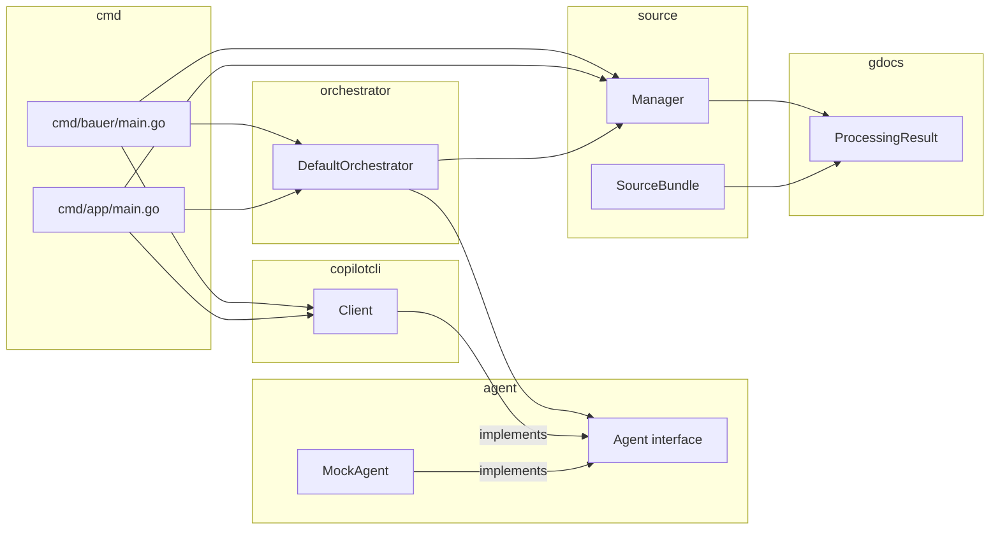

# Bauer v2 Implementation Log

_Coordination file for the multi-agent implementation of specs 001 and 002._

---

## How to use this file

Each sub-agent appends its entry to the **Branch Log** section below. You (the reviewer) read through these entries in order to understand what was implemented in each branch, then check out each branch and review it as a PR against the previous.

**Review guide:**
1. Start with the **Branch Chain** section — it gives you the full sequence.
2. For each branch: read the log entry, check out the branch, review the diff.
3. Each branch is independently reviewable as a PR against its parent.

---

## Branch Chain

| Order | Branch | Parent | Phase / Tasks | Status |
|-------|--------|--------|---------------|--------|
| 0 | `feature/bauer-v2` | `main` | Base branch — no code changes | ✅ created |
| 1 | `feat/phase-0a-agent-source` | `feature/bauer-v2` | 001 Phase 0: T0.1, T0.2, T0.2a, T0.2b | ✅ done |
| 2 | `feat/phase-0b-artifacts-config` | `feat/phase-0a-agent-source` | 001 Phase 0: T0.2c, T0.3, T0.4, T0.5 | ⏳ pending |
| 3 | `feat/phase-1-cli-restore` | `feat/phase-0b-artifacts-config` | 001 Phase 1: T1.1, T1.2, T1.3 | ⏳ pending |
| 4 | `feat/phase-2-cli-features` | `feat/phase-1-cli-restore` | 001 Phase 2: T2.1, T2.2, T2.3 | ⏳ pending |
| 5 | `feat/figma-phase-b-client` | `feat/phase-2-cli-features` | 002 Phase B: T2F.0, T2F.1, T2F.2, T2F.3, T2F.4 | ⏳ pending |
| 6 | `feat/figma-phase-c-mapping` | `feat/figma-phase-b-client` | 002 Phase C: T2F.5, T2F.6, T2F.7 | ⏳ pending |
| 7 | `feat/figma-phase-d-cli` | `feat/figma-phase-c-mapping` | 002 Phase D: T2F.8, T2F.9 | ⏳ pending |
| 8 | `feat/figma-phase-e-drift` | `feat/figma-phase-d-cli` | 002 Phase E: T2F.10 | ⏳ pending |
| 9 | `feat/phase-3-api-foundation` | `feat/figma-phase-e-drift` | 001 Phase 3: T3.0, T3.1, T3.2, T3.3, T3.4 | ⏳ pending |
| 10 | `feat/phase-4-api-endpoints` | `feat/phase-3-api-foundation` | 001 Phase 4: T4.1, T4.2, T4.3 | ⏳ pending |
| 11 | `feat/phase-5-auth-security` | `feat/phase-4-api-endpoints` | 001 Phase 5: T5.1, T5.2, T5.3 | ⏳ pending |
| 12 | `feat/figma-phase-f-api` | `feat/phase-5-auth-security` | 002 Phase F: T4F.1, T4F.2 | ⏳ pending |

---

## Branch Log

---

### Branch 1: `feat/phase-0a-agent-source`

_Parent: `feature/bauer-v2`_

**Tasks:** T0.1, T0.2, T0.2a, T0.2b

**Summary:** Introduced the `agent.Agent` interface to decouple the orchestrator from `copilotcli.Client`. Created the `source` layer (`source.Manager`) so the orchestrator no longer imports `gdocs` directly. `copilotcli.Client` now satisfies `agent.Agent` via a compile-time check. All call sites in `cmd/bauer` and `cmd/app` updated to use `orchestrator.New(agent, sources)`. Also fixed pre-existing test failures: `Config.DryRun` promoted to `*bool` with `BoolPtr`/`BoolVal` helpers; `config.CLIFlags` added; `cmd/bauer` now has `resolveCLIConfig` and `openPRExecutionConfig`; `config_test.go` updated with valid credentials JSON fixture.

**Files changed:**
- `internal/agent/agent.go` — new: `Agent` interface with `Start`, `ExecuteChunk`, `GenerateSummary`, `Stop`
- `internal/agent/mock.go` — new: `MockAgent` no-op implementation for tests
- `internal/agent/agent_test.go` — new: tests for `MockAgent` and compile-time interface check
- `internal/source/source.go` — new: `Adapter` interface and `Request` type
- `internal/source/types.go` — new: `SourceBundle` wrapping `*gdocs.ProcessingResult` and design placeholder
- `internal/source/manager.go` — new: `Manager` with `NewManager` and `Fetch` (calls gdocs)
- `internal/source/manager_test.go` — new: tests for `NewManager` and empty-request `Fetch`
- `internal/copilotcli/client.go` — updated: `Start` accepts `context.Context`; `GenerateSummary` signature changed to `(ctx, []string, model) (string, error)`; `buildSummaryPrompt` simplified to `[]string`; compile-time check `var _ agent.Agent = (*Client)(nil)` added
- `internal/orchestrator/orchestrator.go` — major refactor: no longer imports `copilotcli` or `gdocs`; `DefaultOrchestrator` holds `agent.Agent` and `*source.Manager`; `New(agent, sources)` constructor; `OrchestrationResult.ExtractionResult` renamed to `ExtractionBundle *source.SourceBundle`; local `ChunkOutput` type; `executeAgentChunks` uses `agent.Agent`
- `internal/config/config.go` — `DryRun` changed from `bool` to `*bool`; `BoolPtr` and `BoolVal` helpers added
- `internal/config/cli.go` — `CLIFlags` struct added; `DryRun` assignment fixed for `*bool`
- `internal/config/config_test.go` — credentials fixture updated to valid service-account JSON
- `internal/workflow/workflow.go` — `DryRun: config.BoolPtr(input.DryRun)` and `ExtractionBundle` reference
- `cmd/bauer/main.go` — uses `orchestrator.New(copilotAgent, sources)`; adds `resolveCLIConfig` and `openPRExecutionConfig`
- `cmd/app/main.go` — uses `orchestrator.New(copilotAgent, sources)`

**Diagram:**



---

### Branch 2: `feat/phase-0b-artifacts-config`

_Parent: `feat/phase-0a-agent-source`_

**Tasks:** T0.2c, T0.3, T0.4, T0.5

**Summary:** _(to be filled by agent)_

**Files changed:** _(to be filled by agent)_

**Docs / references:** _(to be filled by agent)_

---

### Branch 3: `feat/phase-1-cli-restore`

_Parent: `feat/phase-0b-artifacts-config`_

**Tasks:** T1.1, T1.2, T1.3

**Summary:** _(to be filled by agent)_

**Files changed:** _(to be filled by agent)_

---

### Branch 4: `feat/phase-2-cli-features`

_Parent: `feat/phase-1-cli-restore`_

**Tasks:** T2.1, T2.2, T2.3

**Summary:** _(to be filled by agent)_

**Files changed:** _(to be filled by agent)_

---

### Branch 5: `feat/figma-phase-b-client`

_Parent: `feat/phase-2-cli-features`_

**Tasks:** T2F.0, T2F.1, T2F.2, T2F.3, T2F.4

**Summary:** _(to be filled by agent)_

**Files changed:** _(to be filled by agent)_

**External API docs used:**
- https://developers.figma.com/docs/rest-api/
- https://developers.figma.com/docs/rest-api/file-endpoints/
- https://developers.figma.com/docs/rest-api/comments-endpoints/

---

### Branch 6: `feat/figma-phase-c-mapping`

_Parent: `feat/figma-phase-b-client`_

**Tasks:** T2F.5, T2F.6, T2F.7

**Summary:** _(to be filled by agent)_

**Files changed:** _(to be filled by agent)_

---

### Branch 7: `feat/figma-phase-d-cli`

_Parent: `feat/figma-phase-c-mapping`_

**Tasks:** T2F.8, T2F.9

**Summary:** _(to be filled by agent)_

**Files changed:** _(to be filled by agent)_

---

### Branch 8: `feat/figma-phase-e-drift`

_Parent: `feat/figma-phase-d-cli`_

**Tasks:** T2F.10

**Summary:** _(to be filled by agent)_

**Files changed:** _(to be filled by agent)_

---

### Branch 9: `feat/phase-3-api-foundation`

_Parent: `feat/figma-phase-e-drift`_

**Tasks:** T3.0, T3.1, T3.2, T3.3, T3.4

**Summary:** _(to be filled by agent)_

**Files changed:** _(to be filled by agent)_

---

### Branch 10: `feat/phase-4-api-endpoints`

_Parent: `feat/phase-3-api-foundation`_

**Tasks:** T4.1, T4.2, T4.3

**Summary:** _(to be filled by agent)_

**Files changed:** _(to be filled by agent)_

---

### Branch 11: `feat/phase-5-auth-security`

_Parent: `feat/phase-4-api-endpoints`_

**Tasks:** T5.1, T5.2, T5.3

**Summary:** _(to be filled by agent)_

**Files changed:** _(to be filled by agent)_

---

### Branch 12: `feat/figma-phase-f-api`

_Parent: `feat/phase-5-auth-security`_

**Tasks:** T4F.1, T4F.2

**Summary:** _(to be filled by agent)_

**Files changed:** _(to be filled by agent)_

---

## Reviewing a Branch

To review branch N:

```bash
git checkout <branch-name>
git diff <parent-branch> -- .
```

Or on GitHub, open a PR from `<branch-name>` into `<parent-branch>`.

Each branch is a clean, independently reviewable unit. You can review them in any order, but reviewing in the listed order (1 → 12) builds understanding correctly.
