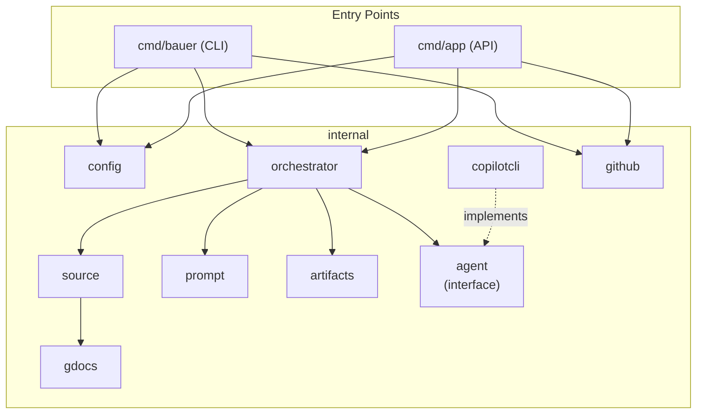

# v2 Reconciliation Plan

_Last updated: 2026-04-29_

> Everything in one place: what's broken, what we're building, how we're going to get there.

---

## Background

Bauer started as a clean CLI tool (v1) that extracts suggestions from a Google Doc and applies them via Copilot. A run of PRs (#14–#23) added an HTTP API and GitHub integration, but the two grew without a unified plan. The CLI lost core functionality, the API has security problems, and neither is production-ready. This document is the source of truth for v2: fixing what's broken, extending properly, and building a solid foundation.

---

## Problems

1. **CLI is broken** — `--github-repo` is now required, so `bauer --doc-id X --credentials Y` fails. The original flow is gone.
2. **Lost CLI flags** — `--chunk-size`, `--page-refresh`, `--model`, `--summary-model` were silently removed in PR #23.
3. **Credentials in API request bodies** — `POST /api/v1/workflow` takes a filesystem credentials path and a GitHub token in the request body. Both get logged. Both are security risks.
4. **No env var support anywhere** — makes CI, Docker, and K8s deployments unnecessarily awkward.
5. **Fragmented config** — four overlapping config systems with no shared precedence model.
6. **Two inconsistent API endpoints** — `/api/v1/job` and `/api/v1/workflow` overlap but have completely different shapes and async models.
7. **`config.json` with real values committed** — contains a real doc ID, credentials path, and local path.
8. **Stale Taskfile** — `task run` uses old flags. `task build-api` doesn't exist.
9. **Stale README** — documents old CLI, doesn't mention `/api/v1/workflow`, broken examples.
10. **No agent abstraction** — the orchestrator is tightly coupled to `copilotcli`. Swapping the AI backend requires modifying the orchestrator itself.
11. **No source abstraction** — the orchestration flow is still effectively hard-wired to Google Docs as the only upstream source.
12. **Overwrite-only run outputs** — extracted data and prompt files are overwritten on each run, which blocks traceability and later design-aware features.

## Known Limitations

These are deliberate trade-offs, not bugs. Good to be aware of:

- **Synchronous API**: `POST /api/v1/workflows` blocks until the full flow completes (can be 10–30+ minutes for large repos). HTTP clients with short timeouts will see connection drops. Acceptable for a POC — async job tracking is a future concern.
- **Single concurrent workflow per process**: No job queue. Multiple simultaneous `/api/v1/workflows` requests all run in parallel goroutines without any coordination. Not a problem at low volume; a job queue should be added before high-traffic use.
- **Temp dir management**: When the API clones a repo, it uses a temp directory. These directories are not cleaned up between requests today. A cleanup step post-workflow should be added.
- **`gh` CLI dependency**: GitHub operations use `exec.Command("gh", ...)`. The `gh` binary must be installed and authenticated in every environment that runs the API. The Dockerfile handles this. A future improvement is migrating to the GitHub REST API directly.

---

## Requirements

### CLI

- Runs **inside the target repo** — no `--github-repo` flag, no cloning. Reads the GitHub remote from local git config when needed.
- **Default mode**: extract suggestions → run Copilot SDK → apply changes in-place. Nothing else.
- **`--open-pr` flag**: after applying changes, create a branch from `main`, commit, push, open a PR.
- **`--open-issue` flag**: skip Copilot entirely, generate an implementation plan, open a GitHub issue.
- `--open-pr` and `--open-issue` are **mutually exclusive** — passing both must exit immediately with a clear error before any work starts.
- All original flags restored: `--doc-id`, `--credentials`, `--chunk-size`, `--page-refresh`, `--model`, `--summary-model`, `--dry-run`. Note: `--output-dir` is superseded by the artifact history system — outputs now live under a timestamped run directory inside the artifacts dir.
- Two new flags from this spec: `--artifacts-dir` (default `./bauer-artifacts`) and `--figma-url` (added in 002/T2F.2; empty by default).
- `--credentials` falls back to `BAUER_CREDENTIALS_PATH`, then `GOOGLE_APPLICATION_CREDENTIALS`. Env var support for credentials is a reasonable assumption for the CLI too — it's the standard practice in CI pipelines, and `GOOGLE_APPLICATION_CREDENTIALS` is Google's own Application Default Credentials (ADC) standard, so many developers already have it set.
- GitHub auth (for `--open-pr`/`--open-issue`) comes from `BAUER_GITHUB_TOKEN` → `GITHUB_TOKEN` → `GH_TOKEN` → `gh auth token`. Never a CLI flag.
- Figma auth (for `--figma-url`) comes from `BAUER_FIGMA_TOKEN` → `FIGMA_TOKEN`. Never a CLI flag. If `--figma-url` is supplied but neither env var is set, Bauer exits with a clear error before any API calls.
- All `BAUER_*` env vars work as fallbacks for all flags.

### API

- `POST /api/v1/issues` — extract plan, open GitHub issue. No code changes.
- `POST /api/v1/workflows` — clone repo, apply via Copilot, open PR.
- `POST /api/v1/webhooks/jira` — Jira-triggered workflow (calls same internal logic as workflows).
- `GET /api/v1/health` — liveness.
- `GET /api/v1/health/ready` — readiness (checks credentials + token + gh CLI).
- Secrets **never** in request bodies. Always env vars server-side.
- Config from `.env` + `.env.local` + OS env vars.
- Per-request params override server-level defaults.

### Agent Interface

- A new `internal/agent` package defines an `Agent` interface.
- `internal/copilotcli` implements it.
- The orchestrator depends on `agent.Agent`, not the concrete `*copilotcli.Client`.
- Allows future agents (REST-based model, different SDK, test mock) to be plugged in without touching the orchestrator.

### Shared / General

- All logic in `internal/`, `cmd/` is wiring only — no business logic.
- A new `internal/source` package defines source adapters and a normalized combined output contract. The orchestrator depends on that contract, not directly on `internal/gdocs`.
- The prompt package uses explicit named fields (`SuggestionsJSON` for gdocs data, `FigmaContextJSON` for Figma data added in 002). It does **not** abstract its inputs behind a generic blob — it must always know exactly what it is rendering.
- Run outputs are append-only per run. Extraction, prompts, logs, and future screenshots live under timestamped artifact directories.
- `config.json` and `internal/config/json.go` are deleted entirely — no JSON config support anywhere. `.env.example` is the canonical reference for all configurable values.
- Taskfile: `build`, `build-api`, `run`, `run-api`, `docker-build` all work.
- Testing and docs are **part of each task**, not separate tasks.

---

## Architecture: Sharing Core Logic

Sharing the `internal/` packages between CLI and API is the right call. They're already entry-point-agnostic — `cmd/` just wires them. Bug fixes and new features benefit all consumers immediately, and adding a new entry point (GitHub Action, scheduled job) is just a new `cmd/` package.



The `agent.Agent` interface is one key new addition. The other is the source layer: the orchestrator should no longer assume Google Docs is the only upstream input. The prompt package should consume normalized prompt bundles so future sources such as Figma can enrich prompts without special-casing the orchestrator.

---

## Artifact History: Goals and Rationale

Bauer currently overwrites the same output files on every run. This means:

- if a run produces bad output, the previous good output is gone
- there is no way to compare what changed between two runs over the same document
- screenshots and extracted data from Figma cannot be stored reliably — they would be overwritten the moment a new run begins
- when the API becomes active, multiple concurrent runs from different clients would collide on the same output paths

The goal of the artifact system is to make every run independently inspectable, reproducible, and non-destructive.

**What "append-only" means in this context:**

Each run gets its own directory named by a unique run ID. Outputs are written once and never overwritten. Later runs add new directories alongside existing ones. The global `runs.jsonl` file receives one new line per run (append-only, never rewritten).

**Why file system now and not a DB?**

For the current Bauer scope, the simplest correct solution is file system only:

- works in CLI mode with no service dependencies
- preserves prompts and extraction payloads exactly as produced
- handles screenshots naturally as binary files
- the whole artifact directory for a run can be zipped and shared for debugging

A DB (SQLite or otherwise) becomes appropriate later when:

- the API needs to query across runs (e.g. "all runs for doc X")
- mapping manifests need to be indexed by section key for fast lookup
- the API needs pagination and filtering of run history

That is a future concern. The file system layout chosen here is structured so that a future migration to SQLite for the index layer requires only adding a DB write alongside the existing file write — not restructuring the artifact layout.

---

## API Endpoint Design

### `POST /api/v1/issues`

Opens a GitHub issue with a detailed implementation plan. Runs extraction + prompt generation only — Copilot never executes.

**Request:**

```json
{
  "doc_id": "1abc...",
  "github_repo": "owner/repo",
  "chunk_size": 1,
  "page_refresh": false,
  "model": "gpt-5-mini-high"
}
```

**Response:**

```json
{
  "status": "success",
  "issue_url": "https://github.com/owner/repo/issues/42",
  "issue_number": 42
}
```

---

### `POST /api/v1/workflows`

Full flow: clone repo → apply changes via Copilot → open PR.

**Request:**

```json
{
  "doc_id": "1abc...",
  "github_repo": "owner/repo",
  "branch_prefix": "bauer",
  "chunk_size": 1,
  "page_refresh": false,
  "model": "gpt-5-mini-high",
  "summary_model": "gpt-5-mini-high",
  "dry_run": false
}
```

**Response:**

```json
{
  "status": "success",
  "pr_url": "https://github.com/owner/repo/pulls/123",
  "branch": "bauer/doc-suggestions-1743500000",
  "chunk_count": 3
}
```

---

### `POST /api/v1/webhooks/jira`

See the Jira section below for full details.

---

## GitHub Integration

The API needs to push branches, create PRs, and open issues. This runs in an org context where you don't have admin access, so the approach matters.

### Why Not a PAT?

PATs have real drawbacks for org automation:

- Tied to a user account — if that person leaves or loses access, everything breaks.
- Org-level fine-grained PATs often require org owner approval to enable.
- Actions show as "the user did this" rather than "the automation did this" — messy audit trail.
- In large orgs, a bot user account has its own access management overhead.

**A GitHub App is the right approach for org repos.** You can create it under your personal account and request the org admin to install it on the target repos — no org admin access required on your end.

### GitHub App Setup (Step by Step)

#### Step 1: Create the GitHub App (you do this, no org admin needed)

1. Go to https://github.com/settings/apps/new
2. Fill in:
   - **App name**: `bauer-bot` (or whatever works for the org)
   - **Homepage URL**: your internal repo or wiki
   - **Webhook**: uncheck "Active" — we don't need GitHub calling us
3. Under **Repository permissions**, set:
   - **Contents**: Read and write (push branches, commit)
   - **Issues**: Read and write (create issues)
   - **Pull requests**: Read and write (create PRs)
   - **Metadata**: Read-only (required by GitHub, no choice)
4. Under **Where can this GitHub App be installed?**, select **Any account**
5. Click **Create GitHub App**
6. Scroll down → click **Generate a private key** → download the `.pem` file
7. Note the **App ID** shown at the top of the app settings page

#### Step 2: Get the App installed on org repos (org admin does this)

Send the org admin a link to: `https://github.com/apps/{your-app-slug}/installations/new`

Ask them to:

1. Click Install
2. Choose the org
3. Select the specific repos Bauer needs access to (don't grant all repos)

After installation, get the **Installation ID** from the URL: `https://github.com/organizations/{org}/settings/installations/{installation_id}`

#### Step 3: Store secrets

Two values needed at runtime:

- `GITHUB_APP_ID` — the integer App ID from step 1
- `GITHUB_APP_PRIVATE_KEY` — full PEM content (or `GITHUB_APP_PRIVATE_KEY_PATH` pointing to the file)
- `GITHUB_APP_INSTALLATION_ID` — from step 2

These go in `.env.local` for local dev, K8s Secrets for production. Never commit the PEM.

#### Step 4: Runtime token generation (how it works)

At runtime, Bauer:

1. Creates a JWT signed with the private key (valid max 10 minutes)
2. Calls `POST https://api.github.com/app/installations/{id}/access_tokens` with `Authorization: Bearer {jwt}`
3. Gets back an installation access token valid for 1 hour
4. Uses that token for all GitHub API calls

This is handled by the `go-github` library + `golang-jwt/jwt`. See T5.1 for implementation details.

> GitHub App docs: https://docs.github.com/en/apps/creating-github-apps/about-creating-github-apps/about-creating-github-apps
> Installation token docs: https://docs.github.com/en/apps/creating-github-apps/authenticating-with-a-github-app/generating-an-installation-access-token-for-a-github-app

---

## Jira: Webhooks, Auth & OIDC

There are three distinct auth concerns here — it's important not to mix them up.

### Concern 1: Jira calling Bauer (securing the webhook endpoint)

When a Jira issue is created, Jira POSTs to `/api/v1/webhooks/jira`. We need to make sure only Jira can do this.

**Option A: Shared secret (pragmatic, Jira-native)**
Include a secret in the webhook URL: `https://bauer.example.com/api/v1/webhooks/jira?secret=xxx`. Bauer validates it. This is what Jira natively supports and is good enough for most internal setups.

**Option B: IP allowlist**
Jira Cloud publishes its egress IP ranges. Allowlist them at the load balancer. Can be combined with the shared secret for defence in depth.

**Option C: API gateway + OIDC**
If Bauer's API is protected by your company IdP, Jira webhook calls won't work natively because Jira doesn't support custom `Authorization` headers on outgoing webhooks. The realistic solution is to put an API gateway (e.g. nginx, Kong) in front of Bauer that handles token validation and passes verified requests through.

For the initial implementation, the shared secret (Option A) is the right call. It's simple, Jira supports it natively, and it works without additional infrastructure.

### Concern 2: Bauer calling Jira APIs

If Bauer needs to call back to Jira (read issue details, post a comment, update ticket status), it needs to authenticate with Jira.

**For Jira Cloud:** The simplest and Atlassian-recommended approach for automated M2M access is a **Jira API token** tied to a service account (a dedicated Jira user for automation). Generate it at https://id.atlassian.com/manage-profile/security/api-tokens. Use it with Basic auth: `Authorization: Basic base64(email:api_token)`.

This is different from OAuth — it's simpler and doesn't require user interaction. For Jira Cloud, this is the standard M2M approach.

> Jira API token docs: https://support.atlassian.com/atlassian-account/docs/manage-api-tokens-for-your-atlassian-account/

### Concern 3: Protecting Bauer's own API with your OIDC IdP

If you want all callers to Bauer's API (Jira integration layers, internal services, etc.) to authenticate via your company IdP, you add optional JWT middleware to the API.

**The flow (OAuth 2.0 Client Credentials / M2M):**

```
Caller (internal service, Jira integration layer, etc.)
  → POST {idp_base_url}/oauth/token
      grant_type=client_credentials
      &client_id={client_id}
      &client_secret={client_secret}
      &scope=bauer:write

IdP → Caller: { "access_token": "...", "expires_in": 3600 }

Caller → Bauer API:
  Authorization: Bearer {access_token}
  POST /api/v1/workflows { ... }

Bauer:
  → Fetches {idp_base_url}/.well-known/openid-configuration (OIDC discovery)
  → Gets jwks_uri from discovery doc
  → Validates JWT signature, issuer, audience, expiry
  → Allows or rejects
```

This is the **OAuth 2.0 Client Credentials** grant — the standard pattern for machine-to-machine auth. No user interaction, no browser redirect. Each service that wants to call Bauer registers as a client in the IdP, gets a `client_id` + `client_secret`, and exchanges them for short-lived tokens.

**Registering the app with your IdP:**

1. Register a new application in your IdP (steps vary by IdP — Keycloak, Auth0, Okta, etc.)
2. Select "Machine to Machine" / "Client Credentials" as the grant type
3. Create a scope called `bauer:write` (or similar)
4. You get a `client_id` and `client_secret` for each registered caller
5. Set `BAUER_OIDC_ISSUER` to your IdP base URL and `BAUER_OIDC_AUDIENCE` to the API identifier (Bauer's API)

The middleware is **optional** — if `BAUER_OIDC_ISSUER` is not set, it's bypassed entirely. This means local dev works without any IdP setup.

> OIDC discovery spec: https://openid.net/specs/openid-connect-discovery-1_0.html
> Client Credentials grant: https://www.oauth.com/oauth2-servers/access-tokens/client-credentials/

### What to implement now vs later

- **Now (T4.3)**: Jira webhook with shared secret validation. Covers the initial use case.
- **Now (T5.2)**: OIDC JWT middleware (optional, configurable). Covers Concern 3.
- **Later**: Bauer calling Jira APIs (Concern 2) — only needed if we want to post comments back on tickets. Not required for the initial webhook-triggered workflow.

---

## Configuration Strategy

### Google Credentials

For both the API and CLI, the credentials path resolves in this order:

```
1. --credentials flag (CLI only)
2. BAUER_CREDENTIALS_PATH
3. GOOGLE_APPLICATION_CREDENTIALS   ← Google's own ADC standard
4. ./credentials.json               ← fallback, fail gracefully if not found
```

Using `GOOGLE_APPLICATION_CREDENTIALS` as a fallback aligns with Google's own tooling. If a developer already has it set for `gcloud` or other Google SDK tools, Bauer picks it up automatically. For the CLI specifically, yes — env var support for credentials is a good assumption. In CI (GitHub Actions, GitLab CI, etc.) you inject secrets as env vars, not as files on disk.

### A note on timing

The `.env.example` reference file (documenting all supported env vars) is created in **T0.5** as part of Phase 0 cleanup — useful immediately. The actual `.env`/`.env.local` _loading code_ (`godotenv`) is API-specific and lives in **T3.1**. For CLI phases (0–2), the Taskfile provides sufficient local configuration — no env file loading needed in the CLI binary.

### API: `.env` + `.env.local`

```
OS env vars → .env.local → .env → hardcoded defaults
```

- `.env` — committed, non-sensitive defaults
- `.env.local` — gitignored, secrets and local overrides
- OS env vars always win (Docker/K8s injects them directly)

The API loads both at startup using `godotenv`. Neither file is required — if they don't exist, startup continues.

### CLI: Flags + Env Vars

```
CLI flags → BAUER_* env vars → hardcoded defaults
```

No `.env` files for the CLI — that would be unexpected UX for a command-line tool. Env vars as fallback are the right pattern for CI/scripting.

---

## Roadmap

**Phase 0 — Foundation**

- T0.1: Create `internal/agent` interface
- T0.2: Refactor `copilotcli` to implement `agent.Agent`
- T0.2a: Create `internal/source` interfaces + normalized source bundle
- T0.2b: Refactor orchestrator and prompt contract to consume normalized source bundles
- T0.2c: Add append-only artifact history foundation
- T0.3: Create `internal/config/manager.go`
- T0.4: Env var support for Google + GitHub credentials
- T0.5: Remove JSON config entirely + create `.env.example`

**Phase 1 — CLI Restoration**

- T1.1: Restore `cmd/bauer/main.go` (all flags, modes, config manager)
- T1.2: Fix dry-run semantics
- T1.3: Update Taskfile (`build`, `run`)

**Phase 2 — CLI Feature Completeness**

- T2.1: Implement `--open-pr`
- T2.2: Implement `--open-issue`
- T2.3: Enforce mutual exclusion of `--open-pr` and `--open-issue`

**Phase 3 — API Foundation**

> `.env.example` is already created in T0.5. What's new here is the `godotenv` loading code in the API binary, plus the Docker image. Both are needed before building new API features.

- T3.0: Dockerize the API (Dockerfile, `.dockerignore`, `docker-build` Taskfile task)
- T3.1: Add `.env` + `.env.local` loading with `godotenv` in API startup
- T3.2: Remove secrets from request body + merge with server config
- T3.3: Rename routes + clean up route registration
- T3.4: Add `task build-api` to Taskfile

**Phase 4 — New API Endpoints**

- T4.1: Implement `POST /api/v1/issues`
- T4.2: Implement `GET /api/v1/health/ready`
- T4.3: Implement `POST /api/v1/webhooks/jira`

**Phase 5 — Auth & Security**

- T5.1: GitHub App integration in `internal/github/auth.go`
- T5.2: OIDC M2M JWT middleware for API
- T5.3: Secret masking in structured logs

---

## Task Overview

| Task  | Description                                                                                                                                             |
| ----- | ------------------------------------------------------------------------------------------------------------------------------------------------------- |
| T0.1  | Create `internal/agent/agent.go` with `Agent` interface: `Start`, `ExecuteChunk`, `GenerateSummary`, `Stop`                                             |
| T0.2  | Make `copilotcli.Client` implement `agent.Agent`; update orchestrator to depend on the interface                                                        |
| T0.2a | Create `internal/source` with source adapters and a normalized `SourceBundle` output that can combine multiple upstream sources                         |
| T0.2b | Refactor orchestrator to call the source layer (via `source.Manager.Fetch`); do NOT change `PromptData` field structure — prompt keeps explicit named fields |
| T0.2c | Add `--artifacts-dir` flag + `BAUER_ARTIFACTS_DIR` env var; write timestamped run directories with `runs.jsonl` index (default `./bauer-artifacts/`); remove old `--output-dir` |
| T0.3  | Build `internal/config/manager.go` with `Resolve()` that merges env vars → flags/request → defaults (three sources; no file/JSON config)                |
| T0.4  | Add `BAUER_CREDENTIALS_PATH` + `GOOGLE_APPLICATION_CREDENTIALS` fallback for credentials; add `BAUER_GITHUB_TOKEN` to token resolution                  |
| T0.5  | Delete `config.json` + `internal/config/json.go`, remove `--config` flag, add to `.gitignore`, create `.env.example` as the canonical env var reference |
| T1.1  | Rewrite `cmd/bauer/main.go` to use `internal/config/cli.go` for all flag parsing; restore all original flags; wire to config manager                    |
| T1.2  | Fix `--dry-run`: skip Copilot in standalone mode; skip PR creation (not Copilot) in `--open-pr` mode                                                    |
| T1.3  | Update `Taskfile.yml`: fix `task run` flags, ensure `task build` works, add `task run-api`                                                              |
| T2.1  | After Copilot applies changes, read remote from git config, create branch from `main`, commit, push, open PR                                            |
| T2.2  | Skip Copilot; run extraction only; format suggestions as markdown; open GitHub issue; print issue URL                                                   |
| T2.3  | Early validation in `main.go`: if both `--open-pr` and `--open-issue` are set, exit 1 with clear error before any API calls                             |
| T3.0  | Create `Dockerfile` and `.dockerignore` for the API server; add `docker-build` and `docker-run` Taskfile tasks                                          |
| T3.1  | `go get github.com/joho/godotenv`; load `.env` then `.env.local` at API startup (`.env.example` already exists from T0.5)                               |
| T3.2  | Remove `credentials` + `github_token` from `APIRequest`; handler reads from env vars; per-request fields override server config                         |
| T3.3  | Rename `/api/v1/workflow` → `/api/v1/workflows`; use Go 1.22 method+path routing; consolidate route registration                                        |
| T3.4  | Add `build-api` task to `Taskfile.yml`                                                                                                                  |
| T4.1  | New handler: runs orchestrator in dry-run, formats result as issue body, creates GitHub issue, returns `{ issue_url, issue_number }`                    |
| T4.2  | New handler: checks credentials file readable + GH token set + `gh` in PATH; returns `503` with failure map if any check fails                          |
| T4.3  | New handler: validates shared secret, parses Jira payload, extracts doc ID from configured custom field, fires workflow in goroutine                    |
| T5.1  | Add GitHub App token generation to `internal/github/auth.go`: JWT → installation token; `GITHUB_APP_ID` + `GITHUB_APP_PRIVATE_KEY` env vars             |
| T5.2  | New `internal/auth/middleware.go`: optional JWT validation using IdP JWKS; `BAUER_OIDC_ISSUER` + `BAUER_OIDC_AUDIENCE` env vars; bypassed if unset      |
| T5.3  | `MaskSecret()` + `MaskPath()` helpers in `internal/logging/masking.go`; audit all `slog` calls; mask tokens and paths                                   |

---

## Implementation Details

### T0.1 — Create `internal/agent` interface

**What**: A new `internal/agent` package with an `Agent` interface. This is the contract every AI execution backend must satisfy.

**Why**: The orchestrator currently imports `copilotcli` directly. Without an interface, swapping the AI backend (future model, REST agent, test mock) means modifying the orchestrator. Depending on an interface keeps the orchestrator backend-agnostic.

**Files touched**:

- `internal/agent/agent.go` — **create**

**Implementation**:

```go
// internal/agent/agent.go
package agent

import "context"

// Agent is the interface any AI execution backend must implement.
// copilotcli.Client implements this; future backends (REST-based agents,
// test mocks, etc.) can implement it without touching the orchestrator.
type Agent interface {
    // Start boots the agent (e.g. starts the Copilot SDK server process).
    // Must be called before any other method. Callers should defer Stop().
    Start(ctx context.Context) error

    // ExecuteChunk sends a single chunk prompt file to the agent and returns
    // the full text output. chunkNum is for logging/display only.
    ExecuteChunk(ctx context.Context, chunkPath string, chunkNum int, model string) (string, error)

    // GenerateSummary produces a summary of all chunk outputs.
    // Only called when there are multiple chunks.
    GenerateSummary(ctx context.Context, outputs []string, model string) (string, error)

    // Stop shuts the agent down cleanly. Safe to call after a failed Start.
    Stop() error
}
```

No other files change in this task.

**Acceptance criteria**:

- [ ] `internal/agent/agent.go` exists and compiles: `go build ./internal/agent/...`
- [ ] Interface has exactly the four methods with the signatures above
- [ ] Package doc comment explains its purpose
- [ ] A `MockAgent` struct implementing `Agent` is added in `internal/agent/mock.go` for use in tests (all methods are no-ops returning nil)

**End result**: A clean interface that `copilotcli` will implement in T0.2, and that the orchestrator will depend on after T0.2.

---

### T0.2 — Refactor `copilotcli` to implement `agent.Agent`

**What**: Make `copilotcli.Client` satisfy `agent.Agent`. Update the orchestrator to depend on `agent.Agent` instead of the concrete `*copilotcli.Client`.

**Why**: Without this, T0.1 is just a floating interface. This task completes the abstraction and makes the orchestrator testable.

**Files touched**:

- `internal/copilotcli/client.go` — **modify** (adjust method signatures if needed + add compile-time check)
- `internal/orchestrator/orchestrator.go` — **modify** (change field type and constructor parameter)

**Implementation**:

Check that `copilotcli.Client` has `Start`, `ExecuteChunk`, `GenerateSummary`, `Stop` with the exact signatures from T0.1. Adjust any that differ.

Add a compile-time interface check at the top of `client.go`:

```go
// internal/copilotcli/client.go
import "github.com/canonical/bauer/internal/agent"

// Compile-time check: Client must implement agent.Agent.
var _ agent.Agent = (*Client)(nil)
```

In `internal/orchestrator/orchestrator.go`, change the dependency type:

```go
import "github.com/canonical/bauer/internal/agent"

type DefaultOrchestrator struct {
    agent agent.Agent  // was: *copilotcli.Client
    // ... other fields
}

// New creates a new DefaultOrchestrator. Pass any agent.Agent implementation.
// In production, pass copilotcli.NewClient(cwd). In tests, pass agent.MockAgent{}.
func New(a agent.Agent) *DefaultOrchestrator {
    return &DefaultOrchestrator{agent: a}
}
```

The call sites in `cmd/bauer/main.go` and `cmd/app/main.go` still create a `copilotcli.Client` and pass it in — the concrete type stays at the wiring layer.

**Acceptance criteria**:

- [ ] `var _ agent.Agent = (*Client)(nil)` compiles without errors
- [ ] `internal/orchestrator` does not import `internal/copilotcli` anywhere
- [ ] All existing orchestrator tests still pass with `go test ./internal/orchestrator/...`
- [ ] `go vet ./...` passes
- [ ] At least one orchestrator test uses `agent.MockAgent` to show testability

**End result**: The orchestrator is backend-agnostic. Plugging in a future AI backend is a one-line change at the wiring layer.

---

### T0.2a — Create `internal/source` interfaces and normalized source bundle

**What**: Add a new `internal/source` package that owns source adapters and the combined output contract used by the orchestrator.

**Why**: Bauer is about to ingest both Google Docs and Figma. Hard-wiring orchestration to `internal/gdocs` would immediately create source-specific technical debt.

**Files touched**:

- `internal/source/source.go` — **create**
- `internal/source/types.go` — **create**
- `internal/source/manager.go` — **create**

**Implementation**:

```go
// internal/source/source.go
package source

import "context"

type Adapter interface {
    Name() string
    Fetch(ctx context.Context, req Request) (any, error)
}
```

```go
// internal/source/types.go
package source

import "bauer/internal/gdocs"

type Request struct {
    DocID string
}

type SourceBundle struct {
    Document *gdocs.ProcessingResult `json:"document,omitempty"`
    Design   any                     `json:"design,omitempty"`
}
```

**Acceptance criteria**:

- [ ] `internal/source` exists and compiles
- [ ] The orchestrator can depend on `source.SourceBundle` instead of `gdocs.ProcessingResult` directly
- [ ] The source layer is shaped to allow a later Figma adapter without reworking the orchestrator again

**End result**: Bauer has an explicit source-intake seam instead of assuming Google Docs is the only upstream source.

---

### T0.2b — Refactor orchestrator to consume the source layer

**What**: Make the orchestrator call `internal/source` to obtain its input bundle instead of calling `internal/gdocs` directly.

**Why**: The orchestrator must not be coupled to any specific source. With `internal/source` in place (T0.2a), the orchestrator should depend on `source.SourceBundle`, not on `gdocs.ProcessingResult`. This is the seam that allows Figma (and any future source) to be added without touching the orchestrator again.

**What this task does NOT do**: It does not change the `PromptData` type or the prompt package's field structure. The prompt package intentionally uses explicit, named fields (`SuggestionsJSON` for gdocs data; `FigmaContextJSON` added later in T2F.6 when Figma support lands). Abstracting the prompt contract behind a generic blob (e.g., `WorkUnitsJSON string`) would hide per-source prompt logic and make templates unreadable. The prompt package must always know exactly what it is rendering.

**Files touched**:

- `internal/orchestrator/orchestrator.go` — **modify** (call `source.Manager.Fetch()` instead of calling `gdocs` directly)

**Implementation**:

```go
// internal/orchestrator/orchestrator.go
// Before: orchestrator directly imported and called internal/gdocs
// After: orchestrator calls the source manager and receives a SourceBundle

func (o *Orchestrator) Execute(ctx context.Context, req source.Request) error {
    bundle, err := o.sources.Fetch(ctx, req)
    if err != nil {
        return fmt.Errorf("source fetch: %w", err)
    }
    // bundle.Document is *gdocs.ProcessingResult
    // bundle.Design will be *figma.NormalizedDesign once T2F.4 lands (nil until then)

    chunks, err := o.prompt.GenerateAllChunks(bundle.Document, nil /* no figma yet */)
    // ...
}
```

**Acceptance criteria**:

- [ ] The orchestrator no longer imports `internal/gdocs` directly
- [ ] The orchestrator calls `source.Manager.Fetch()` and receives a `SourceBundle`
- [ ] Existing Google Docs-only behavior still produces the same output
- [ ] `internal/prompt` and `PromptData` are unchanged by this task

**End result**: The orchestrator is decoupled from any specific source. Adding Figma in T2F.5–T2F.6 requires no changes to the orchestrator itself.

---

### T0.2c — Add append-only artifact history foundation

**What**: Replace overwrite-only output behavior with timestamped run directories and a stable artifact layout. Introduce `--artifacts-dir` as the CLI flag and `BAUER_ARTIFACTS_DIR` as the env var that controls where artifacts are written.

**Why**: See [Artifact History: Goals and Rationale](#artifact-history-goals-and-rationale) above for the full motivation. This task is the implementation.

**Where `runs.jsonl` lives:**

- Default location: `./bauer-artifacts/runs.jsonl` — relative to the current working directory where `bauer` is invoked (typically the root of the target repo)
- Configurable via `BAUER_ARTIFACTS_DIR` env var or `--artifacts-dir` flag
- Format: one JSON object per line, appended at the end of each run (never rewritten in full)
- Full schema is defined in 002/Artifact History section

**Files touched**:

- `internal/artifacts/manager.go` — **create**
- `internal/config/config.go` — **modify** (add `ArtifactsDir` field)
- `internal/config/cli.go` — **modify** (add `--artifacts-dir` flag)
- `internal/orchestrator/orchestrator.go` — **modify** (call artifact manager)

**Implementation**:

New CLI flag:

```go
// internal/config/cli.go
fs.StringVar(&f.ArtifactsDir, "artifacts-dir", "",
    "Directory for run artifacts (extraction, prompts, outputs, screenshots). Defaults to ./bauer-artifacts")
```

Resolution order (consistent with all other config values):

```
--artifacts-dir flag → BAUER_ARTIFACTS_DIR env var → "./bauer-artifacts"
```

Directory layout written by the artifact manager:

```text
{artifacts-dir}/
  runs.jsonl                          ← append-only index; one JSON line per completed run
  manifest.json                       ← latest mapping manifest for cache reuse (overwritten per run)
  <run-id>/
    metadata.json                     ← doc ID, timestamps, mode, chunk count
    extraction/
      gdocs.json
    prompts/
      chunk-1-of-N.md
    outputs/
      chunk-1-output.md
      summary.md
      issue-body.md
    logs/
      execution.jsonl
```

The `figma.json`, `mappings.json`, `comments.json`, and `screenshots/` subdirectory are added to the layout when Figma support lands in T2F.7 (002).

**Acceptance criteria**:

- [ ] Each run gets a unique timestamped directory under the configured artifacts dir
- [ ] `runs.jsonl` is created on first run and appended to on subsequent runs; never overwritten
- [ ] `--artifacts-dir` flag overrides `BAUER_ARTIFACTS_DIR`; defaults to `./bauer-artifacts`
- [ ] `BAUER_ARTIFACTS_DIR` is documented in `.env.example`
- [ ] Extraction and prompt outputs are no longer overwritten across runs
- [ ] The old `--output-dir` flag is removed (outputs now live inside the artifact directory)
- [ ] Metadata for a run can be inspected after execution completes

**End result**: Bauer gets the traceability foundation needed for both v2 cleanup and later Figma-aware work. Every run is independently inspectable and non-destructive.

---

### T0.3 — Create `internal/config/manager.go`

**What**: A unified config resolver used by both CLI and API. Takes sources in priority order and merges them, returning a fully-resolved `*Config`.

**Why**: Four overlapping config systems with no precedence model. This replaces them all with one consistent resolver. Every new config field is registered once.

**Files touched**:

- `internal/config/manager.go` — **create**
- `internal/config/manager_test.go` — **create**
- `internal/config/config.go` (or `types.go`) — **verify** the `Config` struct has all needed fields

**Implementation**:

```go
// internal/config/manager.go
package config

import (
    "fmt"
    "strings"
)

// Source provides a partial Config from a single input (env vars, flags, file, defaults).
// Fields not provided by this source should be zero-valued.
type Source interface {
    Load() (*Config, error)
}

// Resolver merges multiple Sources in priority order.
// First source listed = highest priority.
type Resolver struct {
    sources []Source
}

// NewResolver creates a Resolver. List sources highest-priority first.
// Typical order: NewEnvVarSource(), NewFlagsSource(flags), NewDefaultsSource()
func NewResolver(sources ...Source) *Resolver {
    return &Resolver{sources: sources}
}

// Resolve merges all sources and returns the final Config.
func (r *Resolver) Resolve() (*Config, error) {
    result := &Config{}
    // Apply sources lowest-priority first, higher priority overwrites
    for i := len(r.sources) - 1; i >= 0; i-- {
        partial, err := r.sources[i].Load()
        if err != nil {
            return nil, fmt.Errorf("config source %d: %w", i, err)
        }
        mergeConfig(result, partial)
    }
    return result, nil
}

// Boolean fields in Config use *bool so that an explicit false can override a
// default of true. nil means "this source did not set this field" — fall through
// to the next lower-priority source. A source that wants to set false must use
// BoolPtr(false), not leave the field nil.

func mergeConfig(base, override *Config) {
    if override.DocID != ""           { base.DocID = override.DocID }
    if override.CredentialsPath != "" { base.CredentialsPath = override.CredentialsPath }
    if override.Model != ""           { base.Model = override.Model }
    if override.SummaryModel != ""    { base.SummaryModel = override.SummaryModel }
    if override.OutputDir != ""       { base.OutputDir = override.OutputDir }
    if override.BranchPrefix != ""    { base.BranchPrefix = override.BranchPrefix }
    if override.ChunkSize != 0        { base.ChunkSize = override.ChunkSize }
    if override.PageRefresh != nil    { base.PageRefresh = override.PageRefresh } // *bool
    if override.DryRun != nil         { base.DryRun = override.DryRun }           // *bool
}

// BoolPtr returns a pointer to b. Use in Source.Load() to explicitly set a bool field.
//   cfg.PageRefresh = config.BoolPtr(false)  // explicitly disable
func BoolPtr(b bool) *bool { return &b }

// BoolVal safely dereferences a *bool, returning def when the pointer is nil.
//   pageRefresh := config.BoolVal(cfg.PageRefresh, false)
func BoolVal(p *bool, def bool) bool {
    if p == nil { return def }
    return *p
}

// Validate checks that required fields are present.
func (c *Config) Validate() error {
    var errs []string
    if c.DocID == ""           { errs = append(errs, "--doc-id is required") }
    if c.CredentialsPath == "" { errs = append(errs, "--credentials (or BAUER_CREDENTIALS_PATH) is required") }
    if len(errs) > 0 {
        return fmt.Errorf("configuration error:\n  %s", strings.Join(errs, "\n  "))
    }
    return nil
}
```

> **Note**: There is no `FileSource`. JSON config file support is removed entirely (see T0.5). The three sources are: env vars (highest priority) → flags/request params → hardcoded defaults.

Implement the source types:

```go
// EnvVarSource reads all BAUER_* env vars.
type EnvVarSource struct{}

func NewEnvVarSource() *EnvVarSource { return &EnvVarSource{} }

func (e *EnvVarSource) Load() (*Config, error) {
    cfg := &Config{}
    if v := os.Getenv("BAUER_CREDENTIALS_PATH"); v != "" {
        cfg.CredentialsPath = v
    } else if v := os.Getenv("GOOGLE_APPLICATION_CREDENTIALS"); v != "" {
        cfg.CredentialsPath = v
    }
    cfg.DocID        = os.Getenv("BAUER_DOC_ID")
    cfg.Model        = os.Getenv("BAUER_MODEL")
    cfg.SummaryModel = os.Getenv("BAUER_SUMMARY_MODEL")
    cfg.OutputDir    = os.Getenv("BAUER_OUTPUT_DIR")
    cfg.BranchPrefix = os.Getenv("BAUER_BRANCH_PREFIX")
    if v := os.Getenv("BAUER_CHUNK_SIZE"); v != "" {
        cfg.ChunkSize, _ = strconv.Atoi(v)
    }
    // Booleans: only set when the env var is explicitly present, so that
    // "not set" (nil) differs from "set to false" — enabling correct override behaviour.
    if v := os.Getenv("BAUER_PAGE_REFRESH"); v != "" {
        b := v == "true"
        cfg.PageRefresh = &b
    }
    if v := os.Getenv("BAUER_DRY_RUN"); v != "" {
        b := v == "true"
        cfg.DryRun = &b
    }"
    return cfg, nil
}

// DefaultsSource provides hardcoded fallback values.
type DefaultsSource struct{}

func NewDefaultsSource() *DefaultsSource { return &DefaultsSource{} }

func (d *DefaultsSource) Load() (*Config, error) {
    return &Config{
        Model:        "gpt-5-mini-high",
        SummaryModel: "gpt-5-mini-high",
        ChunkSize:    1,
        OutputDir:    "bauer-output",
        BranchPrefix: "bauer",
        PageRefresh:  BoolPtr(false),
        DryRun:       BoolPtr(false),
    }, nil
}
```

Write `manager_test.go` with tests for:

- Env var overrides flag value; flag value overrides hardcoded default
- Zero value does not override lower-priority non-zero
- `Validate()` errors on missing doc-id and credentials

**Acceptance criteria**:

- [ ] `go test ./internal/config/...` passes
- [ ] Precedence is verified by tests: env var overrides flag value; flag value overrides hardcoded default
- [ ] Boolean fields (`PageRefresh`, `DryRun`) use `*bool` — a `FlagsSource` setting `false` correctly overrides a `DefaultsSource` of `true`
- [ ] Setting a flag to an explicit value overrides the env var fallback
- [ ] `Validate()` returns helpful error messages mentioning the specific missing fields
- [ ] `NewDefaultsSource` provides the expected default values

**End result**: One config system with three sources (env vars → flags → defaults). Both CLI and API `main.go` use `config.NewResolver(...)`. No JSON file loading anywhere.

---

### T0.4 — Env var support for Google + GitHub credentials

**What**: Ensure the credentials path and GitHub token both support the correct env var fallback chain.

**Why**: Without env var support for credentials, CI pipelines and container deployments are unnecessarily awkward. `GOOGLE_APPLICATION_CREDENTIALS` is already a Google standard — aligning with it means zero extra setup for developers already using Google tooling.

**Files touched**:

- `internal/config/manager.go` — **modify** (`EnvVarSource.Load()` — already has this in T0.3 if done together)
- `internal/github/auth.go` — **modify** (add `BAUER_GITHUB_TOKEN` to token resolution)
- `.env.example` — **create/update** (document all env vars)

**Implementation**:

The credentials chain is already in T0.3's `EnvVarSource`. If T0.3 and T0.4 are done in the same PR, this is just part of that task.

In `internal/github/auth.go`, update `GetGitHubToken()`:

```go
func GetGitHubToken() (string, error) {
    // Check env vars in priority order
    for _, env := range []string{"BAUER_GITHUB_TOKEN", "GITHUB_TOKEN", "GH_TOKEN"} {
        if v := os.Getenv(env); v != "" {
            return v, nil
        }
    }
    // Fall back to gh CLI
    out, err := exec.Command("gh", "auth", "token").Output()
    if err != nil {
        return "", fmt.Errorf("no GitHub token found: set BAUER_GITHUB_TOKEN or run 'gh auth login'")
    }
    return strings.TrimSpace(string(out)), nil
}
```

**Acceptance criteria**:

- [ ] `BAUER_CREDENTIALS_PATH` set → `--credentials` flag not required
- [ ] `GOOGLE_APPLICATION_CREDENTIALS` set → works as fallback when `BAUER_CREDENTIALS_PATH` is absent
- [ ] `BAUER_GITHUB_TOKEN` takes priority over `GITHUB_TOKEN` and `GH_TOKEN`
- [ ] All three env var names documented in README and `.env.example`

**End result**: Standard CI/CD env var injection works without any flag changes.

---

### T0.5 — Remove JSON config entirely + create `.env.example`

**What**: Delete `config.json`, `config.json.example` (both uncommitted), and `internal/config/json.go`. Remove the `--config` CLI flag. Add `config.json` to `.gitignore`. Create `.env.example` as the canonical reference for all configurable env vars.

**Why**: JSON config files are not ergonomic for either the API (env vars are the right approach for servers) or the CLI (flags + env vars are the right approach for command-line tools). Having a third config mechanism adds complexity with no benefit. Removing it simplifies the config manager to three clean sources.

**Files touched**:

- `config.json` — **delete** (`git rm --cached config.json`)
- `internal/config/json.go` — **delete**
- `internal/config/cli.go` — **modify** (remove `--config` flag and `ConfigPath` field)
- `.gitignore` — **modify** (add `config.json` and `.env.local`)
- `.env.example` — **create** (full reference for all supported env vars)

**Implementation**:

Remove from `internal/config/cli.go`:

```go
// DELETE these:
fs.StringVar(&f.ConfigPath, "config", "", "Path to a JSON config file for default values")
// and the ConfigPath field from the CLIFlags struct
```

Create `.env.example`:

```bash
# .env.example — copy relevant parts to .env.local and fill in secrets.
# .env.local is gitignored. Never commit secrets.
# For the CLI: these same BAUER_* vars work as flag fallbacks.

# --- Secrets (go in .env.local, never committed) ---
BAUER_GITHUB_TOKEN=ghp_...
BAUER_CREDENTIALS_PATH=/path/to/service-account.json

# --- GitHub App (alternative to PAT, recommended for org repos) ---
# GITHUB_APP_ID=12345
# GITHUB_APP_PRIVATE_KEY_PATH=/path/to/private-key.pem
# GITHUB_APP_INSTALLATION_ID=67890

# --- OIDC (optional — for API deployments protected by your IdP) ---
# BAUER_OIDC_ISSUER=https://auth.example.com
# BAUER_OIDC_AUDIENCE=bauer-api

# --- Jira webhook ---
# BAUER_JIRA_WEBHOOK_SECRET=your-shared-secret
# BAUER_JIRA_DOC_FIELD=customfield_10100

# --- API Server ---
BAUER_API_PORT=8080

# --- Copilot / model ---
BAUER_MODEL=gpt-5-mini-high
BAUER_SUMMARY_MODEL=gpt-5-mini-high

# --- Bauer behaviour ---
BAUER_CHUNK_SIZE=1
BAUER_PAGE_REFRESH=false
BAUER_OUTPUT_DIR=bauer-output
BAUER_BRANCH_PREFIX=bauer
```

Add to `.gitignore`:

```
config.json
.env.local
```

Remove `config.json` from git tracking:

```bash
git rm --cached config.json
```

**Acceptance criteria**:

- [ ] `internal/config/json.go` does not exist
- [ ] `config.json` is not tracked in git (listed in `.gitignore`)
- [ ] `bauer --config` flag no longer exists (check `bauer --help`)
- [ ] `.env.example` exists with all env vars from the full `BAUER_*` list documented
- [ ] `.env.local` is in `.gitignore`
- [ ] All references to `json.go` or `ConfigPath` are removed from `internal/config/`
- [ ] `go build ./...` still compiles cleanly

**End result**: Lean, unambiguous config. Env vars for everything, flags for per-run overrides. One reference file (`.env.example`) instead of two competing example configs.

---

### T1.1 — Restore `cmd/bauer/main.go`

**What**: Rewrite `cmd/bauer/main.go` to use `internal/config/cli.go` + the new config manager for all flag parsing. Restore all original flags. Implement the three-mode logic.

**Why**: PR #23 replaced the CLI's config wiring with inline flag parsing and made `--github-repo` required. This task undoes that.

**Files touched**:

- `cmd/bauer/main.go` — **full rewrite**
- `internal/config/cli.go` — **modify** (add `--open-pr`, `--open-issue`, `--branch-prefix` flags)

**Implementation**:

Add to `internal/config/cli.go`:

```go
// Add these fields to CLIFlags struct (or equivalent):
OpenPR      bool
OpenIssue   bool
BranchPrefix string

// Register flags:
fs.BoolVar(&f.OpenPR, "open-pr", false,
    "After applying changes, create a branch and open a PR. Mutually exclusive with --open-issue.")
fs.BoolVar(&f.OpenIssue, "open-issue", false,
    "Skip Copilot, generate plan, open a GitHub issue instead. Mutually exclusive with --open-pr.")
fs.StringVar(&f.BranchPrefix, "branch-prefix", "",
    "Branch name prefix for --open-pr (default: from config or 'bauer')")
```

New `cmd/bauer/main.go` structure:

```go
func main() {
    // 1. Parse flags
    flags, err := config.ParseCLIFlags(os.Args[1:])
    if err != nil { fmt.Fprintln(os.Stderr, err); os.Exit(1) }

    // 2. Mutual exclusion check — before any network calls
    if flags.OpenPR && flags.OpenIssue {
        fmt.Fprintln(os.Stderr, "Error: --open-pr and --open-issue are mutually exclusive. Pick one.")
        os.Exit(1)
    }

    // 3. Resolve config
    cfg, err := config.NewResolver(
        config.NewEnvVarSource(),
        config.NewFlagsSource(flags),
        config.NewDefaultsSource(),
    ).Resolve()
    if err != nil { fmt.Fprintln(os.Stderr, err); os.Exit(1) }

    if err := cfg.Validate(); err != nil { fmt.Fprintln(os.Stderr, err); os.Exit(1) }

    ctx := context.Background()
    cwd, _ := os.Getwd()
    copilotAgent := copilotcli.NewClient(cwd)
    orch := orchestrator.New(copilotAgent)

    // 4. Dispatch to mode
    switch {
    case flags.OpenIssue:
        if err := runOpenIssue(ctx, cfg, orch); err != nil {
            fmt.Fprintln(os.Stderr, err); os.Exit(1)
        }
    case flags.OpenPR:
        if err := runOpenPR(ctx, cfg, orch, flags.DryRun); err != nil {
            fmt.Fprintln(os.Stderr, err); os.Exit(1)
        }
    default:
        if _, err := orch.Execute(ctx, cfg); err != nil {
            fmt.Fprintln(os.Stderr, err); os.Exit(1)
        }
    }
}
```

**Acceptance criteria**:

- [ ] `bauer --doc-id X --credentials Y` runs standalone mode successfully
- [ ] `bauer --doc-id X --credentials Y --dry-run` writes chunk files and exits without Copilot
- [ ] `bauer --open-pr --open-issue ...` exits with code 1 and a clear message immediately
- [ ] `bauer --help` shows all flags: `--doc-id`, `--credentials`, `--chunk-size`, `--page-refresh`, `--model`, `--summary-model`, `--output-dir`, `--dry-run`, `--open-pr`, `--open-issue`, `--branch-prefix`
- [ ] Setting `BAUER_DOC_ID` env var means `--doc-id` flag is not required
- [ ] `go vet ./cmd/bauer/...` passes

**End result**: The original CLI flow is restored. All flags are back.

---

### T1.2 — Fix dry-run semantics

**What**: `--dry-run` in standalone mode skips Copilot and stops after writing chunk files. `--dry-run` in `--open-pr` mode runs Copilot but skips PR creation.

**Why**: Right now `--dry-run` only skips PR creation, which is wrong for standalone mode.

**Files touched**:

- `cmd/bauer/main.go` — **modify** (pass dry-run intent to the right place)
- `internal/orchestrator/orchestrator.go` — **verify** (should already respect `cfg.DryRun`)

**Implementation**:

In the orchestrator, verify this pattern exists:

```go
// internal/orchestrator/orchestrator.go
if cfg.DryRun {
    slog.Info("dry-run: skipping Copilot execution")
    return &OrchestrationResult{Chunks: chunks, DryRun: true}, nil
}
```

In `cmd/bauer/main.go`, for `--open-pr` mode, the orchestrator runs with `DryRun=false` always (we want code changes). The `--dry-run` flag only skips the PR creation step:

```go
case flags.OpenPR:
    // Run Copilot regardless of dry-run (we want to see the changes)
    result, err := orch.Execute(ctx, cfg)
    if err != nil { return err }
    if flags.DryRun {
        fmt.Println("dry-run: changes applied locally, PR creation skipped")
        return nil
    }
    return runOpenPR(ctx, cfg, result)
```

Update `--dry-run` help text to make both behaviors explicit:

```
In standalone mode: skip Copilot, write chunk files only.
In --open-pr mode: apply changes locally, skip PR creation.
```

**Acceptance criteria**:

- [ ] Standalone + `--dry-run`: writes chunk files, does NOT invoke Copilot SDK, exits 0
- [ ] `--open-pr` + `--dry-run`: invokes Copilot SDK, applies changes, does NOT create PR, prints "dry-run" message
- [ ] Both behaviors described in `--help`
- [ ] Unit test for each dry-run path using `MockAgent`

**End result**: Predictable `--dry-run` with clear documented semantics per mode.

---

### T1.3 — Update Taskfile

**What**: Fix `task run` (uses old flags), ensure `task build` works, add `task run-api`.

**Files touched**:

- `Taskfile.yml` — **modify**

**Implementation**:

```yaml
version: "3"

tasks:
  build:
    desc: Build the Bauer CLI binary
    cmds:
      - go build -o bauer ./cmd/bauer/

  build-api:
    desc: Build the Bauer API server binary
    cmds:
      - go build -o bauer-api ./cmd/app/

  run:
    desc: Run Bauer CLI in standalone mode.
    summary: |
      Requires BAUER_DOC_ID and BAUER_CREDENTIALS_PATH (or --credentials flag).
      Example: task run -- --doc-id 1abc --credentials ./creds.json
    cmds:
      - go run ./cmd/bauer/ {{.CLI_ARGS}}

  run-api:
    desc: Build and start the API server (reads config from .env / .env.local)
    cmds:
      - task: build-api
      - ./bauer-api

  test:
    desc: Run all unit tests
    cmds:
      - go test ./...

  lint:
    desc: Run linter
    cmds:
      - golangci-lint run ./...
```

**Acceptance criteria**:

- [ ] `task build` produces `./bauer`
- [ ] `task build-api` produces `./bauer-api`
- [ ] `task run -- --doc-id X --credentials Y` runs CLI
- [ ] `task run-api` starts the API server (assuming `.env.local` is set up)
- [ ] `task --list` shows all tasks with descriptions

---

### T2.1 — Implement `--open-pr`

**What**: After Copilot applies changes, read the GitHub remote from local git config, create a branch from `main`, commit all changes, push, and open a PR.

**Why**: This is the "full CLI GitHub flow" — same end result as the API's `/api/v1/workflows`, but triggered locally from the dev's machine.

**Files touched**:

- `cmd/bauer/main.go` — **modify** (`runOpenPR` function)
- `internal/github/repo.go` — **modify or extend** (add `ReadRemoteFromGitConfig`)
- `internal/github/` — **verify** `CreateBranch`, `CommitAndPush`, `CreatePR` exist and work from a local path

**Implementation**:

Add to `internal/github/repo.go`:

```go
// ReadRemoteFromGitConfig reads the origin URL from the git config in dir
// and returns the parsed owner and repo name.
func ReadRemoteFromGitConfig(ctx context.Context, dir string) (owner, repo string, err error) {
    cmd := exec.CommandContext(ctx, "git", "-C", dir, "remote", "get-url", "origin")
    out, err := cmd.Output()
    if err != nil {
        return "", "", fmt.Errorf("could not read git remote 'origin': %w (is this a git repo?)", err)
    }
    return ParseRepoFromURL(strings.TrimSpace(string(out)))
}
```

`runOpenPR` in `cmd/bauer/main.go`:

```go
func runOpenPR(ctx context.Context, cfg *config.Config, result *orchestrator.OrchestrationResult) error {
    cwd, _ := os.Getwd()

    owner, repo, err := github.ReadRemoteFromGitConfig(ctx, cwd)
    if err != nil {
        return fmt.Errorf("--open-pr requires a git repo with an 'origin' remote: %w", err)
    }

    token, err := github.GetGitHubToken()
    if err != nil {
        return fmt.Errorf("--open-pr requires GitHub auth: %w", err)
    }

    branchName := fmt.Sprintf("%s/doc-suggestions-%d", cfg.BranchPrefix, time.Now().Unix())

    if err := github.CreateAndPushBranch(ctx, cwd, branchName, token); err != nil {
        return fmt.Errorf("failed to create/push branch: %w", err)
    }

    prTitle := fmt.Sprintf("Apply BAU suggestions from doc %s", cfg.DocID)
    prURL, err := github.CreatePR(ctx, owner, repo, branchName, "main", prTitle, token)
    if err != nil {
        return fmt.Errorf("failed to create PR: %w", err)
    }

    fmt.Printf("PR created: %s\n", prURL)
    return nil
}
```

**Acceptance criteria**:

- [ ] Running `bauer --doc-id X --credentials Y --open-pr` in a git repo with an `origin` remote creates a PR
- [ ] Branch is named `<prefix>/doc-suggestions-<unix-timestamp>`
- [ ] PR URL is printed to stdout
- [ ] Running outside a git repo prints a clear error and exits 1
- [ ] Running without a GitHub token prints a clear error and exits 1 (before running Copilot)
- [ ] No `--github-repo` flag required — remote is read from git config

**End result**: Full CLI GitHub flow from any repo directory, no cloning required.

---

### T2.2 — Implement `--open-issue`

**What**: Skip Copilot. Run extraction only. Format the extracted suggestions as a structured GitHub issue body. Open the issue. Print the URL.

**Files touched**:

- `cmd/bauer/main.go` — **modify** (`runOpenIssue` function)
- `internal/github/issues.go` — **create**
- `internal/orchestrator/orchestrator.go` — **verify** dry-run stops before Copilot

**Implementation**:

`internal/github/issues.go`:

```go
package github

// CreateIssue creates a GitHub issue and returns its URL and number.
func CreateIssue(ctx context.Context, owner, repo, title, body, token string) (string, int, error) {
    // Use gh CLI: exec.Command("gh", "issue", "create", "--repo", owner+"/"+repo,
    //   "--title", title, "--body", body)
    // OR use GitHub REST API directly
    // Return issue URL and number from output
}
```

`runOpenIssue` in `cmd/bauer/main.go`:

```go
func runOpenIssue(ctx context.Context, cfg *config.Config, orch *orchestrator.DefaultOrchestrator) error {
    // Token check first — fail fast before any API calls
    token, err := github.GetGitHubToken()
    if err != nil {
        return fmt.Errorf("--open-issue requires GitHub auth: %w", err)
    }

    cwd, _ := os.Getwd()
    owner, repo, err := github.ReadRemoteFromGitConfig(ctx, cwd)
    if err != nil {
        return fmt.Errorf("--open-issue requires a git repo with an 'origin' remote: %w", err)
    }

    // Run in dry-run mode: extraction + chunking, no Copilot
    dryRunCfg := *cfg
    dryRunCfg.DryRun = true
    result, err := orch.Execute(ctx, &dryRunCfg)
    if err != nil {
        return fmt.Errorf("extraction failed: %w", err)
    }

    title := fmt.Sprintf("BAU: Apply suggestions from doc %s", cfg.DocID)
    body := formatIssueBody(result, cfg.DocID)

    issueURL, issueNum, err := github.CreateIssue(ctx, owner, repo, title, body, token)
    if err != nil {
        return fmt.Errorf("failed to create issue: %w", err)
    }

    fmt.Printf("Issue #%d created: %s\n", issueNum, issueURL)
    return nil
}
```

`formatIssueBody` produces a markdown body like:

```
## BAU Suggestions from Google Doc

**Doc ID**: `1abc...`
**Total suggestions**: 47 across 3 chunks

### Chunk 1 (15 suggestions)
...
```

**Acceptance criteria**:

- [ ] `bauer --doc-id X --credentials Y --open-issue` does NOT invoke Copilot
- [ ] GitHub issue is created and URL is printed
- [ ] Issue body is well-formatted markdown with doc ID and suggestion summary
- [ ] No git changes are made to the working directory
- [ ] Fails fast with clear error if no GitHub token or not in a git repo

**End result**: A lightweight way to generate an issue-as-plan before committing to automated code changes.

---

### T2.3 — Enforce mutual exclusion of `--open-pr` and `--open-issue`

**What**: Exit immediately with a clear error if both `--open-pr` and `--open-issue` are set. No work should start before this check.

**Files touched**:

- `cmd/bauer/main.go` — **modify** (already handled in T1.1 structure, verify it's there)

**Implementation**:

```go
// In main(), immediately after flag parsing — before config resolution or any API calls:
if flags.OpenPR && flags.OpenIssue {
    fmt.Fprintln(os.Stderr, "Error: --open-pr and --open-issue are mutually exclusive.")
    fmt.Fprintln(os.Stderr, "  Use --open-pr to apply changes and open a PR.")
    fmt.Fprintln(os.Stderr, "  Use --open-issue to generate a plan and open an issue without applying changes.")
    os.Exit(1)
}
```

**Acceptance criteria**:

- [ ] `bauer --open-pr --open-issue` exits with code 1 before reading any config or making any API calls
- [ ] Error message mentions both flags and briefly explains what each does
- [ ] Unit test covers this path

---

### T3.0 — Dockerize the API

**What**: Create a `Dockerfile` for the API server, a `.dockerignore`, and convenience Taskfile tasks for building and running the image locally.

**Why**: The API is meant to run in a container. Having a working Docker image before building out new API features means every feature is tested in a prod-like environment from the start. It also makes the deployment story concrete rather than theoretical.

**Files touched**:

- `Dockerfile` — **create**
- `.dockerignore` — **create**
- `Taskfile.yml` — **modify** (add `docker-build`, `docker-run`)

**Implementation**:

`Dockerfile`:

```dockerfile
# --- Build stage ---
FROM golang:1.22-bookworm AS builder

WORKDIR /app
COPY go.mod go.sum ./
RUN go mod download
COPY . .
RUN CGO_ENABLED=0 go build -o bauer-api ./cmd/app/

# --- Runtime stage ---
FROM debian:bookworm-slim

RUN apt-get update && apt-get install -y --no-install-recommends \
    git \
    curl \
    ca-certificates \
    && rm -rf /var/lib/apt/lists/*

# Install GitHub CLI
RUN curl -fsSL https://cli.github.com/packages/githubcli-archive-keyring.gpg \
    | dd of=/usr/share/keyrings/githubcli-archive-keyring.gpg \
    && echo "deb [arch=$(dpkg --print-architecture) signed-by=/usr/share/keyrings/githubcli-archive-keyring.gpg] https://cli.github.com/packages stable main" \
    | tee /etc/apt/sources.list.d/github-cli.list > /dev/null \
    && apt-get update && apt-get install -y gh \
    && rm -rf /var/lib/apt/lists/*

WORKDIR /app
COPY --from=builder /app/bauer-api .

ENV BAUER_API_PORT=8080
EXPOSE 8080

CMD ["./bauer-api"]
```

`.dockerignore`:

```
.env.local
config.json
*.pem
bauer
bauer-api
bauer-output/
bauer-log.json
bauer-doc-suggestions.json
.git/
```

Add to `Taskfile.yml`:

```yaml
docker-build:
  desc: Build the Bauer API Docker image
  cmds:
    - docker build -t bauer-api:latest .

docker-run:
  desc: Run the Bauer API locally in Docker (reads .env.local for secrets)
  summary: |
    Requires .env.local to be set up with BAUER_GITHUB_TOKEN and BAUER_CREDENTIALS_PATH.
    The credentials file is mounted read-only into the container.
  cmds:
    - docker run -p 8080:8080
      --env-file .env.local
      -v "${BAUER_CREDENTIALS_PATH}:/creds/service-account.json:ro"
      -e BAUER_CREDENTIALS_PATH=/creds/service-account.json
      bauer-api:latest
```

**Acceptance criteria**:

- [ ] `docker build -t bauer-api:latest .` completes without errors
- [ ] Container starts: `docker run -p 8080:8080 bauer-api:latest` and `/api/v1/health` returns `200`
- [ ] `gh` and `git` are available inside the container: `docker run --rm bauer-api:latest sh -c "gh --version && git --version"`
- [ ] `.env.local` and any `.pem` files are NOT baked into the image (verified via `.dockerignore`)
- [ ] Image is based on `debian:bookworm-slim` (not `golang` — runtime image stays lean)

**End result**: A working, lean Docker image for the API. Running `task docker-build && task docker-run` is the complete local API setup. Foundation for K8s deployment.

---

### T3.1 — Add `.env` + `.env.local` loading with `godotenv`

**What**: Load `.env` then `.env.local` at API startup before config resolution. Neither file is required.

**Files touched**:

- `cmd/app/main.go` — **modify**
- `go.mod` + `go.sum` — **modify**
- `.env` — **create** (committed, non-sensitive defaults)
- `.env.example` — **create** (full documentation of all vars)

**Implementation**:

```bash
go get github.com/joho/godotenv
```

In `cmd/app/main.go`, at the very top of `main()`:

```go
import "github.com/joho/godotenv"

func main() {
    // Load .env (defaults) then .env.local (local overrides and secrets).
    // godotenv.Load does NOT overwrite existing OS env vars — OS vars always win.
    // Errors ignored: these files are optional.
    _ = godotenv.Load(".env")
    _ = godotenv.Load(".env.local")

    // ... rest of startup
}
```

`.env` (committed):

```bash
# API Server
BAUER_API_PORT=8080

# Copilot defaults
BAUER_MODEL=gpt-5-mini-high
BAUER_SUMMARY_MODEL=gpt-5-mini-high

# Bauer behavior defaults
BAUER_CHUNK_SIZE=1
BAUER_PAGE_REFRESH=false
BAUER_OUTPUT_DIR=bauer-output
BAUER_BRANCH_PREFIX=bauer
```

> `.env.example` was already created in T0.5. This task only adds the `godotenv` loading code to the API binary and creates the committed `.env` file with non-sensitive defaults.

**Acceptance criteria**:

- [ ] API starts without `.env` and `.env.local` present (no error)
- [ ] Values from `.env.local` override values in `.env`
- [ ] OS env vars override both
- [ ] `.env.local` is in `.gitignore`
- [ ] `.env.example` already exists from T0.5 — verify it's complete and up to date

---

### T3.2 — Remove secrets from API request body + merge with server config

**What**: Remove `credentials` and `github_token` from `APIRequest`. Handler reads both from env vars. Per-request fields override server-level config defaults.

**Files touched**:

- `internal/workflow/api.go` (or wherever `APIRequest` is defined) — **modify**
- Workflow handler — **modify**
- `cmd/app/types/config.go` — **verify** server-level defaults are properly surfaced

**Implementation**:

Updated `APIRequest`:

```go
type APIRequest struct {
    GitHubRepo   string `json:"github_repo"`
    DocID        string `json:"doc_id"`
    BranchPrefix string `json:"branch_prefix,omitempty"`
    ChunkSize    int    `json:"chunk_size,omitempty"`
    PageRefresh  bool   `json:"page_refresh,omitempty"`
    Model        string `json:"model,omitempty"`
    SummaryModel string `json:"summary_model,omitempty"`
    DryRun       bool   `json:"dry_run,omitempty"`
}
```

In the handler, merge request → server config → defaults:

```go
func firstNonEmpty(vals ...string) string {
    for _, v := range vals { if v != "" { return v } }
    return ""
}
func firstNonZero(vals ...int) int {
    for _, v := range vals { if v != 0 { return v } }
    return 0
}

// In handler:
token, err := github.GetGitHubToken()
if err != nil { httpError(w, 500, "GitHub token not configured on server"); return }

credsPath := firstNonEmpty(
    os.Getenv("BAUER_CREDENTIALS_PATH"),
    os.Getenv("GOOGLE_APPLICATION_CREDENTIALS"),
)
if credsPath == "" { httpError(w, 500, "Credentials not configured on server"); return }

model     := firstNonEmpty(req.Model, apiCfg.Model, "gpt-5-mini-high")
chunkSize := firstNonZero(req.ChunkSize, apiCfg.ChunkSize, 1)
```

**Acceptance criteria**:

- [ ] `POST /api/v1/workflows` without `credentials` or `github_token` in body works correctly
- [ ] Sending `credentials` in the body is silently ignored (field doesn't exist in struct)
- [ ] Server returns `500` with clear message if neither credentials env var is set
- [ ] Missing `model` in request falls back to server config, then `gpt-5-mini-high`
- [ ] Request body is safe to log (no secrets)

---

### T3.3 — Rename routes + clean up route registration

**What**: Rename `/api/v1/workflow` to `/api/v1/workflows`. Consolidate route registration.

**Files touched**:

- Route registration (likely `cmd/app/main.go`) — **modify**

**Implementation**:

Use Go 1.22 method+path routing:

```go
mux := http.NewServeMux()

// Public — no auth required.
// Both health endpoints must be public: K8s liveness and readiness probes
// can't present bearer tokens. Place these before the protected handler.
mux.HandleFunc("GET /api/v1/health",       handlers.HealthHandler)
mux.HandleFunc("GET /api/v1/health/ready", handlers.ReadinessHandler)

// Protected routes — JWT middleware applied when BAUER_OIDC_ISSUER is set.
protected := http.NewServeMux()
protected.HandleFunc("POST /api/v1/workflows",     handlers.WorkflowHandler(apiCfg))
protected.HandleFunc("POST /api/v1/issues",        handlers.IssuesHandler(apiCfg))
protected.HandleFunc("POST /api/v1/webhooks/jira", handlers.JiraWebhookHandler(apiCfg))

mux.Handle("/api/v1/", auth.JWTMiddleware(protected))
```

**Acceptance criteria**:

- [ ] `POST /api/v1/workflows` (plural) works
- [ ] `POST /api/v1/workflow` (singular, old) returns `405` or `404`
- [ ] All handler tests updated to use new path

---

### T3.4 — Add `task build-api` to Taskfile

Already covered in T1.3. Just verify it's there:

```yaml
build-api:
  desc: Build the Bauer API server binary
  cmds:
    - go build -o bauer-api ./cmd/app/
```

**Acceptance criteria**:

- [ ] `task build-api` produces `./bauer-api`

---

### T4.1 — Implement `POST /api/v1/issues`

**What**: New endpoint. Runs the orchestrator in dry-run mode to get the extraction result without running Copilot. Formats the result as a GitHub issue body. Creates the issue. Returns the URL.

**Files touched**:

- `cmd/app/handlers/issues.go` (or similar) — **create**
- `internal/github/issues.go` — **create** (reused from T2.2)
- Route registration — **modify** (already set up in T3.3)

**Implementation**:

Request body:

```go
type IssueRequest struct {
    DocID       string `json:"doc_id"`
    GitHubRepo  string `json:"github_repo"`
    ChunkSize   int    `json:"chunk_size,omitempty"`
    PageRefresh bool   `json:"page_refresh,omitempty"`
    Model       string `json:"model,omitempty"`
}
```

Handler:

```go
func IssuesHandler(apiCfg *apiconfig.Config) http.HandlerFunc {
    return func(w http.ResponseWriter, r *http.Request) {
        var req IssueRequest
        if err := json.NewDecoder(r.Body).Decode(&req); err != nil {
            httpError(w, 400, "invalid request body"); return
        }
        if req.DocID == "" || req.GitHubRepo == "" {
            httpError(w, 400, "doc_id and github_repo are required"); return
        }

        token, err := github.GetGitHubToken()
        if err != nil { httpError(w, 500, "GitHub token not configured"); return }

        credsPath := firstNonEmpty(os.Getenv("BAUER_CREDENTIALS_PATH"), os.Getenv("GOOGLE_APPLICATION_CREDENTIALS"))
        if credsPath == "" { httpError(w, 500, "Credentials not configured"); return }

        cfg := &config.Config{
            DocID:           req.DocID,
            CredentialsPath: credsPath,
            Model:           firstNonEmpty(req.Model, apiCfg.Model, "gpt-5-mini-high"),
            ChunkSize:       firstNonZero(req.ChunkSize, apiCfg.ChunkSize, 1),
            PageRefresh:     req.PageRefresh,
            DryRun:          true,  // Stop before Copilot
            OutputDir:       os.TempDir(),
        }

        copilotAgent := copilotcli.NewClient(os.TempDir())
        orch := orchestrator.New(copilotAgent)
        result, err := orch.Execute(r.Context(), cfg)
        if err != nil { httpError(w, 500, err.Error()); return }

        owner, repoName := parseRepo(req.GitHubRepo)
        title := fmt.Sprintf("BAU: Apply suggestions from doc %s", req.DocID)
        body := formatIssueBody(result, req.DocID)

        issueURL, issueNum, err := github.CreateIssue(r.Context(), owner, repoName, title, body, token)
        if err != nil { httpError(w, 500, err.Error()); return }

        w.Header().Set("Content-Type", "application/json")
        json.NewEncoder(w).Encode(map[string]any{
            "status":       "success",
            "issue_url":    issueURL,
            "issue_number": issueNum,
        })
    }
}
```

**Acceptance criteria**:

- [ ] `POST /api/v1/issues` with valid body returns `{ status, issue_url, issue_number }`
- [ ] Copilot SDK is never invoked
- [ ] `doc_id` or `github_repo` missing → `400`
- [ ] No GH token configured → `500` with clear message
- [ ] Issue body is well-formatted markdown

---

### T4.2 — Implement `GET /api/v1/health/ready`

**What**: Readiness check. Verifies everything the server needs to function is actually in place. Returns `503` with a breakdown if anything is missing. Failure messages are intentionally generic — detailed paths are logged server-side only (see T5.3 for masking helpers).

> **Note**: This endpoint must be registered on the **public mux** (not behind JWT middleware). K8s readiness probes cannot present bearer tokens. See T3.3 and T5.2 for route registration details.

**Files touched**:

- Health handler file — **modify** (add `ReadinessHandler`)
- Route registration — **modify**

**Implementation**:

```go
func ReadinessHandler(w http.ResponseWriter, r *http.Request) {
    failures := map[string]string{}

    // Check credentials
    credsPath := firstNonEmpty(os.Getenv("BAUER_CREDENTIALS_PATH"), os.Getenv("GOOGLE_APPLICATION_CREDENTIALS"))
    if credsPath == "" {
        failures["credentials"] = "not configured (set BAUER_CREDENTIALS_PATH)"
    } else if _, err := os.Stat(credsPath); err != nil {
        // Log the full path server-side (masked); return a generic message to the caller
        // to avoid leaking host/container filesystem layout.
        slog.Warn("credentials file not readable", "path", logging.MaskPath(credsPath), "error", err)
        failures["credentials"] = "credentials file is not readable (check server logs for details)"
    }

    // Check GitHub token
    if _, err := github.GetGitHubToken(); err != nil {
        failures["github_token"] = "not configured (set BAUER_GITHUB_TOKEN or run 'gh auth login')"
    }

    // Check gh CLI
    if _, err := exec.LookPath("gh"); err != nil {
        failures["gh_cli"] = "not found in PATH"
    }

    w.Header().Set("Content-Type", "application/json")
    if len(failures) > 0 {
        w.WriteHeader(http.StatusServiceUnavailable)
        json.NewEncoder(w).Encode(map[string]any{
            "status":  "not ready",
            "missing": failures,
        })
        return
    }

    json.NewEncoder(w).Encode(map[string]any{"status": "ready"})
}
```

**Acceptance criteria**:

- [ ] Returns `200 { "status": "ready" }` when all checks pass
- [ ] Returns `503 { "status": "not ready", "missing": {...} }` when anything is missing
- [ ] `GET /api/v1/health` still always returns `200` (unaffected)
- [ ] K8s readiness probe can use this endpoint

---

### T4.3 — Implement `POST /api/v1/webhooks/jira`

**What**: Jira webhook endpoint. Validates shared secret, parses payload, extracts Google Doc ID from a configurable custom field, triggers the workflow in a goroutine (respond fast).

**Files touched**:

- `cmd/app/handlers/jira.go` — **create**
- `internal/jira/payload.go` — **create** (Jira payload struct)
- Route registration — **modify**
- `.env.example` — **update** (`BAUER_JIRA_WEBHOOK_SECRET`, `BAUER_JIRA_DOC_FIELD`)

**Implementation**:

```go
// internal/jira/payload.go
package jira

type WebhookPayload struct {
    Timestamp    int64  `json:"timestamp"`
    WebhookEvent string `json:"webhookEvent"`
    Issue        struct {
        ID  string          `json:"id"`
        Key string          `json:"key"`
        Fields map[string]json.RawMessage `json:"fields"`
    } `json:"issue"`
}

// ExtractDocID reads the Google Doc ID from the payload using the configured field key.
// fieldKey is typically "customfield_10100" — the exact key depends on your Jira config.
func ExtractDocID(payload *WebhookPayload, fieldKey string) string {
    raw, ok := payload.Issue.Fields[fieldKey]
    if !ok { return "" }
    var docID string
    json.Unmarshal(raw, &docID)
    return docID
}
```

Handler:

```go
func JiraWebhookHandler(apiCfg *apiconfig.Config) http.HandlerFunc {
    return func(w http.ResponseWriter, r *http.Request) {
        // 1. Validate shared secret
        expectedSecret := os.Getenv("BAUER_JIRA_WEBHOOK_SECRET")
        if expectedSecret != "" && r.URL.Query().Get("secret") != expectedSecret {
            http.Error(w, "unauthorized", http.StatusUnauthorized)
            return
        }

        // 2. Parse payload
        var payload jira.WebhookPayload
        if err := json.NewDecoder(r.Body).Decode(&payload); err != nil {
            http.Error(w, "bad request", http.StatusBadRequest)
            return
        }

        // 3. Only process issue_created
        if payload.WebhookEvent != "jira:issue_created" {
            w.WriteHeader(http.StatusOK)
            return
        }

        // 4. Extract doc ID
        fieldKey := firstNonEmpty(os.Getenv("BAUER_JIRA_DOC_FIELD"), "customfield_10100")
        docID := jira.ExtractDocID(&payload, fieldKey)
        if docID == "" {
            slog.Warn("jira webhook: no doc ID found in issue", "issue", payload.Issue.Key, "field", fieldKey)
            w.WriteHeader(http.StatusOK) // not an error — just log and move on
            return
        }

        // 5. Fire workflow asynchronously — Jira has a short response timeout
        go func() {
            ctx, cancel := context.WithTimeout(context.Background(), 60*time.Minute)
            defer cancel()
            runWorkflowFromJira(ctx, apiCfg, docID, payload.Issue.Key)
        }()

        // 6. Respond immediately
        w.Header().Set("Content-Type", "application/json")
        json.NewEncoder(w).Encode(map[string]string{
            "status": "accepted",
            "issue":  payload.Issue.Key,
        })
    }
}
```

`runWorkflowFromJira` calls a **shared internal `WorkflowService` function**, the same one called by the `/api/v1/workflows` handler. Before implementing T4.3, extract the core workflow execution logic from the `/api/v1/workflows` handler into a standalone function (e.g. `service.RunWorkflow(ctx, req WorkflowRequest) (*WorkflowResult, error)` in `internal/workflow/service.go`). Both the HTTP handler and the Jira webhook handler call this function directly — no HTTP loopback.

Example extracted service:

```go
// internal/workflow/service.go
type WorkflowRequest struct {
    DocID        string
    GitHubRepo   string
    BranchPrefix string
    ChunkSize    int
    PageRefresh  bool
    Model        string
    SummaryModel string
    DryRun       bool
    // Secrets are read from env vars inside RunWorkflow, not passed in
}

type WorkflowResult struct {
    PRUrl     string
    Branch    string
    ChunkCount int
}

func RunWorkflow(ctx context.Context, req WorkflowRequest) (*WorkflowResult, error) {
    // Core logic moved here from ExecuteWorkflowHandler
}
```

The `/api/v1/workflows` handler becomes a thin HTTP wrapper around `service.RunWorkflow(...)`.
The Jira webhook goroutine calls `service.RunWorkflow(...)` directly.

Setting up the Jira webhook (ops runbook to include in docs):

1. Jira → Settings → System → Webhooks → Create webhook
2. URL: `https://your-api.example.com/api/v1/webhooks/jira?secret=your-secret`
3. Events: check **Issue → created**
4. Optional JQL: `project = BAU AND issuetype = Task`
5. Save

To find your custom field ID:

```
GET https://your-domain.atlassian.net/rest/api/3/field
```

Look for the field named "Google Doc ID" and note its `id` (e.g. `customfield_10100`). Set `BAUER_JIRA_DOC_FIELD` to that value.

**Acceptance criteria**:

- [ ] Wrong or missing secret → `401`
- [ ] Non-`issue_created` event → `200`, no action
- [ ] Valid payload with doc ID → `200 { "status": "accepted" }`, workflow runs in background
- [ ] Missing doc ID in payload → `200`, warning logged, no workflow triggered
- [ ] `BAUER_JIRA_DOC_FIELD` controls which field is read (defaults to `customfield_10100`)
- [ ] `BAUER_JIRA_WEBHOOK_SECRET` is optional (empty = no secret validation)

---

### T5.1 — GitHub App integration in `internal/github/auth.go`

**What**: Add GitHub App token generation alongside the existing PAT approach. The token resolution order becomes: GitHub App → PAT env vars → `gh auth token`.

**Why**: PATs tied to user accounts aren't suitable for org automation. GitHub Apps provide short-lived tokens, better audit trails, and no dependency on a specific user.

**Files touched**:

- `internal/github/auth.go` — **modify**
- `go.mod` + `go.sum` — **modify** (`go-github/v66`, `golang-jwt/jwt/v5`)

**Implementation**:

New env vars:

- `GITHUB_APP_ID` — integer App ID
- `GITHUB_APP_PRIVATE_KEY` — full PEM content (directly in env var)
- `GITHUB_APP_PRIVATE_KEY_PATH` — path to PEM file (alternative)
- `GITHUB_APP_INSTALLATION_ID` — installation ID

```go
func GetGitHubToken() (string, error) {
    // Option A: GitHub App
    if appID := os.Getenv("GITHUB_APP_ID"); appID != "" {
        return generateAppInstallationToken()
    }
    // Option B: PAT
    for _, env := range []string{"BAUER_GITHUB_TOKEN", "GITHUB_TOKEN", "GH_TOKEN"} {
        if v := os.Getenv(env); v != "" { return v, nil }
    }
    // Option C: gh CLI
    return getTokenFromGHCLI()
}

func generateAppInstallationToken() (string, error) {
    appIDStr := os.Getenv("GITHUB_APP_ID")
    appID, err := strconv.ParseInt(appIDStr, 10, 64)
    if err != nil { return "", fmt.Errorf("invalid GITHUB_APP_ID: %w", err) }

    installIDStr := os.Getenv("GITHUB_APP_INSTALLATION_ID")
    installID, err := strconv.ParseInt(installIDStr, 10, 64)
    if err != nil { return "", fmt.Errorf("invalid GITHUB_APP_INSTALLATION_ID: %w", err) }

    // Load private key
    var pemData []byte
    if keyPath := os.Getenv("GITHUB_APP_PRIVATE_KEY_PATH"); keyPath != "" {
        pemData, err = os.ReadFile(keyPath)
    } else if key := os.Getenv("GITHUB_APP_PRIVATE_KEY"); key != "" {
        pemData = []byte(key)
    }
    if pemData == nil { return "", fmt.Errorf("set GITHUB_APP_PRIVATE_KEY or GITHUB_APP_PRIVATE_KEY_PATH") }

    // Create JWT (valid 10 min)
    jwtToken, err := createAppJWT(appID, pemData)
    if err != nil { return "", err }

    // Exchange for installation token
    return exchangeForInstallationToken(installID, jwtToken)
}
```

Use `golang-jwt/jwt/v5` for JWT signing and `go-github/v66` for the API call.

**Acceptance criteria**:

- [ ] `GITHUB_APP_ID` + `GITHUB_APP_PRIVATE_KEY` + `GITHUB_APP_INSTALLATION_ID` → uses App auth
- [ ] PAT path unchanged when App env vars are not set
- [ ] Invalid or missing private key → clear error message
- [ ] Tokens are not logged (masked in any slog output)

---

### T5.2 — OIDC M2M JWT middleware for API

**What**: Optional JWT validation middleware. Applied to all protected API routes. Bypassed if `BAUER_OIDC_ISSUER` is not configured.

**Files touched**:

- `internal/auth/middleware.go` — **create**
- `cmd/app/main.go` — **modify** (wrap protected routes)
- `go.mod` + `go.sum` — **modify** (`lestrrat-go/jwx/v2` or similar)

**Implementation**:

```go
// internal/auth/middleware.go
package auth

// JWTMiddleware returns middleware that validates Bearer tokens.
// If BAUER_OIDC_ISSUER is not set, returns the handler unchanged (bypass).
func JWTMiddleware(next http.Handler) http.Handler {
    issuer := os.Getenv("BAUER_OIDC_ISSUER")
    if issuer == "" {
        return next // OIDC not configured — bypass
    }
    audience := os.Getenv("BAUER_OIDC_AUDIENCE")
    jwksURL := fetchJWKSFromDiscovery(issuer)

    return http.HandlerFunc(func(w http.ResponseWriter, r *http.Request) {
        token := extractBearerToken(r)
        if token == "" {
            http.Error(w, `{"error":"missing Authorization header"}`, http.StatusUnauthorized)
            return
        }
        if err := validateJWT(token, jwksURL, issuer, audience); err != nil {
            slog.Warn("JWT validation failed", "error", err.Error())
            http.Error(w, `{"error":"invalid or expired token"}`, http.StatusUnauthorized)
            return
        }
        next.ServeHTTP(w, r)
    })
}
```

In `cmd/app/main.go`:

```go
// Public — no auth (K8s liveness and readiness probes can't send tokens)
mux.HandleFunc("GET /api/v1/health",       handlers.HealthHandler)
mux.HandleFunc("GET /api/v1/health/ready", handlers.ReadinessHandler)

// Protected routes — wrapped in JWT middleware when BAUER_OIDC_ISSUER is set
protected := http.NewServeMux()
protected.HandleFunc("POST /api/v1/workflows",     handlers.WorkflowHandler(apiCfg))
protected.HandleFunc("POST /api/v1/issues",        handlers.IssuesHandler(apiCfg))
protected.HandleFunc("POST /api/v1/webhooks/jira", handlers.JiraWebhookHandler(apiCfg))

mux.Handle("/api/v1/", auth.JWTMiddleware(protected))
```

**Acceptance criteria**:

- [ ] `BAUER_OIDC_ISSUER` unset → all requests pass through without auth check
- [ ] `BAUER_OIDC_ISSUER` set + no Bearer token → `401`
- [ ] Valid JWT from configured IdP → request passes through
- [ ] Expired JWT → `401`
- [ ] `GET /api/v1/health` is always accessible without a token
- [ ] `GET /api/v1/health/ready` is always accessible without a token (K8s readiness probe compatible)

---

### T5.3 — Secret masking in structured logs

**What**: Add `MaskSecret()` and `MaskPath()` helpers. Audit all `slog` calls. Make sure tokens and credential paths never appear in logs as plaintext.

**Files touched**:

- `internal/logging/masking.go` — **create**
- `internal/logging/masking_test.go` — **create**
- All files containing `slog.Info/Warn/Error` that log config or request fields — **audit and modify**

**Implementation**:

```go
// internal/logging/masking.go
package logging

import "path/filepath"

// MaskSecret returns a masked version of a secret string.
// Empty string returns "<unset>". Short strings return "****".
// Others return the first 4 chars + "..." (e.g. "ghp_...").
func MaskSecret(s string) string {
    if s == "" { return "<unset>" }
    if len(s) <= 4 { return "****" }
    return s[:4] + "..."
}

// MaskPath returns a masked filesystem path showing only the filename.
// Avoids leaking directory structure in logs.
func MaskPath(path string) string {
    if path == "" { return "<unset>" }
    return ".../" + filepath.Base(path)
}
```

Audit grep: `git grep -n 'slog\.' -- '*.go'`

Update any call that logs a token or credentials path:

```go
// Before:
slog.Info("starting workflow", "token", token, "credentials", credsPath)

// After:
slog.Info("starting workflow",
    "token",       logging.MaskSecret(token),
    "credentials", logging.MaskPath(credsPath),
)
```

**Acceptance criteria**:

- [ ] `MaskSecret("")` → `"<unset>"`
- [ ] `MaskSecret("ghp_abc123xyz")` → `"ghp_..."`
- [ ] `MaskPath("/home/user/secrets/creds.json")` → `".../creds.json"`
- [ ] `go grep -r 'slog\.' | grep -E '"token"|"credentials"|"key"|"secret"'` shows no unmasked secret fields
- [ ] Unit tests in `masking_test.go` cover edge cases (empty, short, long strings)
