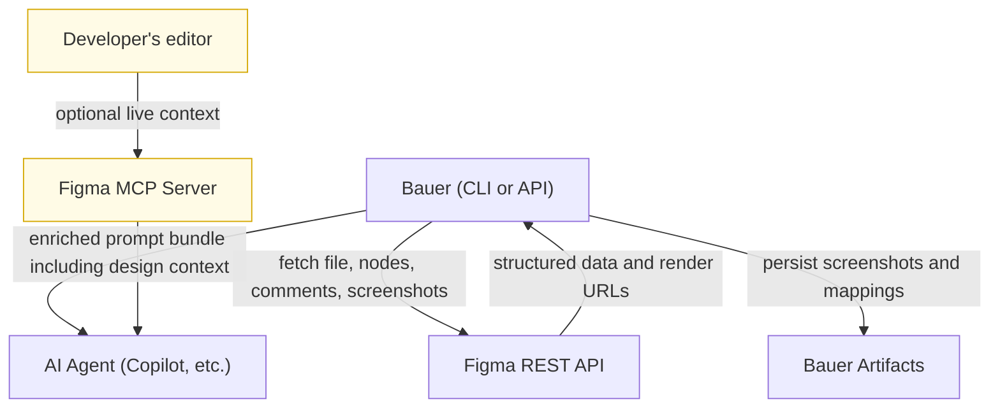
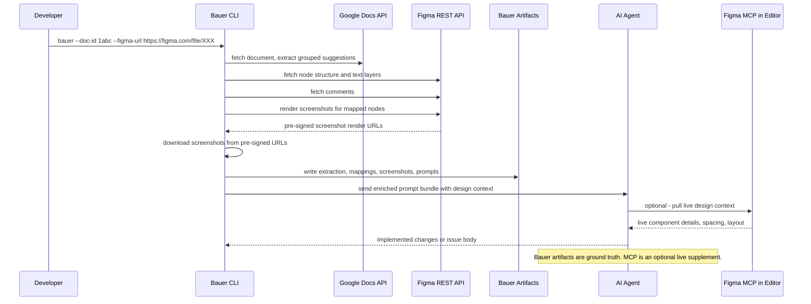
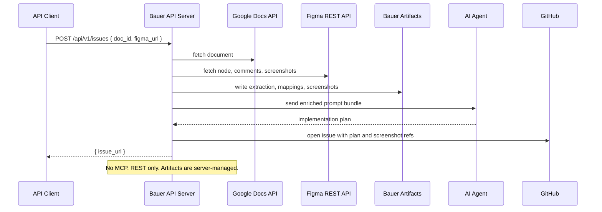

# 002: Figma Integration

_Last updated: 2026-04-29_

> Add Figma as a design-aware input to Bauer so agents can consume visual context, comments, and screenshots alongside the existing Google Docs text flow. Implementation begins after Phase 2 of spec 001.

---

## Table of Contents

1. [Executive Overview](#executive-overview)
2. [Local Development Preparation](#local-development-preparation)
3. [Background](#background)
4. [Problems](#problems)
5. [Goals](#goals)
6. [Non-Goals](#non-goals)
7. [How Figma Works: Developer Cheat Sheet](#how-figma-works-developer-cheat-sheet)
8. [Functional Overview: What REST API and MCP Each Offer](#functional-overview-what-rest-api-and-mcp-each-offer)
9. [Deep Dive: Figma REST API](#deep-dive-figma-rest-api)
10. [Deep Dive: Figma MCP Server](#deep-dive-figma-mcp-server)
11. [Comparison: REST API vs MCP vs Hybrid](#comparison-rest-api-vs-mcp-vs-hybrid)
12. [Using REST API and MCP Together](#using-rest-api-and-mcp-together)
13. [Chosen Architecture](#chosen-architecture)
14. [Prompt Package Design: Chunking, Direct Source Coupling, and Figma Awareness](#prompt-package-design-chunking-direct-source-coupling-and-figma-awareness)
15. [Preprocessing Overview: How GDocs and Figma Become Prompt Inputs](#preprocessing-overview-how-gdocs-and-figma-become-prompt-inputs)
16. [Detailed Data Congregation and Tying Model](#detailed-data-congregation-and-tying-model)
17. [Comment Extraction and Association](#comment-extraction-and-association)
18. [Screenshots and Visual Asset Handling](#screenshots-and-visual-asset-handling)
19. [Artifact History](#artifact-history)
20. [Roadmap](#roadmap)
21. [Task Overview](#task-overview)
22. [Implementation Details](#implementation-details)
23. [Acceptance Criteria and Verification](#acceptance-criteria-and-verification)
24. [Risks and Open Considerations](#risks-and-open-considerations)
25. [Unified Implementation and Task Breakdown Plan](#unified-implementation-and-task-breakdown-plan)
26. [References](#references)

---

## Executive Overview

This section summarises the two integration surfaces Figma offers, and makes the architectural choice clear before anything else.

### What the Figma REST API gives you

The REST API is a conventional HTTP JSON API. You authenticate with a token, make requests from any HTTP client, and get back structured data about files, frames, nodes, comments, and rendered screenshots. It runs entirely server-side. No browser, no IDE, no MCP runtime.

Bauer can call this API from Go in the same way it currently calls the Google Docs API.

### What the Figma MCP server gives you

The MCP server is a protocol adapter that lets **AI agent clients** (VS Code Copilot, Cursor, Claude Code, etc.) pull live Figma design context during a session. It is not an API you call from your backend. The MCP server runs on Figma's infrastructure, but the MCP **client** lives in the user's IDE or agent runtime. Without a supported local client, MCP does not engage.

### The critical architectural consequence

The REST API works everywhere Bauer runs. The MCP server only works when the agent executing the task has a supported MCP client runtime available locally. That means:

- For Bauer's CLI, running locally inside a developer's repo, MCP is plausibly available if the developer is using VS Code Copilot or Cursor.
- For Bauer's API server, running in a container in the cloud, MCP is **not available**. There is no IDE runtime. The API server cannot use MCP at all.

This makes the architectural decision easy:

- **REST API is Bauer's canonical Figma integration path.**
- **MCP is an optional local-only runtime enrichment.**

---

## Local Development Preparation

> This section is the reference background for task **T2F.0** (Local development setup and environment verification). T2F.0 formalizes these steps as a tracked task with a `verify-figma` Taskfile command and `.env.example` additions. See the T2F.0 task entry in Implementation Details for the deliverable.

Everything you need to work with Figma in Bauer locally, from scratch.

### Step 1: Create a Figma personal access token

1. Log into figma.com
2. Go to Account Settings → Security → Personal Access Tokens
3. Click **Generate new token**
4. Give it a name like `bauer-local`
5. Copy the token — it is shown only once

Figma authentication docs: https://developers.figma.com/docs/rest-api/

Export it:

```bash
export BAUER_FIGMA_TOKEN=figd_xxxxxxxxxxxxx
```

The token format for personal access tokens is `figd_` followed by an alphanumeric string.

### Step 2: Find the Figma link to supply to Bauer

Bauer accepts two link formats.

**Preferred: node-specific link**

Copy this from the Figma app by right-clicking a frame → Copy link. It looks like:

```text
https://www.figma.com/file/FILE_KEY/Product-Name?node-id=1:42
```

**Acceptable: whole-file link**

```text
https://www.figma.com/file/FILE_KEY/Product-Name
```

What Bauer extracts from the link:

- `FILE_KEY` — the opaque ID from the URL path, used for all REST API calls
- `node-id` — optional; if present, Bauer fetches only that node and its children

### Step 3: Verify REST API access before running Bauer

Run a quick curl to confirm the token and file are accessible:

```bash
curl -H "Authorization: Bearer $BAUER_FIGMA_TOKEN" \
  "https://api.figma.com/v1/files/FILE_KEY/meta"
```

A successful response returns the file name and last-modified date. An error returns `{"status":403,"err":"Forbidden"}` if the file is not shared with your account.

REST API overview: https://developers.figma.com/docs/rest-api/

### Step 4: Optional — MCP setup for local AI-assisted execution

If you want your local AI client (VS Code Copilot, Cursor, Claude Code) to also pull live Figma design context during execution, configure the Figma MCP server in your editor.

For VS Code, add `mcp.json` in the workspace or user config:

```json
{
  "inputs": [],
  "servers": {
    "figma": {
      "url": "https://mcp.figma.com/mcp",
      "type": "http"
    }
  }
}
```

When you connect, your editor will prompt you to authenticate with Figma. This is a separate authentication from the REST API token — it uses browser-based OAuth.

MCP remote setup docs: https://developers.figma.com/docs/figma-mcp-server/remote-server-installation/

**Does MCP require a Figma client?**

Yes. The MCP protocol requires a client runtime in your editor or agent tool. The Figma remote MCP server is accessible via HTTP SSE, but the client must be a supported tool that speaks the MCP protocol (VS Code with the Copilot Chat extension, Cursor, Claude Code, etc.). Without a supported client:

- the MCP server cannot be reached in a useful way
- there is no session context for Figma to attach to
- the enrichment simply does not happen

This is the core reason MCP cannot augment Bauer's API server: the API runs in the cloud, not in a user's IDE.

MCP overview: https://developers.figma.com/docs/figma-mcp-server/

### Step 5: Optional — Code Connect

Code Connect maps Figma components to code components and shows them in Figma Dev Mode. It is not required for Bauer to function, but improves the fidelity of component references in the design context.

Code Connect docs: https://developers.figma.com/docs/code-connect/

### Step 6: Full suggested local environment

```bash
export BAUER_FIGMA_TOKEN=figd_xxxxxxxxxxxxx
export BAUER_CREDENTIALS_PATH=/path/to/google-credentials.json
export BAUER_GITHUB_TOKEN=ghp_xxxxxxxxxxxxx
export BAUER_ARTIFACTS_DIR=./bauer-artifacts
```

---

## Background

Spec 001 establishes Bauer v2 as a shared-core system with a restored CLI, a later API, and better configuration, security, and source abstraction. It also establishes two prerequisites that this spec depends on:

- `internal/source`: a source abstraction layer so the orchestrator is not hard-wired to Google Docs
- `internal/artifacts`: append-only run artifact history with timestamped run directories

With those prerequisites in place, this spec adds Figma as a second upstream source.

The integration works in one direction: Figma provides visual and structural context that Bauer ties back to the Google Docs suggestions and feeds to agents. Google Docs text remains the canonical anchor for intent.

---

## Problems

1. **No design ingestion path** — Bauer has no way to fetch and normalize Figma data.
2. **No stable tie between text and design** — there is no durable association layer between Google Docs suggestion groups and Figma regions.
3. **No Figma comment path** — design review comments cannot influence prompts or issue generation.
4. **No screenshot pipeline** — Bauer cannot persist design screenshots and reuse them in prompts, issues, or PRs.
5. **Prompt package lacks Figma awareness** — the prompt engine currently knows only about gdocs data; it cannot conditionally add figma-specific prompting instructions when design context is present.
6. **No preprocessing contract** — there is no explicit layer where gdocs output and figma output are combined into enriched suggestion groups before prompt generation.
7. **No local-to-prod asset story** — no clear path from local screenshots to hosted issue/PR images.
8. **No Figma onboarding for developers** — many users will not know what a node, frame, component, or Dev Mode means.

---

## Goals

- Add Figma as a practical design source for the CLI first.
- Explain Figma, REST API, and MCP clearly for developers new to them.
- Fetch, normalize, and persist design context, comments, and screenshots via the REST API.
- Tie design context back to Google Docs suggestion groups explicitly, not by guessing.
- Update the prompt package to be directly aware of gdocs and figma data, and to add figma-specific prompting sections when design context is present.
- Preserve chunking as the execution unit — chunks are even more important with Figma because design context increases per-chunk token load.
- Keep artifact storage simple: file system first.
- Support issue mode first and API/PR modes later.

---

## Non-Goals

- Replacing Google Docs as the canonical text source.
- Requiring Figma write-back in the first slice.
- Requiring Code Connect before CLI support can ship.
- Adding a database in the first slice — file system artifacts are sufficient.
- Building a full visual diff system in the first slice.
- Making the prompt package source-agnostic (it is intentionally coupled to gdocs and figma types).

---

## How Figma Works: Developer Cheat Sheet

This section is intentionally simple. You do not need prior Figma experience.

### Core object model

| Term         | Meaning                                        | Bauer relevance                                                    |
| ------------ | ---------------------------------------------- | ------------------------------------------------------------------ |
| File         | The top-level Figma document                   | Shared links always point to a file                                |
| Page         | A tab inside the file                          | Useful for broad grouping                                          |
| Frame        | A screen or a bounded region                   | Usually the right level for implementation checks                  |
| Layer        | Any object inside a frame                      | Text, icon, rectangle, image, group, etc.                          |
| Component    | A reusable design primitive                    | Good signal for whether code should reuse existing UI elements     |
| Instance     | A placed use of a component                    | Shows component usage in a specific screen                         |
| Node         | Figma's API identity for any object            | Node IDs are the stable machine-readable anchor                    |
| Comment      | Review feedback attached to a region           | Needs extraction and association                                   |
| Dev Mode     | Figma's developer inspection view              | Useful for humans; Bauer should use official APIs, not UI scraping |
| Code Connect | Mapping of Figma components to code components | Optional; improves component reference fidelity                    |

### How node IDs look

In a Figma link: `?node-id=1:42`

In API responses: `"id": "1:42"` or URL-encoded as `1%3A42`.

The colon-separated format (`1:42`) is the canonical form. The URL-encoded form (`1%3A42`) is used in link parameters.

### Reading a Figma URL

```text
https://www.figma.com/file/FILE_KEY/File-Name?node-id=1:42

components:
  FILE_KEY  = opaque string after /file/  (used in all API calls)
  File-Name = human-readable name (ignored by API)
  node-id   = optional: which frame or layer to target
```

---

## Functional Overview: What REST API and MCP Each Offer

### REST API capability surface

| What you can do               | Endpoint                                  | Notes                                             |
| ----------------------------- | ----------------------------------------- | ------------------------------------------------- |
| Read file tree and metadata   | `GET /v1/files/:key`                      | Full document object model                        |
| Read a specific node or frame | `GET /v1/files/:key/nodes?ids=1:42`       | More efficient than fetching the whole file       |
| List all comments             | `GET /v1/files/:key/comments`             | Supports `as_md=true` for markdown output         |
| Post a comment                | `POST /v1/files/:key/comments`            | Not needed for first Bauer slice                  |
| Render screenshots            | `GET /v1/images/:key?ids=1:42&format=png` | Returns temporary render URLs; must be downloaded |
| File metadata and version     | `GET /v1/files/:key/meta`                 | Last-modified, version string                     |
| File version history          | `GET /v1/files/:key/versions`             | For drift detection between runs                  |

REST API overview: https://developers.figma.com/docs/rest-api/

### MCP capability surface

| What you can do                     | How                                  | Notes                                        |
| ----------------------------------- | ------------------------------------ | -------------------------------------------- |
| Give agent live design context      | Pass the Figma URL in the prompt     | The client pulls context from the MCP server |
| Let agent inspect a frame           | The editor tool calls the MCP server | Client-specific tool name                    |
| Let agent get a rendered screenshot | The editor tool calls the MCP server | Client-specific                              |
| Define team-specific agent guidance | Write an MCP skill file              | Deployed per-team or per-workspace           |

MCP overview: https://developers.figma.com/docs/figma-mcp-server/

---

## Deep Dive: Figma REST API

Each endpoint Bauer needs, with the exact request shape, an annotated Go pseudocode example, and a link to the official docs directly inline.

### 1. Fetch file metadata

Use this to confirm the file exists, capture the version, and detect stale mappings on subsequent runs.

```http
GET https://api.figma.com/v1/files/:key/meta
Authorization: Bearer {token}
```

Sample response (abbreviated):

```json
{
  "name": "Checkout redesign",
  "lastModified": "2026-04-29T10:00:00Z",
  "version": "3481930"
}
```

Go pseudocode:

```go
// internal/figma/client.go
func (c *Client) GetMeta(ctx context.Context, fileKey string) (*FileMeta, error) {
    req, _ := http.NewRequestWithContext(ctx, http.MethodGet,
        fmt.Sprintf("https://api.figma.com/v1/files/%s/meta", fileKey), nil)
    req.Header.Set("Authorization", "Bearer "+c.token)
    resp, err := c.http.Do(req)
    // decode into FileMeta, check status
}
```

Docs: https://developers.figma.com/docs/rest-api/file-endpoints/

---

### 2. Fetch a specific node (frame or region)

When the user provides a node-specific link, Bauer should fetch only that node's subtree rather than the whole file.

```http
GET https://api.figma.com/v1/files/:key/nodes?ids=1:42
Authorization: Bearer {token}
```

Sample response (abbreviated):

```json
{
  "nodes": {
    "1:42": {
      "document": {
        "id": "1:42",
        "name": "Shipping form",
        "type": "FRAME",
        "children": [
          {
            "id": "1:43",
            "name": "Title label",
            "type": "TEXT",
            "characters": "Shipping address"
          },
          {
            "id": "1:44",
            "name": "Helper text",
            "type": "TEXT",
            "characters": "Enter your details"
          },
          {
            "id": "1:45",
            "name": "CTA button",
            "type": "INSTANCE",
            "componentId": "comp-primary-button"
          }
        ]
      }
    }
  }
}
```

Go pseudocode:

```go
func (c *Client) GetNodes(ctx context.Context, fileKey string, nodeIDs []string) (*NodesResponse, error) {
    ids := url.QueryEscape(strings.Join(nodeIDs, ","))
    req, _ := http.NewRequestWithContext(ctx, http.MethodGet,
        fmt.Sprintf("https://api.figma.com/v1/files/%s/nodes?ids=%s", fileKey, ids), nil)
    req.Header.Set("Authorization", "Bearer "+c.token)
    // decode into NodesResponse
}
```

What Bauer extracts from this response:

- node names and types for the matching layer
- text content from TEXT nodes (used for text-based matching)
- component instance names (used to identify reusable UI patterns)
- the full path (parent frames) for structural context

Docs: https://developers.figma.com/docs/rest-api/file-endpoints/

---

### 3. Fetch comments

Comments in Figma are attached to the file with optional `client_meta` that pins them to a specific node or coordinate.

```http
GET https://api.figma.com/v1/files/:key/comments?as_md=true
Authorization: Bearer {token}
```

Sample response:

```json
{
  "comments": [
    {
      "id": "comment-1",
      "message": "Update helper text to match UX doc wording.",
      "client_meta": { "node_id": "1:42" },
      "created_at": "2026-04-29T11:30:00Z",
      "user": { "handle": "alice", "name": "Alice Engineer" },
      "parent_id": null,
      "resolved_at": null
    },
    {
      "id": "comment-2",
      "message": "Spacing between label and input should be 8px.",
      "client_meta": { "node_id": "1:43" },
      "created_at": "2026-04-29T12:00:00Z",
      "user": { "handle": "bob", "name": "Bob Designer" },
      "parent_id": null,
      "resolved_at": null
    }
  ]
}
```

Go pseudocode:

```go
func (c *Client) GetComments(ctx context.Context, fileKey string) (*CommentsResponse, error) {
    req, _ := http.NewRequestWithContext(ctx, http.MethodGet,
        fmt.Sprintf("https://api.figma.com/v1/files/%s/comments?as_md=true", fileKey), nil)
    req.Header.Set("Authorization", "Bearer "+c.token)
    // decode into CommentsResponse
}
```

Bauer should extract:

- comment ID and parent ID (to detect threads)
- the attached node ID from `client_meta`
- resolved status (skip resolved comments in prompts)
- author and timestamp (for attribution in issue bodies)
- message text in markdown

Docs: https://developers.figma.com/docs/rest-api/comments-endpoints/

---

### 4. Render screenshots

The images endpoint returns temporary pre-signed render URLs. These URLs expire, so Bauer must download the images immediately and persist them.

```http
GET https://api.figma.com/v1/images/:key?ids=1:42,1:45&format=png&scale=2
Authorization: Bearer {token}
```

Sample response:

```json
{
  "err": null,
  "images": {
    "1:42": "https://figma-alpha-render.s3-accelerate.amazonaws.com/img/abc...?expires=...",
    "1:45": "https://figma-alpha-render.s3-accelerate.amazonaws.com/img/def...?expires=..."
  }
}
```

Go pseudocode:

```go
func (c *Client) GetImages(ctx context.Context, fileKey string, nodeIDs []string) (map[string]string, error) {
    ids := url.QueryEscape(strings.Join(nodeIDs, ","))
    req, _ := http.NewRequestWithContext(ctx, http.MethodGet,
        fmt.Sprintf("https://api.figma.com/v1/images/%s?ids=%s&format=png&scale=2", fileKey, ids), nil)
    req.Header.Set("Authorization", "Bearer "+c.token)
    // returns map[nodeID]presignedURL
}

// Then immediately download each URL and persist to disk:
func (c *Client) DownloadImage(ctx context.Context, presignedURL, destPath string) error {
    resp, err := http.Get(presignedURL) // no auth header needed; pre-signed
    // stream to destPath
}
```

Important notes:

- render URLs expire quickly (typically minutes to hours)
- the render is asynchronous server-side; if the URL is empty, retry after a delay
- `scale=2` gives 2x resolution, good for retina display accuracy
- request multiple node IDs in one call to minimize rate limit exposure

Docs: https://developers.figma.com/docs/rest-api/file-endpoints/#get-images-endpoint

---

### 5. Rate limits and retries

Figma REST API rate limits:

- 100 requests per minute per token (REST API)
- image renders count separately

Bauer should implement exponential backoff on `429 Too Many Requests` and surface a clear error when rate limits block the run. For local CLI use this is rarely a problem, but it matters at API scale.

---

## Deep Dive: Figma MCP Server

### What MCP actually is

MCP (Model Context Protocol) is a protocol for AI clients to pull live context from external systems during a session. The Figma MCP server implements this protocol for Figma files.

The architecture is:

```
Figma MCP Server (cloud, figma.com)
        ↕  MCP protocol (HTTP SSE)
MCP Client (in the user's IDE or agent tool)
        ↕  tool calls, context retrieval
AI Agent (Copilot, Codex, Claude, etc.)
```

The MCP server does not have a REST API you call from your backend. It is a stateful session server that communicates with a connected client.

### The MCP client requirement

MCP requires a client that:

- speaks the MCP protocol over HTTP SSE
- can authenticate the session (browser OAuth)
- can invoke server-side tools and receive tool results

Supported clients today (as of 2026):

- VS Code with GitHub Copilot Chat extension
- Cursor
- Claude Code
- Windsurf
- Any MCP-compatible agent runtime

**What this means for Bauer's API server:**

Bauer's API server is a Go HTTP server running in a container. There is no user session, no browser, no IDE runtime. The MCP client cannot attach. MCP is therefore structurally incompatible with Bauer's API path.

```
                ┌─────────────────────────────────┐
                │  Bauer API Server (cloud)        │
                │  Go process, no IDE runtime      │
                │                                  │
                │  REST API call → works ✓         │
                │  MCP client attach → impossible  │
                └─────────────────────────────────┘

                ┌─────────────────────────────────┐
                │  Developer's machine (CLI mode)  │
                │  Has VS Code + Copilot Chat      │
                │                                  │
                │  REST API call → works ✓         │
                │  MCP client in editor → works ✓  │
                └─────────────────────────────────┘
```

### Connecting the MCP server (VS Code example)

Create `.vscode/mcp.json` in the workspace:

```json
{
  "inputs": [],
  "servers": {
    "figma": {
      "url": "https://mcp.figma.com/mcp",
      "type": "http"
    }
  }
}
```

When the editor connects, you'll be redirected to Figma's browser OAuth. This is separate from the REST API personal access token.

Docs: https://developers.figma.com/docs/figma-mcp-server/remote-server-installation/

### What MCP gives an agent at runtime

Once connected, the MCP client exposes Figma tools to the AI agent. The exact tool names are client-specific, but the conceptual flow is:

```
# User prompt to agent:
"Implement the shipping form shown at https://www.figma.com/file/XXX?node-id=1:42"

# Agent (with MCP client active):
1. Recognises the Figma URL
2. Invokes figma MCP tool: get_file(fileKey, nodeID)
3. Gets back structured design context for that frame
4. Invokes figma MCP tool: get_image(fileKey, nodeID)
5. Gets back a rendered screenshot
6. Uses that context to guide implementation decisions
7. Self-checks alignment with design before finishing
```

Conceptual tool invocation (pseudocode, actual names are client-specific):

```text
mcp:figma/get_file(file_key="XXX", node_id="1:42")
→ { name: "Shipping form", components: [...], text_layers: [...] }

mcp:figma/get_image(file_key="XXX", node_id="1:42", format="png")
→ { image_url: "..." }
```

Docs: https://developers.figma.com/docs/figma-mcp-server/

### MCP skills: teaching agents how to use Figma

MCP skills are instruction files that guide agent behaviour when using Figma context.

Example skill (`.figma/skills/implement-screen.md`):

```markdown
# implement-screen

When implementing a UI screen from a Figma link:

1. Use Bauer's stored mapping artifacts first if they exist.
2. Prefer existing code components over inventing new ones.
3. If the design shows a spacing variable (e.g. `spacing-md`), look it up in the design system.
4. If Bauer's stored screenshots conflict with what MCP shows, surface the conflict — do not silently use one over the other.
5. Check frame names match the section of the Google Doc you are implementing.
```

Docs: https://developers.figma.com/docs/figma-mcp-server/create-skills/

---

## Comparison: REST API vs MCP vs Hybrid

### Feature comparison table

| Dimension                                  | REST API                   | MCP                                | Hybrid                          |
| ------------------------------------------ | -------------------------- | ---------------------------------- | ------------------------------- |
| Works from Bauer CLI (local)               | Yes                        | Yes (if IDE has MCP client)        | Yes                             |
| Works from Bauer API (cloud)               | Yes                        | **No** — requires local MCP client | Yes (REST only on server)       |
| Fetch structured file/node data            | Yes                        | Yes (via client tools)             | Yes                             |
| Fetch comments deterministically           | Yes                        | No (not Bauer's durable path)      | Yes                             |
| Download and persist screenshots           | Yes                        | No (URLs not durable)              | Yes                             |
| Capture file version for drift detection   | Yes                        | No (session-only)                  | Yes                             |
| Live design context during agent execution | Indirect (Bauer shapes it) | **Strong**                         | Strong                          |
| Agent can query design interactively       | No                         | Yes                                | Yes (when MCP client available) |
| Requires browser OAuth or editor plugin    | No                         | Yes                                | For MCP part only               |
| Durable artifact storage for later runs    | Yes                        | No                                 | Yes                             |
| Works in issue mode (no live agent)        | Yes                        | Irrelevant                         | Yes                             |
| Works in dry-run mode                      | Yes                        | Irrelevant                         | Yes                             |

### Decision commentary

**REST API alone** is the correct choice for Bauer's backend, artifact system, and anything that runs without a local developer present. It gives Bauer full control over what data is fetched, how it is stored, and how it is combined with the Google Docs output.

**MCP alone** cannot work for Bauer because:

- the API server has no MCP client
- MCP gives no durable screenshots or mapping records
- comment extraction is not Bauer's durable path via MCP
- MCP runtime context cannot be serialised into artifact directories

**Hybrid** is the best developer experience because:

- Bauer's preprocessing (REST) gives the agent a rich structured context package
- the agent's editor (MCP) can additionally verify against the live Figma state during implementation
- conflicts between Bauer's stored artifacts and the live design are made visible rather than silently resolved

### Summary diagram



Yellow nodes are optional and only active when the developer is running locally with a supported editor. The Figma REST API response flows back to Bauer, which uses it to build the enriched prompt bundle for the agent **and** to persist artifacts. The API response does not bypass Bauer and go directly to the agent or to storage — Bauer is always in the middle.

### Final choice

1. **REST API is canonical.** All ingestion, normalization, screenshot downloads, comment extraction, and artifact writing go through the REST API.
2. **MCP is optional.** When the developer has a supported editor, MCP can enrich the live agent execution session.
3. **Code Connect is optional.** Useful when the design system already maps components to code; not required for the first Bauer slice.

---

## Using REST API and MCP Together

### Hybrid flow: what actually happens end to end



### What happens in API mode (no MCP)



---

## Chosen Architecture

### Decision

- Bauer's `internal/figma` package owns all REST API calls.
- The `internal/source/mapping` sub-package builds the association between gdocs suggestion groups and figma design anchors. It lives inside the source domain because it owns the join between source outputs — it must know about both gdocs and figma types, but the orchestrator can import it without importing gdocs or figma directly.
- The `internal/prompt` package is directly coupled to both `internal/gdocs` and `internal/figma` types. It is not source-agnostic. It is intentionally aware of whether it is rendering a gdocs-only prompt or a gdocs+figma enriched prompt.
- The `internal/artifacts` package persists everything under a timestamped run directory.
- MCP enrichment happens outside Bauer — in the agent client — and Bauer does not need to control it.

### Codebase shape after this spec lands

```text
internal/
  gdocs/          ← unchanged; still the primary text extraction path
  figma/
    client.go     ← REST client (get_meta, get_nodes, get_comments, get_images)
    link.go       ← parse and validate figma URLs
    normalize.go  ← convert raw API payloads to Bauer types
    types.go      ← NormalizedDesign, DesignAnchor, DesignComment, ScreenshotArtifact
  source/
    source.go     ← Source interface and Request type (from 001)
    types.go      ← SourceBundle (gdocs result + optional figma result)
    manager.go    ← fetches from both sources and builds SourceBundle
    mapping/
      resolver.go   ← builds ResolvedChunk list by joining gdocs groups + figma anchors
      types.go      ← ResolvedChunk, DesignAnchorRef, MappingMetadata
  prompt/
    engine.go     ← generates chunked prompts; aware of gdocs + figma data; adds figma sections when present
    types.go      ← PromptData (always has gdocs fields; optionally has FigmaContextJSON)
    templates/    ← separate template file for figma-specific prompt sections
  artifacts/
    manager.go    ← append-only artifact writes (from 001)
  orchestrator/
    orchestrator.go  ← calls source manager → mapping resolver → prompt engine → agent
```

---

## Prompt Package Design: Chunking, Direct Source Coupling, and Figma Awareness

This section documents deliberate design decisions about the prompt package that must not be accidentally reversed.

### Decision 1: chunking is preserved and is more important than ever

The current prompt engine splits grouped suggestions into chunks. Each chunk is a bounded context window for one agent execution.

**Chunking is not removed.** With Figma integration, each suggestion group may carry:

- one or more design anchor references
- one or more screenshots (as base64 or file paths)
- zero or more Figma comment excerpts

This makes per-chunk token load significantly larger than before. Chunking prevents the agent from being overwhelmed by the cumulative context of all suggestions plus all design data at once.

The chunk boundary still sits at the suggestion-group level, exactly as today. A chunk contains N suggestion groups, each now potentially enriched with figma context.

The chunk number and total chunk count remain present in the prompt data because:

- agents need to know they are receiving a partial view
- summary sessions (when chunk count > 1) still need to reconcile the partial outputs
- the `GenerateSummary` path in `agent.Agent` depends on this structure

### Decision 2: the prompt package is directly coupled to gdocs and figma types

The prompt package does **not** receive an abstract `WorkUnitsJSON` blob and figure out what to do with it. That approach hides important per-source decisions inside a blob serialization boundary.

Instead:

- The prompt package always expects gdocs grouped suggestion data.
- The prompt package optionally receives figma context per suggestion group.
- When figma context is present, the prompt engine adds figma-specific instruction sections.

This is intentional coupling. The prompt package knows about gdocs and figma. It does not need to know about any other future source unless that source needs different prompting behaviour, at which point the decision should be made explicitly.

### Prompt data type

```go
// internal/prompt/types.go
package prompt

// PromptData is the input to the prompt engine for a single chunk.
// GDocs data (SuggestionsJSON) is always present.
// FigmaContextJSON is the serialised per-suggestion figma enrichment;
// it is an empty string when no Figma URL was supplied.
// ChunkNumber and TotalChunks are preserved from the original design and are
// even more important now: each chunk may carry screenshot references that
// significantly increase context size.
type PromptData struct {
    DocumentTitle    string
    SuggestedURL     string
    ChunkNumber      int    // 1-based; e.g. 1 of 3
    TotalChunks      int    // total chunks for this run
    LocationCount    int    // number of suggestion locations in this chunk
    SuggestionsJSON  string // always: gdocs LocationGroupedSuggestions for this chunk
    FigmaContextJSON string // optional: per-location figma enrichment; "" if not present
}
```

### Template behaviour

The prompt engine uses a base template (unchanged gdocs behaviour) and a conditional figma block:

```text
[base template: document title, chunk progress, suggestions]

{if .FigmaContextJSON != ""}
## Design Context

The following design information is available for the suggestions in this chunk.
Use it to validate that your implementation matches the intended UI.
If there are Figma screenshots referenced, examine them carefully before making changes.

{figma context JSON rendered as structured list}

### Instructions for design alignment
- Verify spacing, component usage, and text content against the design.
- Do not invent new components if the design shows an existing one.
- If a Figma comment requests a specific change, treat it as a hard requirement.
{end if}
```

### Why not abstract the source at the prompt level?

Because prompting decisions are source-specific. The instruction "examine this screenshot" is meaningless without knowing it is a Figma screenshot. The instruction "treat this comment as a hard requirement" is specific to design review comments. Abstracting these into a generic `WorkUnitsJSON` blob would make the templates unreadable and hide the per-source logic in serialization rather than in code.

---

## Preprocessing Overview: How GDocs and Figma Become Prompt Inputs

The preprocessing layer is the most important part of the Figma integration. Everything upstream (fetching, normalizing) and downstream (prompting, issuing) depends on getting this right.

### Current flow (gdocs only)

```
gdocs.ProcessingResult
  └─ GroupedSuggestions []LocationGroupedSuggestions
       └─ chunked by internal/prompt
            └─ PromptData { SuggestionsJSON }
                 └─ agent execution
```

### Target flow (gdocs + optional figma)

```
gdocs.ProcessingResult
  └─ GroupedSuggestions []LocationGroupedSuggestions
                                                     ⎫
figma.NormalizedDesign                               ⎬─ mapping.Resolver
  └─ Anchors []DesignAnchor                          ⎭
  └─ Comments []DesignComment
  └─ Screenshots []ScreenshotArtifact

                          ↓
              source/mapping.Resolver.Build(gdocsResult, figmaDesign)
                          ↓
              []source/mapping.ResolvedChunk
              (each chunk: N suggestion groups + their figma enrichment)
                          ↓
              prompt.Engine.GenerateChunks(resolvedChunks)
                          ↓
              []PromptData { SuggestionsJSON, FigmaContextJSON }
                          ↓
              agent.Agent.ExecuteChunk(...) × N
```

### Why is the mapping step separate from both the source and the prompt?

- The source layer fetches raw data. It does not know about the relationship between sections and nodes.
- The prompt layer renders prompts. It does not know how to resolve which screenshot belongs to which suggestion.
- The mapping layer owns the join logic. It is the only place that has both the gdocs location structure and the figma node tree. It lives in `internal/source/mapping` — a sub-package of source — because it is fundamentally about combining source outputs, not about prompting or agent execution.

This separation keeps each layer testable in isolation.

---

## Detailed Data Congregation and Tying Model

### What the current gdocs output looks like

The current `gdocs.ProcessingResult` type, from `internal/gdocs/process.go`:

```go
type ProcessingResult struct {
    DocumentTitle         string
    DocumentID            string
    Metadata              *MetadataTable
    ActionableSuggestions []ActionableSuggestion
    GroupedSuggestions    []LocationGroupedSuggestions
    Comments              []Comment
}
```

A `LocationGroupedSuggestions` groups all suggestion changes that occur at the same logical location:

```go
type LocationGroupedSuggestions struct {
    Location    SuggestionLocation
    Suggestions []GroupedActionableSuggestion
}

type SuggestionLocation struct {
    Section       string
    ParentHeading string
    HeadingLevel  int
    InTable       bool
    Table         *TableLocation
}

type TableLocation struct {
    TableIndex   int
    TableID      string
    TableTitle   string
    RowIndex     int
    ColumnIndex  int
    ColumnHeader string
}
```

Sample JSON representation of a grouped suggestions output:

```json
{
  "document_title": "Checkout v3 copy updates",
  "document_id": "1abc",
  "grouped_suggestions": [
    {
      "location": {
        "section": "Body",
        "parent_heading": "Shipping section",
        "heading_level": 2,
        "in_table": true,
        "table": {
          "table_index": 1,
          "table_id": "t1",
          "table_title": "Copy changes",
          "row_index": 2,
          "column_index": 2,
          "column_header": "New copy"
        }
      },
      "suggestions": [
        {
          "id": "suggest.123",
          "anchor": {
            "preceding_text": "Shipping address",
            "following_text": "Continue"
          },
          "change": {
            "type": "replace",
            "original_text": "Use this form",
            "new_text": "Enter your shipping details"
          },
          "verification": {
            "text_before_change": "Shipping address Use this form Continue",
            "text_after_change": "Shipping address Enter your shipping details Continue"
          }
        }
      ]
    }
  ]
}
```

### What the figma REST API returns for the relevant node

After `GET /v1/files/:key/nodes?ids=1:42`:

```json
{
  "name": "Checkout",
  "lastModified": "2026-04-29T10:00:00Z",
  "nodes": {
    "1:42": {
      "document": {
        "id": "1:42",
        "name": "Shipping form",
        "type": "FRAME",
        "children": [
          {
            "id": "1:43",
            "name": "Section label",
            "type": "TEXT",
            "characters": "Shipping address"
          },
          {
            "id": "1:44",
            "name": "Helper",
            "type": "TEXT",
            "characters": "Enter your shipping details"
          },
          {
            "id": "1:45",
            "name": "CTA",
            "type": "INSTANCE",
            "componentId": "comp-primary-button"
          }
        ]
      }
    }
  }
}
```

After `GET /v1/files/:key/comments?as_md=true`:

```json
{
  "comments": [
    {
      "id": "comment-1",
      "message": "Helper text should match doc: 'Enter your shipping details'",
      "client_meta": { "node_id": "1:42" },
      "created_at": "2026-04-29T12:00:00Z",
      "user": { "handle": "alice" },
      "resolved_at": null
    }
  ]
}
```

After `GET /v1/images/:key?ids=1:42,1:45&format=png&scale=2` (then downloaded):

```text
bauer-artifacts/<run-id>/screenshots/
  shot-node-1-42.png   (the shipping form frame screenshot)
  shot-node-1-45.png   (the CTA button closeup)
```

### The normalized figma design type Bauer builds

```go
// internal/figma/types.go

type NormalizedDesign struct {
    FileKey      string
    RootNodeID   string   // the node supplied in the link, or "" for whole-file
    Version      string   // from file meta; used for drift detection
    LastModified string
    Anchors      []DesignAnchor
    Comments     []DesignComment
    Screenshots  []ScreenshotArtifact
}

type DesignAnchor struct {
    NodeID        string
    NodeName      string
    NodePath      []string   // breadcrumb from root frame to this node
    NearestText   []string   // text content of TEXT children, for matching
    ComponentIDs  []string   // component IDs referenced by INSTANCE nodes
}

type DesignComment struct {
    ID           string
    NodeID       string     // from client_meta; may be empty for file-level comments
    Message      string
    Author       string
    CreatedAt    string
    Resolved     bool
}

type ScreenshotArtifact struct {
    NodeID       string
    LocalPath    string     // path under run artifacts dir
    Scale        int        // 1 or 2
    FetchedAt    string
    SourceNodeVersion string // figma version when screenshot was taken
}
```

### The resolved chunk type: the key join

```go
// internal/source/mapping/types.go

// ResolvedChunk is a group of suggestion locations enriched with figma design context.
// It is the unit that the prompt engine receives and renders into a PromptData.
type ResolvedChunk struct {
    Locations       []gdocs.LocationGroupedSuggestions   // one or more gdocs location groups
    DesignAnchors   []DesignAnchorRef                    // matched figma nodes (may be empty)
    ScreenshotPaths []string                             // local paths to downloaded screenshots
    Comments        []DesignCommentRef                   // matched figma comments (may be empty)
    Mapping         MappingMetadata
}

type DesignAnchorRef struct {
    FileKey  string
    NodeID   string
    NodeName string
}

type DesignCommentRef struct {
    CommentID string
    Message   string
    Author    string
    NodeID    string
}

type MappingMetadata struct {
    Method     string   // "url", "cache", "text", "name", "fallback", or "none" (no figma)
    Confidence float64  // 0.0 to 1.0; 0 for the "none" case
    Status     string   // "healthy", "stale", "unresolved", or "none"
}
```

### Concrete end-to-end example

Given:

- Google Doc table `t1`, row 2, column 2 contains copy update suggestions for "Shipping section"
- Figma file `XXX`, node `1:42` is the "Shipping form" frame
- The frame contains a text layer with "Shipping address" and another with "Enter your shipping details"
- There is a comment on node `1:42` asking to match the helper text to the doc
- Screenshots have been downloaded for nodes `1:42` and `1:45`

The mapping resolver produces:

```json
{
  "locations": [
    {
      "location": {
        "parent_heading": "Shipping section",
        "table": { "table_id": "t1", "row_index": 2, "column_index": 2 }
      },
      "suggestions": ["suggest.123"]
    }
  ],
  "design_anchors": [
    { "file_key": "XXX", "node_id": "1:42", "node_name": "Shipping form" }
  ],
  "screenshot_paths": [
    "bauer-artifacts/<run-id>/screenshots/shot-node-1-42.png",
    "bauer-artifacts/<run-id>/screenshots/shot-node-1-45.png"
  ],
  "comments": [
    {
      "comment_id": "comment-1",
      "message": "Helper text should match doc: 'Enter your shipping details'",
      "author": "alice",
      "node_id": "1:42"
    }
  ],
  "mapping": {
    "method": "text",
    "confidence": 0.91,
    "status": "healthy"
  }
}
```

Bauer can now say explicitly: **for the copy updates in table `t1`, use screenshots `shot-node-1-42.png` and `shot-node-1-45.png`, and note that the designer has already commented that the helper text must match the doc wording.**

The prompt engine serializes this as `FigmaContextJSON` and adds it to the chunk prompt. The agent receives both the suggestion details and the design context in a single bounded context window.

### How matching works: a deep dive into the mapping algorithm

The matching problem is: given a `LocationGroupedSuggestions` (from gdocs), find the corresponding `DesignAnchor` (from figma) with a confidence score. This is the hardest and most critical part of the Figma integration. Getting it wrong silently associates the wrong design context to a suggestion group, which means the agent either ignores relevant design information or acts on the wrong one.

**Why it is hard:**

- Figma frame names and Google Doc headings are written by different people and often diverge ("Shipping" in the doc vs "Checkout Form v3" in Figma)
- Figma's visual hierarchy does not always mirror document hierarchy — a section in the doc may correspond to several nested Figma frames
- The same heading text can appear in multiple Figma frames
- Figma node IDs are stable but opaque — they carry no semantic meaning by themselves
- There is no shared key between the two systems

**Package home: `internal/source/mapping`**

The resolver lives in `internal/source/mapping` — a sub-package of source. This placement is deliberate:

- It cannot live in `internal/gdocs` or `internal/figma` — those packages do not know about each other
- It cannot live in `internal/prompt` — the prompt package renders, it does not resolve
- It belongs in the source domain because it owns the join between source outputs
- The orchestrator imports `source/mapping` and gets clean `[]ResolvedChunk` values without importing gdocs or figma types directly

---

**Matching strategies: options considered**

| Strategy | Input required | Works without prev run | Handles name drift | Latency | Accuracy |
| --- | --- | --- | --- | --- | --- |
| User-supplied node ID (from URL) | `?node-id=X:Y` in Figma link | Yes | Yes (explicit) | None | 1.0 |
| Manifest cache (from previous run) | Previous `mappings.json` | No | Only if re-verified | Minimal | Inherited |
| Text layer content matching | TEXT node `characters` in frame subtree | Yes | Partially | Low | 0.65–0.95 |
| Frame name matching | Frame `name` field | Yes | Poorly | Low | 0.50–0.85 |
| Semantic embedding matching | Embedding API or local model | Yes | Well | High | 0.80–0.98 |
| Whole-frame fallback | Nothing | Yes | Yes (broad) | None | 0.50 |

**Not chosen for the first slice:**

- **Semantic embedding**: would require an external API call or a local model, adds latency and an infrastructure dependency that is not needed for a local CLI tool. Worth revisiting if text and name matching prove insufficient in practice.
- **Structural path matching**: comparing gdocs heading nesting to Figma frame nesting. Figma's visual hierarchy rarely mirrors document hierarchy reliably enough to be useful without heavy calibration.

**Chosen strategy: a priority-ordered fallback chain**

Strategies are tried in priority order. The first one that meets its confidence threshold is used. Lower-priority strategies are tried only if higher-priority ones don't resolve.

---

**Strategy 1: User-supplied node ID (confidence 1.0)**

If the Figma URL contains `?node-id=X:Y`, the user has made an explicit selection in the Figma app. This is authoritative. Parse it in T2F.1 (`link.go`) and use it as the top-level anchor for all suggestion groups that fall under that frame.

No matching algorithm runs. The node ID is used directly.

---

**Strategy 2: Manifest cache (confidence: inherited from previous run)**

On a subsequent run over the same document, Bauer reads `mappings.json` from the most recent successful run for this `(doc_id, figma_file_key)` pair. If the manifest contains a resolved entry for a given section key `(parent_heading, section, table_id)`, and the Figma file version is unchanged, the cached node ID is used directly.

- If the Figma file version has changed: the cached entry is marked `status: "stale"` and re-verification runs strategies 3 and 4. If they confirm the same node, status upgrades to `healthy`. If they disagree, the new match wins and the manifest is updated.
- Confidence is not boosted when reusing a cache entry. A previously `0.7`-confidence match stays at `0.7`.

The manifest key format:

```json
{
  "section_key": "shipping-section::shipping-form-table",
  "node_id": "1:42",
  "node_name": "Shipping form",
  "figma_version": "3481930",
  "confidence": 0.88,
  "method": "text",
  "status": "healthy"
}
```

---

**Strategy 3: Text layer content matching (confidence 0.50–0.95)**

Walk each candidate frame's subtree and collect all TEXT node `characters` values. Build a token bag from this text. Compare it to a token bag built from the gdocs suggestion group's context:

- `parent_heading` text
- `section` text
- the `original_text` of each suggestion in the group (what the doc says to change)

Similarity metric: weighted Jaccard similarity after stop-word removal and normalization.

```
gdocs_tokens = tokenize(parent_heading + " " + section + " " + original_texts)
figma_tokens = tokenize(all TEXT characters in frame subtree)

shared = gdocs_tokens ∩ figma_tokens
union  = gdocs_tokens ∪ figma_tokens

jacc = |shared| / |union|
confidence = 0.50 + (jacc * 0.45)   -- maps [0, 1] → [0.50, 0.95]
```

Threshold: `jacc >= 0.30` → accept this match.

Why Jaccard and not Levenshtein? Levenshtein measures character-level edit distance on strings, which is useful for spelling corrections but noisy for this use case where the vocabulary overlaps but the token ordering differs. Jaccard measures set overlap, which is a better fit for comparing bags of UI text tokens.

Pseudocode:

```go
func matchByTextLayers(group gdocs.LocationGroupedSuggestions, anchors []figma.DesignAnchor) (*figma.DesignAnchor, float64) {
    // Build token bag from the gdocs suggestion group:
    // parent heading + section text + original text of every suggestion.
    gdocsTokens := tokenize(group.Location.ParentHeading + " " + group.Location.Section)
    for _, sug := range group.Suggestions {
        gdocsTokens = append(gdocsTokens, tokenize(sug.Change.OriginalText)...)
    }
    gdocsSet := toSet(gdocsTokens)

    best, bestConf := (*figma.DesignAnchor)(nil), 0.0
    for i := range anchors {
        // NearestText is []string; join into a single string before tokenizing.
        figmaTokens := tokenize(strings.Join(anchors[i].NearestText, " "))
        figmaSet := toSet(figmaTokens)

        shared := gdocsSet.Intersection(figmaSet)
        union  := gdocsSet.Union(figmaSet)
        if len(union) == 0 {
            continue
        }
        jacc := float64(len(shared)) / float64(len(union))
        conf := 0.50 + (jacc * 0.45)

        if conf > bestConf {
            bestConf = conf
            best = &anchors[i]
        }
    }
    if bestConf > 0 && (bestConf-0.50)/0.45 >= 0.30 { // jacc threshold
        return best, bestConf
    }
    return nil, 0
}

// tokenize normalizes text into a lowercase token slice with stop words and short tokens removed.
func tokenize(text string) []string {
    stop := map[string]bool{"the": true, "a": true, "an": true, "and": true, "or": true, "in": true, "of": true, "to": true, "for": true, "is": true, "are": true}
    words := strings.FieldsFunc(strings.ToLower(text), func(r rune) bool {
        return !unicode.IsLetter(r) && !unicode.IsDigit(r)
    })
    var result []string
    for _, w := range words {
        if len(w) >= 3 && !stop[w] {
            result = append(result, w)
        }
    }
    return result
}
```

---

**Strategy 4: Frame name matching (confidence 0.50–0.85)**

If text layer matching doesn't reach the threshold, compare the frame's `name` field to the gdocs heading:

```
heading_tokens = tokenize(parent_heading)
frame_tokens   = tokenize(anchor.NodeName)

overlap = |heading_tokens ∩ frame_tokens| / max(|heading_tokens|, |frame_tokens|)
confidence = 0.50 + (overlap * 0.35)
```

Threshold: `overlap >= 0.50` → accept.

This is weaker than text layer matching but works when Figma frames are named consistently with doc sections.

---

**Fallback: whole-frame anchor (confidence 0.50, status `unresolved`)**

If no strategy succeeds, the top-level frame from the user-supplied Figma URL is used as the anchor for all unresolved suggestion groups. Confidence is `0.50`. Status is `unresolved`. These entries appear prominently in the artifact and are surfaced to the user.

---

**Full priority chain pseudocode:**

```go
func (r *Resolver) resolveAnchor(group gdocs.LocationGroupedSuggestions) (*figma.DesignAnchor, MappingMetadata) {
    loc := group.Location
    // 1. User-supplied node ID (parsed from URL in T2F.1 and stored on design)
    if r.design.RootNodeID != "" && r.design.RootNodeID == r.design.UserSuppliedNodeID {
        return r.design.RootAnchor(), MappingMetadata{Method: "url", Confidence: 1.0, Status: "healthy"}
    }

    // 2. Manifest cache
    if r.manifest != nil {
        if cached := r.manifest.Lookup(locKey(loc)); cached != nil {
            if cached.FigmaVersion == r.design.Version {
                return cached.Anchor, MappingMetadata{Method: "cache", Confidence: cached.Confidence, Status: "healthy"}
            }
            // version changed: fall through and re-verify, then update manifest
        }
    }

    // 3. Text layer content matching
    if anchor, conf := matchByTextLayers(group, r.design.Anchors); anchor != nil {
        return anchor, MappingMetadata{Method: "text", Confidence: conf, Status: "healthy"}
    }

    // 4. Frame name matching
    if anchor, conf := matchByFrameName(group.Location, r.design.Anchors); anchor != nil {
        return anchor, MappingMetadata{Method: "name", Confidence: conf, Status: "healthy"}
    }

    // 5. Fallback
    return r.design.RootAnchor(), MappingMetadata{Method: "fallback", Confidence: 0.50, Status: "unresolved"}
}
```

---

**Confidence thresholds summary:**

| Strategy | Method value | Min confidence | Status on match |
| --- | --- | --- | --- |
| User-supplied node ID | `"url"` | 1.0 | `"healthy"` |
| Manifest cache (version unchanged) | `"cache"` | Inherited | `"healthy"` |
| Manifest cache (version changed) | `"cache"` | Inherited, re-verified | `"stale"` initially |
| Text layer (jacc >= 0.30) | `"text"` | 0.635 | `"healthy"` |
| Frame name (overlap >= 0.50) | `"name"` | 0.675 | `"healthy"` |
| Whole-frame fallback | `"fallback"` | 0.50 | `"unresolved"` |

**How a developer corrects a bad mapping:**

After any run, `bauer-artifacts/<run-id>/extraction/mappings.json` contains every resolved mapping with its confidence and status. Any entry with `status: "unresolved"` or `confidence < 0.65` should be reviewed.

To manually correct a mapping:
1. Open `mappings.json` in the run directory
2. Find the entry with the wrong or unresolved node ID
3. Replace `node_id` with the correct Figma node ID (right-click a frame in Figma → Copy link → extract the `node-id` param)
4. Copy the corrected file to `bauer-artifacts/manifest.json` (the manifest cache location)
5. Re-run Bauer — Strategy 2 (manifest cache) will use the corrected mapping on the next run

This is explicit and low-tech. A future improvement (T2F.10) adds drift detection and version-aware cache reuse.

All resolved and unresolved mappings are written to artifacts regardless of confidence. Nothing is silently dropped.

---

## Comment Extraction and Association

### What to extract for each comment

- comment ID
- parent comment ID (for thread detection)
- node ID from `client_meta` (the design region it is attached to)
- author handle and name
- timestamp
- message text (markdown if `as_md=true` was used)
- resolved status — skip resolved comments from prompts

### Association rules

1. If the comment's `node_id` matches a mapped design anchor → attach it directly to the corresponding `ResolvedChunk`.
2. If the comment's `node_id` is a child of a mapped frame → attach it to the same `ResolvedChunk` as the parent frame.
3. If the comment has no `node_id` (file-level comment) → keep it in the artifact but do not attach to any specific chunk.
4. If the comment is resolved → skip it from prompt inclusion (but keep it in the artifact for completeness).

### Prompt rendering of comments

Comments appear in the `FigmaContextJSON` block with a clear label:

```text
**Design comment (alice, 2026-04-29):**
Helper text should match doc: "Enter your shipping details"
— attached to: Shipping form (node 1:42)
```

---

## Screenshots and Visual Asset Handling

### Why not use the Figma render URL directly in prompts?

- Figma image render URLs expire (typically within hours).
- Issue bodies and PR comments need stable image references.
- Replaying a run later must not depend on live temporary URLs.
- Agent prompts that embed image URLs may silently receive expired links.

### Screenshot pipeline

```
1. mapping resolver identifies which node IDs need screenshots
2. batch request to GET /v1/images/:key?ids=...&format=png&scale=2
3. receive map of nodeID → presigned URL
4. download each URL with no auth header (pre-signed)
5. persist to bauer-artifacts/<run-id>/screenshots/shot-node-<id>.png
6. record in ScreenshotArtifact: local path, node ID, figma version, fetch timestamp
7. ResolvedChunk references local paths, not Figma URLs
```

### Image formats and scale

- `format=png` is the default and is always safe.
- `scale=2` gives 2x resolution for retina accuracy.
- For multi-node exports (e.g. a full frame + each sub-region), make a single batch request.

### Issue and PR use

**Stage 1 (CLI-only):** The CLI cannot host images publicly, so GitHub issue bodies cannot embed hosted image URLs. Instead, issue bodies produced by `--open-issue` include:

1. A text block listing each screenshot by node name and local artifact path:
   ```text
   ## Design screenshots
   The following screenshots were captured during this run and are available locally:
   - Shipping form (node 1:42): `bauer-artifacts/<run-id>/screenshots/shot-node-1-42.png`
   - CTA button (node 1:45): `bauer-artifacts/<run-id>/screenshots/shot-node-1-45.png`
   Run ID: `2026-04-29T14:30:45Z-a1b2c3d4`
   ```
2. The run ID in the issue body, so any team member with access to the artifact directory can locate the screenshots by matching the run ID.

This is not ideal for remote reviewers, but it is explicit and correct for a local CLI tool. The design context (comments, anchor references, and the mapping confidence) still appears in the issue body in full text form regardless of screenshot hosting.

**Stage 2 (API/prod):** The API server uploads screenshots to a central store and embeds hosted URLs directly as Markdown images in the issue body (``). This is specced in T4F.2.

---

## Artifact History

### Chosen first solution: file system only

Rationale:

- Bauer is CLI-first and runs locally.
- Screenshots are naturally files.
- Extraction JSON, prompts, and outputs should be versioned as files.
- No extra infrastructure dependency is needed.

### Proposed run directory layout

```text
bauer-artifacts/
  runs.jsonl                          ← append-only run index (one JSON line per run)
  manifest.json                       ← latest mapping manifest for cache reuse (overwritten per run)
  <run-id>/
    metadata.json                     ← doc ID, figma URL, timestamps, summary
    extraction/
      gdocs.json                      ← full ProcessingResult
      figma.json                      ← NormalizedDesign
      mappings.json                   ← all ResolvedChunk mappings with confidence scores
      comments.json                   ← all extracted Figma comments
    screenshots/
      shot-node-1-42.png
      shot-node-1-45.png
    prompts/
      chunk-1-of-3.md
      chunk-2-of-3.md
      chunk-3-of-3.md
    outputs/
      chunk-1-output.md
      chunk-2-output.md
      chunk-3-output.md
      summary.md                      ← present when chunk count > 1
      issue-body.md                   ← present in --open-issue mode
    logs/
      execution.jsonl                 ← structured log of each step
```

### `runs.jsonl` schema

Each line in `runs.jsonl` is a complete JSON object appended at the end of a run. The file is never rewritten in full — only appended.

```json
{
  "run_id": "2026-04-29T14-30-45Z-a1b2c3d4",
  "started_at": "2026-04-29T14:30:45Z",
  "completed_at": "2026-04-29T14:31:20Z",
  "status": "success",
  "doc_id": "1abc...",
  "figma_url": "https://www.figma.com/file/XXX/Product-Name",
  "mode": "execute",
  "chunk_count": 3,
  "artifact_dir": "bauer-artifacts/2026-04-29T14-30-45Z-a1b2c3d4"
}
```

Field definitions:

| Field | Type | Description |
| --- | --- | --- |
| `run_id` | string | `{ISO8601_ts}-{8-hex}` — timestamp prefix makes it sortable |
| `started_at` | string | ISO 8601 UTC timestamp when the run began |
| `completed_at` | string | ISO 8601 UTC timestamp when the run finished; `null` if crashed |
| `status` | string | `"success"` \| `"failed"` \| `"in_progress"` |
| `doc_id` | string | Google Doc ID for this run |
| `figma_url` | string | Figma URL if one was supplied; `""` otherwise |
| `mode` | string | `"execute"` \| `"dry-run"` \| `"issue"` |
| `chunk_count` | int | Number of chunks processed; `0` if the run failed before chunking |
| `artifact_dir` | string | Relative path to this run's artifact directory |

Note on the run ID format: colons are avoided in the timestamp portion (`T14-30-45Z` not `T14:30:45Z`) because run IDs are used as directory names, and colons are not valid in directory names on Windows and some other systems.

**SQLite alternative:** The JSONL approach is simple and works for CLI use. If Bauer later needs cross-run queries (e.g. "all runs for doc X") or the API needs to paginate run history, the same schema maps directly to a SQLite `runs` table with no restructuring required. At that point, JSONL can be kept as a flat-file sidecar or replaced entirely.

### DB decision

**No DB in the first slice.** The file system is the simplest correct solution.

If Bauer later needs:

- search across runs (e.g. "all runs for doc X")
- mapping index reuse across different users
- server-side run tracking and pagination

…then a DB becomes appropriate. The right schema at that point is:

- a `runs` table with run metadata, doc ID, figma URL, status
- a `mappings` table with file key, node ID, section anchor, confidence, version
- file system or object storage for screenshots and binary assets

That is a future concern. For the first slice, everything is a file.

---

## Roadmap

### Phase A — Prerequisites from amended 001

These must be complete before this spec's work begins. They are tracked in 001.

- T0.2a: `internal/source` interfaces and normalized `SourceBundle`
- T0.2b: orchestrator refactored to call the source layer; prompt package `PromptData` type is intentionally unchanged
- T0.2c: append-only artifact history foundation in `internal/artifacts`
- T2.1, T2.2, T2.3: CLI `--open-pr`, `--open-issue`, mutual exclusion

### Phase B — Figma CLI ingestion

- T2F.0: Local development setup and environment verification
- T2F.1: Figma URL parsing and validation
- T2F.2: Figma config and auth (`BAUER_FIGMA_TOKEN`)
- T2F.3: `internal/figma` REST client (meta, nodes, comments, images)
- T2F.4: Figma output normalization into Bauer types

### Phase C — Preprocessing and prompt integration

- T2F.5: `internal/source/mapping` resolver — join gdocs groups with figma anchors
- T2F.6: Update `internal/prompt` for figma-aware chunked prompts
- T2F.7: Persist figma artifacts under run directories

### Phase D — CLI experience and optional MCP guidance

- T2F.8: Extend CLI issue mode and default execution with figma context
- T2F.9: Add optional MCP-aware runtime guidance in prompt templates

### Phase E — Polish and drift detection

- T2F.10: Drift detection, cache reuse, low-confidence surfacing

### Phase F — API rollout

- T4F.1: API endpoint schema updates for Figma URL input
- T4F.2: Server-side screenshot hosting and issue/PR inline visuals

---

## Task Overview

| Task   | Short description                                                                                  |
| ------ | -------------------------------------------------------------------------------------------------- |
| T2F.0  | Local development setup: Figma token, URL verification, optional MCP config                        |
| T2F.1  | Parse and validate Figma file and node URLs                                                        |
| T2F.2  | Add `BAUER_FIGMA_TOKEN` and Figma-specific config                                                  |
| T2F.3  | Create `internal/figma` REST client: meta, nodes, comments, images                                 |
| T2F.4  | Normalize raw Figma API payloads into `NormalizedDesign`                                           |
| T2F.5  | Build `internal/source/mapping` resolver: join gdocs groups with figma anchors, comments, and screenshots |
| T2F.6  | Update `internal/prompt` to be figma-aware: chunked prompts with conditional `FigmaContextJSON`    |
| T2F.7  | Persist figma extraction, mappings, comments, and screenshots in run artifacts                     |
| T2F.8  | Extend CLI issue mode and execution mode with figma-enriched prompts                               |
| T2F.9  | Add optional MCP runtime guidance to prompt templates                                              |
| T2F.10 | Add drift detection, mapping cache reuse, and low-confidence reporting                             |
| T4F.1  | API: add `figma_url` to request schema; update issue and workflow endpoints                        |
| T4F.2  | API: server-side screenshot hosting and inline image references in issues/PRs                      |

---

## Implementation Details

### T2F.0 — Local development setup and environment verification

**What**: Formalize and codify the local development setup steps as a tracked task. This ensures every developer working on the Figma integration starts from a verified baseline and does not waste time debugging configuration issues.

**Why**: The Figma integration requires credentials, a valid file URL, and optionally an MCP-capable editor. Each of these has different setup paths and failure modes. Getting them right before writing code avoids confusion between "my code is broken" and "my token is wrong."

**Files touched**:

- `.env.example` — **modify** (add `BAUER_FIGMA_TOKEN`, `BAUER_ARTIFACTS_DIR`)
- `Taskfile.yml` — **modify** (add `verify-figma` task)
- `docs/specs/002_figma_integration.md` — no file changes; this task is the pre-implementation checklist

**Setup steps (the deliverable):**

```bash
# 1. Generate a Figma personal access token
#    figma.com → Account Settings → Security → Personal Access Tokens → Generate
export BAUER_FIGMA_TOKEN=figd_xxxxxxxxxxxxx

# 2. Set the artifacts directory
export BAUER_ARTIFACTS_DIR=./bauer-artifacts

# 3. Verify REST API access with a known file key
curl -s -H "Authorization: Bearer $BAUER_FIGMA_TOKEN" \
  "https://api.figma.com/v1/files/FILE_KEY/meta" | jq .name
# Should print the file name. If it prints an error, the token or file key is wrong.

# 4. (Optional) Configure MCP for your editor
# See Step 4 in the Local Development Preparation section of this spec.
```

Add a `verify-figma` task to `Taskfile.yml`:

```yaml
verify-figma:
  desc: Verify Figma token and REST API access. Set FILE_KEY to a known Figma file key.
  cmds:
    - |
      TOKEN="${BAUER_FIGMA_TOKEN:-$FIGMA_TOKEN}"
      if [ -z "$TOKEN" ]; then
        echo "ERROR: set BAUER_FIGMA_TOKEN or FIGMA_TOKEN"; exit 1
      fi
    - |
      if [ -z "{{.FILE_KEY}}" ]; then
        echo "ERROR: provide FILE_KEY=your-figma-file-key"; exit 1
      fi
    - curl -sf -H "Authorization: Bearer ${BAUER_FIGMA_TOKEN:-$FIGMA_TOKEN}"
        "https://api.figma.com/v1/files/{{.FILE_KEY}}/meta"
        | jq '{name: .name, lastModified: .lastModified}'
```

Usage: `task verify-figma FILE_KEY=AbCdEfGhIjKl`

**Add to `.env.example`**:

```bash
# Figma integration (optional; required only when --figma-url is used)
BAUER_FIGMA_TOKEN=          # Personal access token from figma.com account settings
BAUER_ARTIFACTS_DIR=./bauer-artifacts  # Directory for run artifacts; defaults to ./bauer-artifacts
```

**Acceptance criteria**:

- [ ] `BAUER_FIGMA_TOKEN` and `BAUER_ARTIFACTS_DIR` are present in `.env.example` with comments
- [ ] `task verify-figma FILE_KEY=<key>` prints the Figma file name and last-modified date, or exits 1 with a clear error
- [ ] running the task without `BAUER_FIGMA_TOKEN` set exits 1 with a clear message
- [ ] the Local Development Preparation section of this spec is accurate and can be followed start-to-finish without external help

---

### T2F.1 — Parse and validate Figma URLs

**What**: Extract `file_key` and optional `node_id` from any valid Figma link.

**Why**: Bauer cannot call the REST API without a stable `file_key`. All downstream calls depend on it.

**Files touched**:

- `internal/figma/link.go` — **create**
- `internal/config/cli.go` — **modify** (add `--figma-url` flag)

**Implementation**:

```go
// internal/figma/link.go
package figma

import (
    "fmt"
    "net/url"
    "regexp"
    "strings"
)

var figmaFilePattern = regexp.MustCompile(`figma\.com/(?:file|design)/([A-Za-z0-9_-]+)`)

type LinkRef struct {
    FileKey string
    NodeID  string   // URL-decoded; e.g. "1:42". Empty for whole-file links.
    RawURL  string
}

// ParseLink extracts the file key and optional node ID from a Figma link.
// Accepts both /file/ and /design/ URL patterns.
func ParseLink(rawURL string) (*LinkRef, error) {
    matches := figmaFilePattern.FindStringSubmatch(rawURL)
    if len(matches) < 2 {
        return nil, fmt.Errorf("not a valid Figma link: %q", rawURL)
    }
    ref := &LinkRef{FileKey: matches[1], RawURL: rawURL}

    u, err := url.Parse(rawURL)
    if err == nil {
        // url.Query().Get() already URL-decodes the value:
        // "1%3A42" is returned as "1:42" automatically by net/url.
        ref.NodeID = u.Query().Get("node-id")
    }
    return ref, nil
}
```

**Acceptance criteria**:

- [ ] `ParseLink` correctly extracts `file_key` from `/file/` and `/design/` URL shapes
- [ ] `ParseLink` correctly extracts and URL-decodes `node-id` when present
- [ ] `ParseLink` returns a clear error for non-Figma URLs
- [ ] `internal/figma/link_test.go` covers whole-file links, node-specific links, and invalid inputs

---

### T2F.2 — Figma config and auth

**What**: Add `BAUER_FIGMA_TOKEN` to the config system. Add `--figma-url` flag to the CLI.

**Why**: The CLI needs a way to receive a Figma URL and resolve the REST API token without hardcoding.

**Files touched**:

- `internal/config/config.go` — **modify** (add `FigmaToken`, `FigmaURL` fields)
- `internal/config/cli.go` — **modify** (add `--figma-url` flag)
- `.env.example` — **modify** (add `BAUER_FIGMA_TOKEN`, `BAUER_ARTIFACTS_DIR`)

**Implementation**:

```go
// internal/config/config.go (additions)
type Config struct {
    // ... existing fields ...
    FigmaToken  string // from BAUER_FIGMA_TOKEN
    FigmaURL    string // from --figma-url flag or BAUER_FIGMA_URL env var
    ArtifactsDir string // from BAUER_ARTIFACTS_DIR; defaults to "./bauer-artifacts"
}
```

Token resolution order (same layered model as other secrets):

```
--figma-url flag  → BAUER_FIGMA_URL env var   (URL; not a secret)
BAUER_FIGMA_TOKEN → FIGMA_TOKEN               (token; never a flag)
```

- `BAUER_FIGMA_TOKEN` is the primary env var. Set this in `.env.local` for local work and in CI secrets.
- `FIGMA_TOKEN` is a fallback for developers who already have a token set from another Figma tool.
- If `--figma-url` is provided but neither token env var is set, Bauer must exit before any network call with: `BAUER_FIGMA_TOKEN or FIGMA_TOKEN must be set when --figma-url is supplied`.

`.env.example` additions:

```bash
# Figma integration (optional; required when --figma-url is supplied)
BAUER_FIGMA_TOKEN=figd_xxxxxxxxxxxxx
BAUER_ARTIFACTS_DIR=./bauer-artifacts
```

**Acceptance criteria**:

- [ ] `BAUER_FIGMA_TOKEN` resolves from the environment
- [ ] `FIGMA_TOKEN` resolves as a fallback when `BAUER_FIGMA_TOKEN` is unset
- [ ] `--figma-url` flag sets the Figma URL in config
- [ ] If `--figma-url` is supplied but neither `BAUER_FIGMA_TOKEN` nor `FIGMA_TOKEN` is set, Bauer exits with a clear error before making any API calls
- [ ] Token is never logged (verified by grepping structured log output)

---

### T2F.3 — Create `internal/figma` REST client

**What**: A Go HTTP client that wraps the four Figma REST endpoints Bauer needs.

**Why**: This is Bauer's entire durable Figma integration surface. Everything else calls into this package.

**Files touched**:

- `internal/figma/client.go` — **create**
- `internal/figma/types.go` — **create** (raw API response types, before normalization)

**Implementation**:

```go
// internal/figma/client.go
package figma

import (
    "context"
    "encoding/json"
    "fmt"
    "net/http"
    "net/url"
    "strings"
    "time"
)

const baseURL = "https://api.figma.com/v1"

type Client struct {
    token  string
    http   *http.Client
}

func NewClient(token string) *Client {
    return &Client{
        token: token,
        http:  &http.Client{Timeout: 30 * time.Second},
    }
}

// GetMeta fetches file name, last-modified, and version.
// Docs: https://developers.figma.com/docs/rest-api/file-endpoints/
func (c *Client) GetMeta(ctx context.Context, fileKey string) (*FileMeta, error) {
    return doGet[FileMeta](ctx, c, fmt.Sprintf("%s/files/%s/meta", baseURL, fileKey))
}

// GetNodes fetches a specific node (frame, layer) and its children.
// Docs: https://developers.figma.com/docs/rest-api/file-endpoints/
func (c *Client) GetNodes(ctx context.Context, fileKey string, nodeIDs []string) (*NodesResponse, error) {
    ids := url.QueryEscape(strings.Join(nodeIDs, ","))
    return doGet[NodesResponse](ctx, c,
        fmt.Sprintf("%s/files/%s/nodes?ids=%s", baseURL, fileKey, ids))
}

// GetComments fetches all unresolved file comments as markdown.
// Docs: https://developers.figma.com/docs/rest-api/comments-endpoints/
func (c *Client) GetComments(ctx context.Context, fileKey string) (*CommentsResponse, error) {
    return doGet[CommentsResponse](ctx, c,
        fmt.Sprintf("%s/files/%s/comments?as_md=true", baseURL, fileKey))
}

// GetImages requests rendered screenshots for the given node IDs at 2x scale.
// Returns a map of nodeID → pre-signed URL. URLs expire; download immediately.
// Docs: https://developers.figma.com/docs/rest-api/file-endpoints/#get-images-endpoint
func (c *Client) GetImages(ctx context.Context, fileKey string, nodeIDs []string) (map[string]string, error) {
    ids := url.QueryEscape(strings.Join(nodeIDs, ","))
    resp, err := doGet[imagesResponse](ctx, c,
        fmt.Sprintf("%s/images/%s?ids=%s&format=png&scale=2", baseURL, fileKey, ids))
    if err != nil {
        return nil, err
    }
    return resp.Images, nil
}

func doGet[T any](ctx context.Context, c *Client, endpoint string) (*T, error) {
    req, err := http.NewRequestWithContext(ctx, http.MethodGet, endpoint, nil)
    if err != nil {
        return nil, err
    }
    req.Header.Set("Authorization", "Bearer "+c.token)
    req.Header.Set("Accept", "application/json")

    resp, err := c.http.Do(req)
    if err != nil {
        return nil, err
    }
    defer resp.Body.Close()

    if resp.StatusCode != http.StatusOK {
        return nil, fmt.Errorf("figma API error: status %d for %s", resp.StatusCode, endpoint)
    }
    var result T
    if err := json.NewDecoder(resp.Body).Decode(&result); err != nil {
        return nil, err
    }
    return &result, nil
}
```

**Acceptance criteria**:

- [ ] `GetMeta`, `GetNodes`, `GetComments`, `GetImages` all work with a real token (manual integration test)
- [ ] 401 and 403 responses produce clear errors
- [ ] 429 responses are returned as errors with enough context to retry (exponential backoff is handled by the caller)
- [ ] The client does not log the token anywhere
- [ ] `internal/figma/client_test.go` mocks the HTTP server and covers success and error paths

---

### T2F.4 — Normalize Figma API payloads

**What**: Convert raw `FileMeta`, `NodesResponse`, `CommentsResponse`, and image maps into `NormalizedDesign`.

**Why**: Downstream code (mapping resolver, prompt engine, artifact writer) must not depend on raw Figma API shapes, which may change.

**Files touched**:

- `internal/figma/normalize.go` — **create**
- `internal/figma/types.go` — **modify** (add Bauer-owned types alongside raw API types)

**Implementation**:

```go
// internal/figma/normalize.go
package figma

// Normalize converts all fetched Figma data into a NormalizedDesign.
// requestedNodeID is the node ID from the user's LinkRef (empty for whole-file).
// screenshotPaths maps nodeID → local file path after download.
func Normalize(
    fileKey string,
    requestedNodeID string,
    meta *FileMeta,
    nodes *NodesResponse,
    comments *CommentsResponse,
    screenshotPaths map[string]string,
) *NormalizedDesign {

    design := &NormalizedDesign{
        FileKey:      fileKey,
        Version:      meta.Version,
        LastModified: meta.LastModified,
    }

    // Look up the requested node deterministically by its ID.
    // Ranging over nodes.Nodes and breaking is not safe because Go map iteration
    // is randomized; if more than one node is ever returned the result would be
    // nondeterministic. Always prefer the requested node ID explicitly.
    if requestedNodeID != "" {
        if node, ok := nodes.Nodes[requestedNodeID]; ok {
            design.RootNodeID = requestedNodeID
            design.Anchors = extractAnchors(requestedNodeID, &node.Document)
        }
        // If the requested node is not in the response, log and continue with empty anchors.
    } else {
        // Whole-file fetch: collect anchors from every top-level frame returned.
        // In practice Bauer only calls this path when no node-id was in the link.
        for nodeID, node := range nodes.Nodes {
            design.Anchors = append(design.Anchors, extractAnchors(nodeID, &node.Document)...)
        }
    }

    // Normalize ALL comments — including resolved ones.
    // Resolved comments are kept in the artifact (comments.json) for completeness.
    // Filtering resolved comments from prompt context happens in the mapping layer,
    // not here. The Resolved field tells downstream code which ones to skip.
    for _, c := range comments.Comments {
        design.Comments = append(design.Comments, DesignComment{
            ID:        c.ID,
            NodeID:    c.ClientMeta.NodeID,
            Message:   c.Message,
            Author:    c.User.Handle,
            CreatedAt: c.CreatedAt,
            Resolved:  c.ResolvedAt != nil,
        })
    }

    // Map screenshots
    for nodeID, localPath := range screenshotPaths {
        design.Screenshots = append(design.Screenshots, ScreenshotArtifact{
            NodeID:    nodeID,
            LocalPath: localPath,
            Scale:     2,
        })
    }

    return design
}

func extractAnchors(nodeID string, doc *DocumentNode) []DesignAnchor {
    anchor := DesignAnchor{
        NodeID:   nodeID,
        NodeName: doc.Name,
    }
    for _, child := range doc.Children {
        if child.Type == "TEXT" {
            anchor.NearestText = append(anchor.NearestText, child.Characters)
        }
        if child.Type == "INSTANCE" {
            anchor.ComponentIDs = append(anchor.ComponentIDs, child.ComponentID)
        }
    }
    return []DesignAnchor{anchor}
}
```

**Acceptance criteria**:

- [ ] all comments are normalized, including resolved ones; resolved comments have `Resolved: true`
- [ ] the requested node is looked up deterministically by its ID; map iteration is never used for the primary lookup
- [ ] text content is extracted from TEXT children into `NearestText []string`
- [ ] component IDs are extracted from INSTANCE children into `ComponentIDs []string`
- [ ] screenshot paths are attached to the correct node anchors
- [ ] unit tests cover: empty children, no comments, no screenshots, whole-file vs node-specific fetch

---

### T2F.5 — Build the mapping resolver

**What**: Join `gdocs.ProcessingResult` grouped suggestions with `figma.NormalizedDesign` anchors, comments, and screenshots into a list of `ResolvedChunk` values.

**Why**: This is the most critical preprocessing step. Without it, the prompt engine has no way to associate design context with the right suggestion groups.

**Files touched**:

- `internal/source/mapping/resolver.go` — **create**
- `internal/source/mapping/types.go` — **create**

**Implementation**:

```go
// internal/source/mapping/resolver.go
package mapping

import (
    "strings"
    "github.com/canonical/bauer/internal/gdocs"
    "github.com/canonical/bauer/internal/figma"
)

// Resolver builds ResolvedChunk values from gdocs and figma outputs.
type Resolver struct{}

// Build returns one ResolvedChunk per gdocs LocationGroupedSuggestions.
// If design is nil (no figma URL was supplied), each chunk has empty design fields.
func (r *Resolver) Build(
    groups []gdocs.LocationGroupedSuggestions,
    design *figma.NormalizedDesign,
) []ResolvedChunk {

    chunks := make([]ResolvedChunk, len(groups))
    for i, group := range groups {
        chunks[i] = ResolvedChunk{
            Locations: []gdocs.LocationGroupedSuggestions{group},
            Mapping:   MappingMetadata{Method: "none", Confidence: 0, Status: "none"},
        }
        if design != nil {
            chunks[i].DesignAnchors, chunks[i].Mapping = r.matchAnchor(group, design)
            chunks[i].ScreenshotPaths = r.screenshotsForAnchors(chunks[i].DesignAnchors, design)
            chunks[i].Comments = r.commentsForAnchors(chunks[i].DesignAnchors, design)
        }
    }
    return chunks
}

// matchAnchor finds the best figma anchor for a given gdocs suggestion group.
// It accepts a LocationGroupedSuggestions (not just SuggestionLocation) so that
// the text matching strategies can use suggestion original_text values.
func (r *Resolver) matchAnchor(
    group gdocs.LocationGroupedSuggestions,
    design *figma.NormalizedDesign,
) ([]DesignAnchorRef, MappingMetadata) {

    heading := strings.ToLower(group.Location.ParentHeading)

    for _, anchor := range design.Anchors {
        // Check if any nearest text closely matches the heading
        for _, text := range anchor.NearestText {
            if strings.Contains(strings.ToLower(text), heading) ||
                strings.Contains(heading, strings.ToLower(anchor.NodeName)) {
                return []DesignAnchorRef{{
                            FileKey:  design.FileKey,
                            NodeID:   anchor.NodeID,
                            NodeName: anchor.NodeName,
                        }}, MappingMetadata{Method: "text", Confidence: 0.85, Status: "healthy"}
            }
        }
    }

    // Fallback: use root node with low confidence
    if design.RootNodeID != "" {
        return []DesignAnchorRef{{
            FileKey:  design.FileKey,
            NodeID:   design.RootNodeID,
        }}, MappingMetadata{Method: "fallback", Confidence: 0.40, Status: "unresolved"}
    }

    return nil, MappingMetadata{Method: "none", Confidence: 0, Status: "unresolved"}
}

func (r *Resolver) screenshotsForAnchors(anchors []DesignAnchorRef, design *figma.NormalizedDesign) []string {
    var paths []string
    for _, anchor := range anchors {
        for _, shot := range design.Screenshots {
            if shot.NodeID == anchor.NodeID {
                paths = append(paths, shot.LocalPath)
            }
        }
    }
    return paths
}

func (r *Resolver) commentsForAnchors(anchors []DesignAnchorRef, design *figma.NormalizedDesign) []DesignCommentRef {
    anchorIDs := map[string]bool{}
    for _, a := range anchors {
        anchorIDs[a.NodeID] = true
    }
    var refs []DesignCommentRef
    for _, c := range design.Comments {
        if c.Resolved {
            continue // resolved comments are kept in comments.json but not in prompt context
        }
        if anchorIDs[c.NodeID] {
            refs = append(refs, DesignCommentRef{
                CommentID: c.ID,
                Message:   c.Message,
                Author:    c.Author,
                NodeID:    c.NodeID,
            })
        }
    }
    return refs
}
```

**Acceptance criteria**:

- [ ] when `design` is nil, all chunks have empty design fields and `Mapping.Method == "none"`
- [ ] heading text matching is case-insensitive and handles partial matches
- [ ] fallback to root node produces `confidence <= 0.5` and `status == "unresolved"`
- [ ] screenshots are attached only to chunks whose anchors match the screenshot node ID
- [ ] resolved comments (`Resolved: true`) are not included in `ResolvedChunk.Comments`; only unresolved comments are passed to the prompt
- [ ] `internal/source/mapping/resolver_test.go` covers: no figma, exact heading match, partial match, fallback

---

### T2F.6 — Update the prompt package for figma-aware chunked prompts

**What**: Update `internal/prompt` to receive `ResolvedChunk` values, preserve chunking, and conditionally add a figma context section when `FigmaContextJSON` is non-empty.

**Why**: The prompt engine must know what sources it is rendering. It is intentionally coupled to gdocs and figma types and must not be source-agnostic.

**Files touched**:

- `internal/prompt/engine.go` — **modify**
- `internal/prompt/types.go` — **modify** (update `PromptData` with `FigmaContextJSON`)
- `internal/prompt/templates/figma-context.md` — **create** (figma-specific prompt section)

**Implementation**:

Updated `PromptData`:

```go
// internal/prompt/types.go
type PromptData struct {
    DocumentTitle    string
    SuggestedURL     string
    ChunkNumber      int    // 1-based; preserved from original design; even more important with figma
    TotalChunks      int
    LocationCount    int
    SuggestionsJSON  string // always: gdocs suggestions for this chunk
    FigmaContextJSON string // optional: serialised figma enrichment; "" if no figma URL
}
```

Engine update (abbreviated):

```go
// internal/prompt/engine.go

// GenerateAllChunks creates one PromptData per chunk from the resolved chunks.
// chunkSize controls how many ResolvedChunks are combined into one prompt.
// When FigmaContextJSON is non-empty, the rendered prompt includes the figma section.
func (e *Engine) GenerateAllChunks(
    docTitle, suggestedURL string,
    chunks []mapping.ResolvedChunk,
    chunkSize int,
) ([]PromptData, error) {

    batches := batchChunks(chunks, chunkSize)
    result := make([]PromptData, len(batches))

    for i, batch := range batches {
        suggestionsJSON, err := json.Marshal(locationsFromBatch(batch))
        if err != nil {
            return nil, err
        }
        figmaJSON, err := figmaContextFromBatch(batch)
        if err != nil {
            return nil, err
        }
        result[i] = PromptData{
            DocumentTitle:    docTitle,
            SuggestedURL:     suggestedURL,
            ChunkNumber:      i + 1,
            TotalChunks:      len(batches),
            LocationCount:    locationCount(batch),
            SuggestionsJSON:  string(suggestionsJSON),
            FigmaContextJSON: figmaJSON,
        }
    }
    return result, nil
}
```

Figma-specific template section (`internal/prompt/templates/figma-context.md`):

```markdown
## Design Context

Design information has been extracted from Figma for the suggestions in this chunk.

{{range .Anchors}}

### {{.NodeName}} (node: {{.NodeID}})

{{end}}

{{if .Screenshots}}

### Screenshots

The following screenshots are available for the regions related to this chunk:
{{range .Screenshots}}- {{.}}
{{end}}
Examine them to validate spacing, component usage, and text content.
{{end}}

{{if .Comments}}

### Designer comments

{{range .Comments}}- **{{.Author}}**: {{.Message}} _(attached to node {{.NodeID}})_
{{end}}
Treat designer comments as hard requirements unless they conflict with the Google Doc.
The Google Doc is the canonical intent source.
{{end}}

### Instructions for design alignment

- Verify your implementation matches the visual design for the suggestion locations in this chunk.
- Do not invent new UI components if the design shows an existing one.
- If the design shows a spacing or typography token, check whether an equivalent exists in the codebase.
```

**Acceptance criteria**:

- [ ] `ChunkNumber` and `TotalChunks` are correct for multi-chunk runs
- [ ] `FigmaContextJSON` is `""` (empty string) when no figma URL was supplied
- [ ] When `FigmaContextJSON` is non-empty, the rendered prompt includes the figma-context section
- [ ] When `FigmaContextJSON` is empty, the rendered prompt is identical to the pre-Figma behaviour
- [ ] `internal/prompt/engine_test.go` covers: no figma, figma with screenshots, figma with comments, multi-chunk

---

### T2F.7 — Persist Figma artifacts

**What**: Write figma extraction, normalized design, mappings, comments, and screenshots under the run artifact directory.

**Why**: Reproducibility, debugging, and later issue/PR asset reuse all require durable per-run artifacts.

**Files touched**:

- `internal/artifacts/manager.go` — **modify** (add figma-specific write methods)
- `internal/orchestrator/orchestrator.go` — **modify** (call artifact writer at the right points)

**Implementation**:

New methods on the artifact manager:

```go
// internal/artifacts/manager.go (additions)

func (m *Manager) WriteFigmaExtraction(runID string, design *figma.NormalizedDesign) error {
    return m.writeJSON(runID, "extraction/figma.json", design)
}

func (m *Manager) WriteMappings(runID string, chunks []mapping.ResolvedChunk) error {
    return m.writeJSON(runID, "extraction/mappings.json", chunks)
}

func (m *Manager) WriteFigmaComments(runID string, comments []figma.DesignComment) error {
    return m.writeJSON(runID, "extraction/comments.json", comments)
}

// Screenshots are written by the download step (T2F.3); the manager only
// needs to ensure the directory exists.
func (m *Manager) EnsureScreenshotsDir(runID string) (string, error) {
    dir := filepath.Join(m.base, runID, "screenshots")
    return dir, os.MkdirAll(dir, 0o755)
}
```

**Acceptance criteria**:

- [ ] `extraction/figma.json` is written and is valid JSON
- [ ] `extraction/mappings.json` is written and contains all resolved chunks
- [ ] `extraction/comments.json` is written and contains all extracted comments (including resolved ones, for completeness)
- [ ] `screenshots/` directory exists under the run directory
- [ ] Artifacts are written before prompt generation begins

---

### T2F.8 — Extend CLI issue mode and execution mode

**What**: Thread the figma URL through the CLI entry point and make the enriched prompts the default output for both issue mode and default execution mode.

**Why**: This is the delivery step. Everything before this is infrastructure; this is where the developer sees the benefit.

**Files touched**:

- `cmd/bauer/main.go` — **modify** (add figma intake: parse URL, fetch, normalize, resolve chunks)
- `internal/workflow/workflow.go` — **modify** (accept figma URL as optional parameter)
- `internal/workflow/api.go` — **modify** (same)

**Implementation outline**:

```go
// cmd/bauer/main.go (figma integration addition)

var figmaRef *figma.LinkRef
if cfg.FigmaURL != "" {
    figmaRef, err = figma.ParseLink(cfg.FigmaURL)
    if err != nil {
        log.Fatal("invalid figma URL:", err)
    }
}

gdocsResult, err := gdocsClient.ProcessDocument(ctx, cfg.DocID)
// handle error

var design *figma.NormalizedDesign
if figmaRef != nil {
    figmaClient := figma.NewClient(cfg.FigmaToken)

    meta, _ := figmaClient.GetMeta(ctx, figmaRef.FileKey)

    nodeIDs := []string{figmaRef.NodeID}
    if figmaRef.NodeID == "" {
        // whole-file: use root node from meta
        // (simplified; real implementation resolves top-level frames)
        nodeIDs = []string{}
    }

    nodes, _ := figmaClient.GetNodes(ctx, figmaRef.FileKey, nodeIDs)
    comments, _ := figmaClient.GetComments(ctx, figmaRef.FileKey)
    imageURLs, _ := figmaClient.GetImages(ctx, figmaRef.FileKey, nodeIDs)

    screenshotDir, _ := artifacts.EnsureScreenshotsDir(runID)
    screenshotPaths := downloadAll(ctx, imageURLs, screenshotDir)

    design = figma.Normalize(figmaRef.FileKey, meta, nodes, comments, screenshotPaths)
    artifacts.WriteFigmaExtraction(runID, design)
    artifacts.WriteFigmaComments(runID, design.Comments)
}

resolver := &mapping.Resolver{}
resolvedChunks := resolver.Build(gdocsResult.GroupedSuggestions, design)
artifacts.WriteMappings(runID, resolvedChunks)

prompts, err := promptEngine.GenerateAllChunks(
    gdocsResult.DocumentTitle,
    cfg.SuggestedURL,
    resolvedChunks,
    cfg.ChunkSize,
)
```

**Acceptance criteria**:

- [ ] when `--figma-url` is not supplied, the CLI behaves exactly as before (no regression)
- [ ] when `--figma-url` is supplied, the generated prompts include figma context sections
- [ ] issue mode with figma produces an issue body that references design context and screenshot artifacts
- [ ] all artifacts are written before the agent executes

---

### T2F.9 — Add optional MCP runtime guidance to prompt templates

**What**: When the figma URL is present, include a short optional guidance block in the prompt that tells a supported MCP-capable agent it may also use live Figma context.

**Why**: Without this, an MCP-capable agent has no instruction about when or how to use the MCP tools available to it. With it, the agent knows to supplement Bauer's stored artifacts with live context when available.

**Files touched**:

- `internal/prompt/templates/figma-context.md` — **modify** (add optional MCP section)

**Implementation**:

```markdown
### If you have access to Figma MCP tools

If your runtime has access to the Figma MCP server, you may supplement the stored screenshots
and design context above with a live fetch from the same Figma URL:

{{.FigmaURL}}

If you do use MCP tools, treat Bauer's stored artifacts (screenshots, mappings, comments) as
the ground truth. If the live MCP view conflicts with the stored artifacts, surface the conflict
explicitly rather than silently using one over the other.

Do not rely on MCP tools alone — the stored artifacts are the authoritative reference for this run.
```

**Acceptance criteria**:

- [ ] the MCP guidance block is only rendered when `FigmaContextJSON` is non-empty
- [ ] the block clearly states that MCP is optional and supplementary
- [ ] Bauer runs and produces correct outputs whether or not an MCP client is present

---

### T2F.10 — Drift detection and mapping cache reuse

**What**: On subsequent runs for the same doc + figma URL, detect whether the Figma file version has changed and whether stored mappings are still valid.

**Why**: Without drift detection, stale mappings from a previous run could silently produce wrong associations.

**Files touched**:

- `internal/source/mapping/resolver.go` — **modify** (add drift check)
- `internal/figma/client.go` — **modify** (version comparison)
- `internal/artifacts/manager.go` — **modify** (load previous run mappings)

**Implementation outline**:

```go
// Before re-fetching everything, check the stored version:
prevMeta := artifacts.LoadPreviousRunMeta(docID, figmaRef.FileKey)
currentMeta, _ := figmaClient.GetMeta(ctx, figmaRef.FileKey)

if prevMeta != nil && prevMeta.FigmaVersion == currentMeta.Version {
    // Version unchanged: reuse stored mappings and screenshots
    log.Info("figma version unchanged; reusing stored mappings", "version", currentMeta.Version)
    resolvedChunks = artifacts.LoadMappings(prevMeta.RunID)
} else {
    // Version changed or first run: fetch everything fresh
    // ... full fetch and resolve path
    if prevMeta != nil {
        log.Warn("figma version changed; mappings may have drifted",
            "prev", prevMeta.FigmaVersion, "current", currentMeta.Version)
    }
}
```

Drift markers in `mappings.json` for low-confidence mappings:

```json
{
  "mapping": {
    "method": "fallback",
    "confidence": 0.4,
    "status": "unresolved",
    "drift_reason": "heading text not found in any node; using root frame as fallback"
  }
}
```

**Acceptance criteria**:

- [ ] when figma version is unchanged, screenshots and mappings are reused without re-fetching
- [ ] when figma version has changed, a warning is logged and everything is re-fetched
- [ ] unresolved mappings are written with `status: "unresolved"` and are not silently promoted
- [ ] re-run with no figma version change saves at least 2 API calls

---

### T4F.1 — API: add `figma_url` to request schema

**What**: Accept `figma_url` in both `POST /api/v1/issues` and `POST /api/v1/workflows` request bodies.

**Why**: The API server must be able to trigger the same figma integration as the CLI.

**Files touched**:

- `cmd/app/models/v1/job.go` — **modify** (add `FigmaURL` field)
- `cmd/app/v1/api.go` — **modify** (thread figma URL through the workflow call)

**Implementation**:

```go
// cmd/app/models/v1/job.go
type IssueRequest struct {
    DocID     string `json:"doc_id"`
    GitHubRepo string `json:"github_repo"`
    ChunkSize  int    `json:"chunk_size,omitempty"`
    FigmaURL   string `json:"figma_url,omitempty"` // optional
}
```

**Acceptance criteria**:

- [ ] `figma_url` is optional; omitting it produces the same behaviour as before
- [ ] when `figma_url` is present, the API runs the full figma fetch and enrichment pipeline
- [ ] `BAUER_FIGMA_TOKEN` must be set server-side; the token is never in the request body

---

### T4F.2 — API: server-side screenshot hosting

**What**: Upload downloaded screenshots to server-managed storage and embed publicly accessible hosted URLs in issue and PR bodies.

**Why**: The Stage 1 CLI approach (local artifact paths in issue body) does not work in API mode — the server's local file system is not accessible to GitHub issue viewers. Screenshots must be hosted somewhere with a stable public URL before the issue body is composed.

**Files touched**:

- `internal/artifacts/hosting.go` — **create** (`ScreenshotHost` interface + first implementation)
- `internal/github/issue.go` — **modify** (embed hosted URLs instead of local paths)
- `cmd/app/` — **modify** (wire the configured host into the handler)

**Options considered:**

| Option | What it is | Pros | Cons |
| --- | --- | --- | --- |
| Self-hosted static file server | API server serves `/static/` from artifact directory | Zero extra infra; simple implementation | Only works if server has a public URL; files must outlive the process |
| S3 / GCS bucket | Upload to object storage; embed public URL | Scalable, durable, globally accessible | Requires cloud credentials and bucket setup; adds infra dependency |
| GitHub issue image upload | Use GitHub's CDN by attaching images via the `github.com` upload flow | No external storage needed | Not a stable public API for third parties; permissions are fragile |

**Chosen approach: self-hosted file server first, S3 upgrade path built-in.**

The first implementation is a `LocalFileServer` that serves screenshots from the artifact directory at a configurable base URL. S3 (or any other backend) can be swapped in without changing callers, because both implement the same `ScreenshotHost` interface.

**Implementation:**

```go
// internal/artifacts/hosting.go
package artifacts

// ScreenshotHost uploads or serves a screenshot and returns its public URL.
type ScreenshotHost interface {
    Host(ctx context.Context, localPath string) (publicURL string, err error)
}

// LocalFileServer serves screenshots from a static directory.
// BaseURL is the externally reachable URL prefix for the server (e.g. https://bauer.example.com/static).
type LocalFileServer struct {
    BaseURL    string // e.g. "https://bauer.example.com/static"
    ServeDir   string // absolute path to the artifact root
}

func (s *LocalFileServer) Host(_ context.Context, localPath string) (string, error) {
    rel, err := filepath.Rel(s.ServeDir, localPath)
    if err != nil {
        return "", fmt.Errorf("screenshot not under serve dir: %w", err)
    }
    return s.BaseURL + "/" + filepath.ToSlash(rel), nil
}

// S3Host is the production implementation.
// It uploads the file to S3 and returns the public object URL.
// Implement in a follow-up task when cloud deployment is ready.
type S3Host struct {
    Bucket string
    Region string
    // ...
}
```

Configuration:

| Env var | Purpose |
| --- | --- |
| `BAUER_STATIC_BASE_URL` | Base URL for the self-hosted file server (required for `LocalFileServer`) |
| `BAUER_S3_BUCKET` | S3 bucket name (required for `S3Host`) |
| `BAUER_S3_REGION` | S3 region (required for `S3Host`) |

If neither is set, the API falls back to the Stage 1 behavior (artifact paths in the issue body, with a warning in logs).

**Acceptance criteria**:

- [ ] `ScreenshotHost` interface is defined and both `LocalFileServer` and a stub `S3Host` are implemented
- [ ] issue bodies in API mode contain `` Markdown image references
- [ ] issue bodies in API mode do not contain local file system paths
- [ ] if `BAUER_STATIC_BASE_URL` is not set and S3 is not configured, a warning is logged and the Stage 1 text fallback is used
- [ ] the hosting backend is wired through config and never hardcoded in handlers

---

## Acceptance Criteria and Verification

### Input handling

- [ ] valid whole-file Figma links are accepted and parsed
- [ ] valid node-specific Figma links are accepted and parsed
- [ ] invalid links fail before any API calls are made
- [ ] missing `BAUER_FIGMA_TOKEN` when `--figma-url` is supplied fails with a clear error

### REST ingestion

- [ ] file metadata is fetched correctly
- [ ] node structure with text layers and component instances is fetched
- [ ] all comments are fetched; resolved comments are preserved in `comments.json` with `Resolved: true`; only unresolved comments appear in prompt context
- [ ] screenshots are rendered and downloaded to the run artifact directory

### Mapping and preprocessing

- [ ] resolved chunks tie gdocs suggestion groups to figma anchors
- [ ] low-confidence mappings are marked `unresolved` and are visible in `mappings.json`
- [ ] one suggestion group can map to one or more screenshots

### Prompt generation

- [ ] chunks are preserved; `ChunkNumber` and `TotalChunks` are correct
- [ ] `FigmaContextJSON` is empty string when no figma URL is supplied
- [ ] when figma context is present, the prompt includes the design context section
- [ ] the gdocs-only flow is unchanged when no figma URL is supplied

### Artifacts

- [ ] `extraction/gdocs.json`, `extraction/figma.json`, `extraction/mappings.json`, `extraction/comments.json` are all written
- [ ] screenshots are downloaded and not referenced by temporary Figma URLs
- [ ] every run produces a new timestamped directory

### Runtime behaviour

- [ ] Bauer CLI works with no figma URL (no regression)
- [ ] Bauer CLI works with a figma URL
- [ ] MCP presence or absence has no effect on whether Bauer produces outputs

---

## Risks and Open Considerations

### Mapping confidence can be ambiguous

The assisted matching algorithm uses text similarity, which can produce false positives when heading text appears in multiple frames. Mitigation: write all mappings to artifacts with confidence scores and status; allow developers to inspect and manually correct `mappings.json` before rerunning.

### Comment threads can be noisy

Active Figma files may have many comments. Only unresolved comments attached to mapped nodes are included in prompts. Very long comment threads may still inflate context size. Mitigation: truncate comment text to N characters in the figma context section; include the full comment only in the artifact.

### Screenshot volume grows quickly

Each run can produce screenshots for multiple nodes per suggestion group across many groups. Mitigation: only export screenshots for directly mapped nodes (not the whole file); add a retention policy to the artifact manager in a later task.

### Users may expect MCP to work from the API

If a developer configures Bauer's API to accept figma URLs and expects MCP enrichment server-side, they will be disappointed. Mitigation: document this limitation clearly in the API request docs and in this spec.

### Figma render URLs expire

The `GetImages` endpoint returns pre-signed URLs that expire. If the download step is delayed or fails, the URL may be invalid by the time it is retried. Mitigation: download immediately after receiving the URL; do not store pre-signed URLs in artifacts.

---

## Future Risks and Out-of-Scope Aspects

The following aspects were identified as real concerns but are explicitly out of scope for the first implementation slice. They are documented here so they are not forgotten.

### Multi-file Figma projects

Some designs span multiple Figma files (e.g. a component library in one file, screens in another). Bauer currently accepts a single Figma URL per run. If the relevant design nodes are split across files, only one file can be used.

This is not addressed in the first slice. A future extension would allow multiple `--figma-url` flags or a config block listing multiple file keys.

### Figma personal access token characteristics

Figma personal access tokens (PATs) do not expire by default, unlike OAuth tokens. This is convenient for local development but means a leaked token remains valid indefinitely. Mitigation for the first slice: document that the token should be treated like a password and never committed to version control. A future improvement would use OAuth 2.0 with short-lived tokens for team or API deployments.

### Test strategy for `internal/figma` and `internal/source/mapping`

The REST client calls a live external API. Unit tests that hit the real Figma API are fragile and require credentials in CI. The first slice does not address how to mock or record Figma API responses.

A future improvement would add either: (a) a recorded HTTP fixture approach using a transport interceptor, or (b) a `FigmaClient` interface so tests can inject a mock. This should be tackled before the integration is considered production-ready.

### Very large Figma files

A Figma file with hundreds of frames and thousands of nodes can make the node fetch expensive (large JSON payload, high normalization cost). The first slice does not implement any file-size guard.

A future improvement would: (a) only fetch the subtree of the user-supplied node ID rather than the full file, (b) add a timeout on the normalization step, and (c) warn when the number of anchors exceeds a configured limit.

---

## Unified Implementation and Task Breakdown Plan

This section combines 001 and 002 tasks into a single sequential implementation path. It reflects the correct delivery order: restore the CLI first, add Figma second, then build the API.

This is not a replacement for the standalone task breakdowns in each spec. It is the joined execution plan.

### Phase map

| Phase | Source | Tasks                                               | What lands                                                                                             |
| ----- | ------ | --------------------------------------------------- | ------------------------------------------------------------------------------------------------------ |
| P0    | 001    | T0.1, T0.2, T0.2a, T0.2b, T0.2c, T0.3, T0.4, T0.5 | `agent.Agent` interface; `internal/source`; `internal/artifacts`; orchestrator decoupled; config cleanup |
| P1    | 001    | T1.1, T1.2, T1.3                                    | CLI flags restored; dry-run fixed; Taskfile works                                                      |
| P2    | 001    | T2.1, T2.2, T2.3                                    | `--open-pr`, `--open-issue`, mutual exclusion                                                          |
| P3    | 002    | T2F.0, T2F.1, T2F.2, T2F.3, T2F.4                  | Dev setup verified; Figma URL parsing; auth; REST client; normalization                                |
| P4    | 002    | T2F.5, T2F.6, T2F.7                                 | Mapping resolver; figma-aware chunked prompts; artifact writes                                         |
| P5    | 002    | T2F.8, T2F.9                                        | CLI enrichment; issue mode with design context; MCP guidance                                           |
| P6    | 001    | T3.0, T3.1, T3.2, T3.3, T3.4                        | Docker; env loading; routes; API cleanup                                                               |
| P7    | 001    | T4.1, T4.2, T4.3                                    | `POST /api/v1/issues`; `GET /health/ready`; Jira webhook                                               |
| P8    | 002    | T4F.1                                               | API accepts `figma_url`; full Figma pipeline server-side                                               |
| P9    | 001    | T5.1, T5.2, T5.3                                    | GitHub App auth; OIDC middleware; secret masking                                                       |
| P10   | 002    | T2F.10                                              | Drift detection; mapping cache reuse                                                                   |
| P11   | 002    | T4F.2                                               | Server-side screenshot hosting; inline images in issues/PRs                                            |

### Prerequisites before starting P3

P3 (Figma CLI ingestion) requires:

- `internal/source` exists and the orchestrator calls it (T0.2a, T0.2b)
- `internal/artifacts` exists and the orchestrator writes to it (T0.2c)
- `internal/prompt` accepts the updated `PromptData` with `FigmaContextJSON` (T0.2b)
- CLI flags are restored and working (T1.1)
- Figma token is configured and REST API access verified (T2F.0)

Do not start P3 before P0 and P1 are complete.

### Codebase structure after P0 lands

After the foundation tasks (T0.1 – T0.5) are complete, the codebase shape is:

```text
internal/
  agent/
    agent.go          ← Agent interface
    mock.go           ← MockAgent for tests
  gdocs/              ← unchanged
  source/
    source.go         ← Adapter interface and Request type
    types.go          ← SourceBundle (gdocs result + optional design)
    manager.go        ← fetches sources and builds SourceBundle
  artifacts/
    manager.go        ← append-only run directory writer
  prompt/
    engine.go         ← PromptData with SuggestionsJSON (FigmaContextJSON not yet wired)
    types.go
    templates/
  copilotcli/         ← unchanged; now implements agent.Agent
  orchestrator/
    orchestrator.go   ← calls source layer; no longer imports gdocs directly
  config/
    config.go
    cli.go
    manager.go
  github/
    auth.go
    pr.go
    repo.go
```

No figma or mapping packages yet. The orchestrator talks to `internal/source`, which still only has a gdocs adapter.

### Codebase structure after P2 lands

After CLI is fully restored and `--open-pr` / `--open-issue` are working (T2.1 – T2.3), no new internal packages have been added. The structure is the same as after P0 with the addition of:

```text
cmd/bauer/
  main.go   ← all flags restored; --open-pr and --open-issue implemented
  
(All other packages unchanged from after P0.)
```

This is the correct state to begin P3 (Figma work).

### Codebase structure after P4 lands

```text
internal/
  agent/
    agent.go          ← Agent interface
    mock.go           ← MockAgent for tests
  gdocs/              ← unchanged
  figma/
    client.go
    link.go
    normalize.go
    types.go
  source/
    source.go
    types.go          ← SourceBundle
    manager.go
    mapping/
      resolver.go
      types.go          ← ResolvedChunk, MappingMetadata
  artifacts/
    manager.go
  prompt/
    engine.go
    types.go          ← PromptData with FigmaContextJSON
    templates/
      figma-context.md
  copilotcli/         ← unchanged
  orchestrator/
    orchestrator.go   ← uses source → mapping → prompt → agent
  config/
    config.go
    cli.go
    manager.go
  github/
    auth.go
    pr.go
    repo.go
```

---

## References

> Note: each section of the Deep Dive and MCP sections includes an inline `Docs:` link directly alongside the code for that specific endpoint or feature. This table is a supplementary index for convenience, not the primary reference. The inline links in each section are the authoritative source for each specific call.

### Official Figma developer docs

| Doc                                  | URL                                                                            |
| ------------------------------------ | ------------------------------------------------------------------------------ |
| REST API overview and authentication | https://developers.figma.com/docs/rest-api/                                    |
| File and node endpoints              | https://developers.figma.com/docs/rest-api/file-endpoints/                     |
| Get Images endpoint                  | https://developers.figma.com/docs/rest-api/file-endpoints/#get-images-endpoint |
| Comments endpoints                   | https://developers.figma.com/docs/rest-api/comments-endpoints/                 |
| MCP server overview                  | https://developers.figma.com/docs/figma-mcp-server/                            |
| MCP remote server setup              | https://developers.figma.com/docs/figma-mcp-server/remote-server-installation/ |
| MCP skills                           | https://developers.figma.com/docs/figma-mcp-server/create-skills/              |
| Code Connect overview                | https://developers.figma.com/docs/code-connect/                                |

### Figma blog posts used in research

| Post                          | URL                                                                |
| ----------------------------- | ------------------------------------------------------------------ |
| The TL;DR on MCP              | https://www.figma.com/blog/the-tldr-on-mcp/                        |
| Agents, meet the Figma canvas | https://www.figma.com/blog/the-figma-canvas-is-now-open-to-agents/ |

### Bauer code references

| File                            | Purpose                                                             |
| ------------------------------- | ------------------------------------------------------------------- |
| `internal/gdocs/process.go`     | `ProcessingResult` type — canonical gdocs output                    |
| `internal/gdocs/types.go`       | `LocationGroupedSuggestions`, `SuggestionLocation`, `TableLocation` |
| `internal/prompt/engine.go`     | Current prompt engine and `PromptData` type                         |
| `internal/artifacts/manager.go` | Append-only artifact storage (from 001)                             |
| `internal/source/types.go`      | `SourceBundle` (from 001)                                           |
